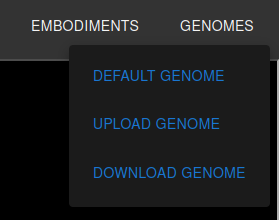
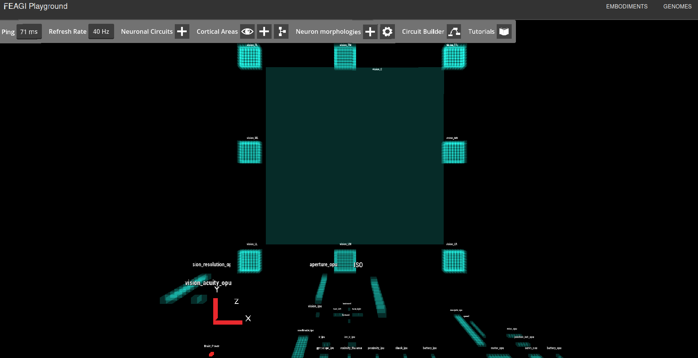

**This page may be outdated or incomplete. Please refer to the [deployment guide](https://github.com/feagi/feagi/wiki/Deployment) in our wiki for the most up to date information.**

# Overview
* [Requirements](#Requirements)
  * [Minimum System Requirements](#Minimum-System-Requirements)
  * [Supported Operating Systems](#Supported-Operating-Systems)
  * [Dependencies](#Dependencies)
* [Deployment](#Deployment)
* [Troubleshooting](#Troubleshooting)

# Introduction
The Framework for Artificial General Intelligence (FEAGI) platform consists of core components known as FEAGI-core that is at large a Python package and is responsible for the creation, development, and operation of the artificial brain processes. FEAGI leverages many open-source libraries as part of its ecosystem to provide data visualization, data analytics, 3D simulation, and robot integration 
capabilities. All the needed software packages are containerized to provided a simple method to deploy the software using Docker. This document describes system requirements and the steps to deploy FEAGI platform. 

# Requirements
### Minimum System Requirements
* Free storage:  5 GB
* Memory:        16 GB
* CPU:           4 Cores

### Supported Operating Systems
* **macOS**: Montery (12.3.1) or newest (Apple Silicon and Intel chips)
* **Windows**: 10 or newest
* **Linux**: Ubuntu (18.04) or newest

### Dependencies
Click on each dependency for installation instructions
* **[Docker](https://docs.docker.com/get-docker/)**: Desktop 4.7.1+, Engine 20.10.14+, Compose v2.4.1+
* **[Python](https://www.python.org/downloads/)**: 3.7+
* **[Git](https://git-scm.com/book/en/v2/Getting-Started-Installing-Git)**: Latest

# Deployment
## 1. Clone the repository to your machine
* To open the CLI, follow the instructions for your operating system below:
  - Windows: Press `Windows Key` + R, then type "CMD"
  - Linux: ALT + CTRL + T
  - Mac: COMMAND + SPACEBAR then type "terminal"
* Run the command `git clone https://github.com/feagi/feagi.git`

## 2. Launch Docker Desktop
**MAC OR WINDOWS ONLY:** You will need to open Docker Desktop for Step 3. If Docker is already minimized in the tray, it is considered as already being open. If you do 
not have it installed you can download a free version at https://www.docker.com/products/docker-desktop/. There are multiple ways to launch docker desktop. The easiest is to search for the docker desktop application on your system and open the application. You should see a window that looks like this:  

Linux: You can skip this as it's running in background already.

## 3. Run
In the command line/terminal run the following commands:
* `cd feagi/docker`
* `docker compose -f playground.yml up -d`
  * **NOTE:** The `-d` flag prevents the application logs from being displayed. If you want to see 
    the logs, omit the `-d` option.
    * Such as this command: `docker compose -f playground.yml up`
  
## 4. Launch the Brain Visualizer
* To launch the application, open your browser and go to http://localhost:4000. You should see the playground launch page that looks like this:
  
* Then click on 'Genomes' in the top right corner, and after that, click on 'Default Genome', which looks like this:
* 
  
* You should see Brain Visualizer like this:
  

## 5. Stopping the Application
Because the application is running in the background, please make sure to always make sure to stop the application when done. There are two ways to do this.
1. Run the command `docker compose -f playground.yml down` inside the feagi/docker folder on your 
   local system. You will see logs indicating that the containers have been stopped.

**or**

2. Stop the containers in the docker desktop application. See the orange circle
  

# Troubleshooting
This section displays errors that users have encountered when trying to install feagi. If you encounter an error not listed here,  please create an issue and we will do our best to help resolve it. Additionally, if you encounter any errors not listed here and you resolve them yourself, please add them here to help others.

### Errors encountered during building

If you encounter any of the following errors, please ensure that docker desktop is installed, launched, and running. These two errors were created when docker desktop was not yet installed or not launched. To launch docker desktop, follow the instructions listed under [Running Docker Desktop](#3.-Running-Docker-Desktop)
1. `Got permission denied while trying to connect to the Docker daemon socket at unix:///var/run/docker.sock: Get "http://%!F(MISSING)var%!F(MISSING)run%!F(MISSING)docker.sock/v1.24/version": dial unix /var/run/docker.sock: connect: permission denied: driver not connecting`

2. 

**To confirm docker desktop is running:**
* On Mac:  Clicking on the docker icon in the top right corner of your screen and ensure that you see "Docker Desktop is running"
* 

### Errors encountered during running

* If you receive an error indicating you have a port conflict, please follow [these](https://github.com/feagi/feagi/wiki/Customizing-the-Environment#port-mapping) instructions on how to override FEAGI's default port mappings.
