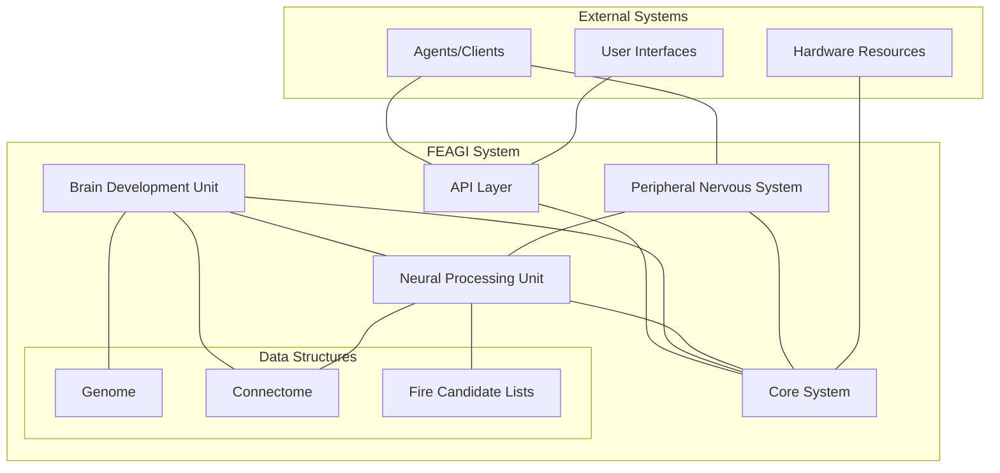
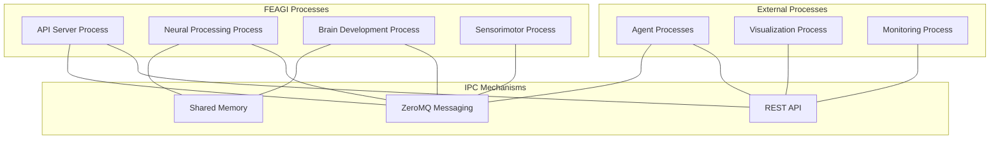
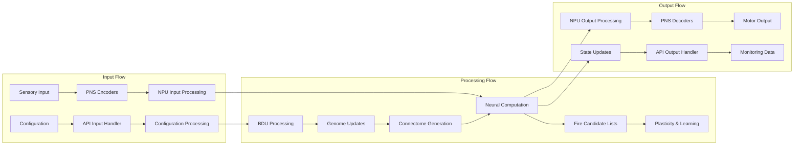
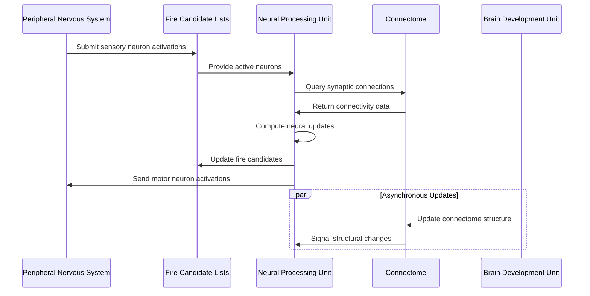
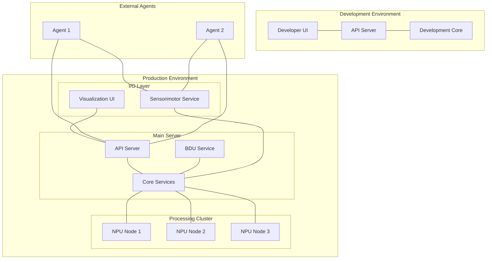
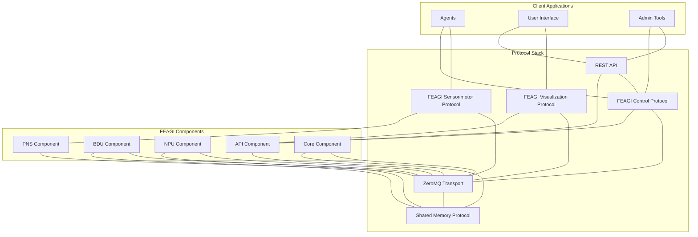
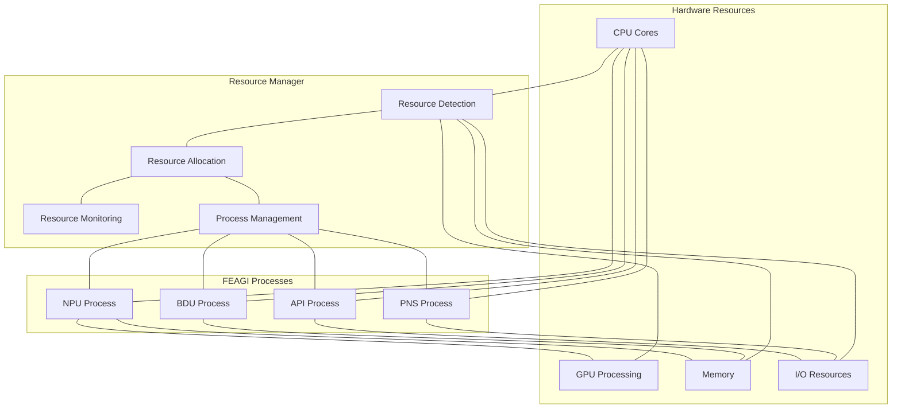
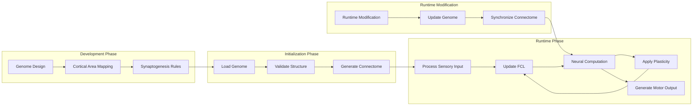

# FEAGI System Architecture Diagrams

This document provides visual representations of FEAGI's architecture using Mermaid diagrams, illustrating the system's components and their interactions.

## Overall System Architecture

## Process Architecture

## Data Flow Architecture

## Component Interaction - Neural Processing

## Deployment Architecture

## Protocol Stack Architecture

## Resource Management Architecture

## Development and Runtime Flow

## Notes on Using These Diagrams

- These diagrams are designed for inclusion in documentation and presentations
- The Mermaid format allows easy updates as the architecture evolves
- Diagrams can be rendered directly in GitHub markdown and many documentation systems
- For complex interactions, consider using the sequence diagram format
- Use consistent naming and color schemes across diagrams for clarity
