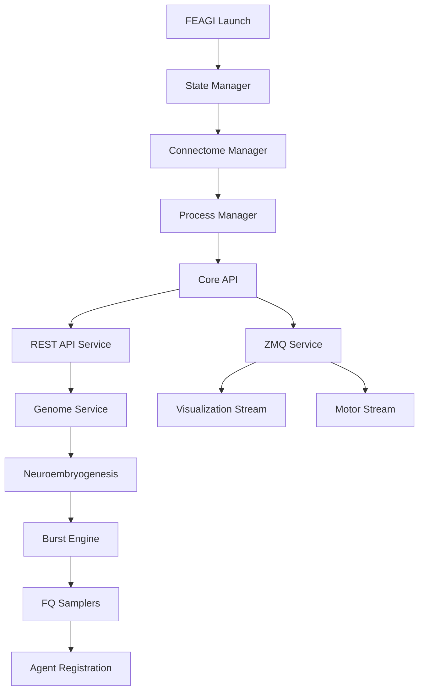

# FEAGI State Management Architecture

## Overview

FEAGI operates as a distributed neural processing system with multiple interconnected services that must be initialized and coordinated in a specific sequence. This document defines the complete state management architecture, including all service states, their dependencies, and the critical triggers that cause state transitions.

## Core Problem Statement

**Current Issue**: The system allows FQ samplers to initialize before critical prerequisites are met:
- Genome not fully developed (neuroembryogenesis incomplete)
- Brain not ready (synaptogenesis not finished) 
- Burst engine not ready (neural processing unavailable)

**Required Fix**: Enforce strict state dependencies where FQ samplers can only initialize after all critical services are operational.

## Service Architecture Overview

FEAGI consists of the following core services with strict dependency relationships:



## Core Services and States

### 1. State Manager (Foundation Service)
**Purpose**: Single source of truth for all system states using memory-mapped storage

**States**: Always operational (no state enum - it IS the state)

**Responsibilities**:
- Track all other service states
- Provide atomic state transitions
- Enable cross-process state sharing
- Log all state changes with timestamps

**Initialization**: First service to start, creates shared memory region

### 2. Connectome Manager (Brain Structure)
**Purpose**: Manages neural network structure (neurons, synapses, cortical areas)

**States** (`ConnectomeState`):
- `MISSING = 0`: No connectome available
- `INITIALIZING = 1`: Being constructed from genome  
- `UPDATING = 2`: Being modified during runtime
- `READY = 3`: Operational and stable
- `SNAPSHOTTING = 4`: Being saved to disk
- `ERROR = 5`: Error state requiring intervention

**State Triggers**:
- `MISSING → INITIALIZING`: Genome loading begins
- `INITIALIZING → READY`: Neuroembryogenesis completes successfully
- `READY → UPDATING`: Runtime modifications (plasticity, growth)
- `UPDATING → READY`: Modifications complete
- `READY → SNAPSHOTTING`: Save operation initiated
- `SNAPSHOTTING → READY`: Save operation complete
- `ANY → ERROR`: Critical error during operations

### 3. Genome Service (Genetic Instructions)
**Purpose**: Manages genome loading, validation, and neuroembryogenesis orchestration

**States** (`GenomeState`):
- `MISSING = 0`: No genome loaded
- `LOADING = 1`: Genome being loaded and processed
- `LOADED = 2`: Genome successfully loaded and brain developed
- `SAVING = 3`: Genome being saved to disk
- `ERROR = 4`: Error during genome operations

**State Triggers**:
- `MISSING → LOADING`: Genome load request received
- `LOADING → LOADED`: **CRITICAL** - Only after complete neuroembryogenesis including synaptogenesis
- `LOADED → SAVING`: Genome save request
- `SAVING → LOADED`: Save operation complete
- `ANY → ERROR`: Genome validation or processing failure

**Critical Dependencies**:
- Must wait for complete neuroembryogenesis before `LOADED`
- Must verify burst engine availability before `LOADED`
- Must set brain readiness only after `LOADED` + burst engine ready

### 4. Neuroembryogenesis (Brain Development)
**Purpose**: Transforms genome into physical brain structure

**States** (`DevelopmentStage`):
- `INITIALIZATION = 0`: Loading and validating genome
- `CORTICOGENESIS = 1`: Creating cortical areas
- `VOXELOGENESIS = 2`: Establishing 3D spatial framework
- `NEUROGENESIS = 3`: Creating neurons
- `SYNAPTOGENESIS = 4`: **CRITICAL** - Creating synaptic connections
- `COMPLETED = 5`: All development stages finished
- `FAILED = 6`: Development failed

**State Triggers**:
- `INITIALIZATION → CORTICOGENESIS`: Genome validated
- `CORTICOGENESIS → VOXELOGENESIS`: Cortical areas created
- `VOXELOGENESIS → NEUROGENESIS`: Spatial framework ready
- `NEUROGENESIS → SYNAPTOGENESIS`: Neurons created
- `SYNAPTOGENESIS → COMPLETED`: **ALL synapses created** (longest step)
- `ANY → FAILED`: Error during any development stage

**Critical Requirements**:
- `SYNAPTOGENESIS` is the longest-running step (can take 10+ seconds)
- Genome state must NOT be set to `LOADED` until `COMPLETED`
- Brain readiness must NOT be set until `COMPLETED`

### 5. Burst Engine (Neural Processing)
**Purpose**: Drives neural dynamics, membrane potentials, and firing patterns

**States** (`ServiceState`):
- `UNAVAILABLE = 0`: Engine not started
- `INITIALIZING = 1`: Engine starting up
- `READY = 2`: Engine running and processing neurons
- `ON_HOLD = 3`: Engine alive but neural processing paused
- `DEGRADED = 4`: Engine running with performance issues
- `ERROR = 5`: Engine encountered critical error
- `FAILED = 6`: Engine failed to start
- `STOPPED = 7`: Engine cleanly stopped

**State Triggers**:
- `UNAVAILABLE → INITIALIZING`: Engine start requested
- `INITIALIZING → READY`: Engine successfully started
- `READY → ON_HOLD`: Pause operation requested
- `ON_HOLD → READY`: Resume operation requested
- `READY → STOPPED`: Stop operation requested
- `STOPPED → UNAVAILABLE`: Engine fully shutdown
- `ANY → ERROR/FAILED`: Critical engine failure

**Critical Dependencies**:
- Must be in `READY` or `ON_HOLD` state before genome can be marked as `LOADED`
- FQ samplers can only initialize when burst engine is `READY`

### 6. FQ Samplers (Fire Queue Sampling)
**Purpose**: Sample neural firing data for visualization and motor output

**States** (`ServiceState`):
- `UNAVAILABLE = 0`: Sampler not created
- `INITIALIZING = 1`: Sampler being created
- `READY = 2`: Sampler operational and sampling
- `ERROR = 3`: Sampler error state
- `STOPPED = 4`: Sampler cleanly stopped

**State Triggers**:
- `UNAVAILABLE → INITIALIZING`: Agent registration requires sampler
- `INITIALIZING → READY`: Sampler successfully created and registered
- `READY → STOPPED`: No agents require sampler
- `STOPPED → UNAVAILABLE`: Sampler destroyed
- `ANY → ERROR`: Sampler failure

**Critical Dependencies** (THE CORE PROBLEM):
- **MUST NOT initialize until**:
  - Genome state = `LOADED` 
  - Neuroembryogenesis stage = `COMPLETED`
  - Burst engine state = `READY`
  - Brain readiness = `True`

### 7. REST API Service (HTTP Interface)
**Purpose**: Provides HTTP endpoints for system control and monitoring

**States** (`ServiceState`):
- `UNAVAILABLE = 0`: API server not started
- `INITIALIZING = 1`: API server starting
- `READY = 2`: API server accepting requests
- `ERROR = 3`: API server error
- `STOPPED = 4`: API server stopped

### 8. ZMQ Service (Real-time Communication)
**Purpose**: Provides ZMQ sockets for high-performance data streaming

**States** (`ServiceState`):
- `UNAVAILABLE = 0`: ZMQ service not started
- `INITIALIZING = 1`: ZMQ service starting
- `READY = 2`: ZMQ sockets operational
- `ERROR = 3`: ZMQ service error
- `STOPPED = 4`: ZMQ service stopped

## Service Dependencies Matrix

### Core Service Dependencies

| Service | Direct Dependencies | Indirect Dependencies | Blocks Until |
|---------|-------------------|---------------------|--------------|
| **State Manager** | None | None | Always operational |
| **Connectome Manager** | State Manager | None | State Manager ready |
| **Process Manager** | State Manager, Connectome Manager | None | Connectome Manager initialized |
| **Core API** | Process Manager, Connectome Manager | State Manager | Process Manager ready |
| **REST API Service** | Core API | All above | Core API ready |
| **ZMQ Service** | Core API | All above | Core API ready |
| **Genome Service** | Core API, Connectome Manager | State Manager, Process Manager | Core API ready |
| **Neuroembryogenesis** | Genome Service, Connectome Manager | All above | Genome Service ready |
| **Burst Engine** | Core API, Connectome Manager | All above | Genome loaded OR manual start |
| **FQ Samplers** | Burst Engine, Process Manager | **ALL ABOVE** | **Brain ready + Burst engine ready** |
| **Agent Registration** | FQ Samplers, ZMQ Service | **ALL ABOVE** | FQ Samplers ready |

### State Change Propagation Rules

#### 1. State Manager → All Services
**Trigger**: State Manager operational
**Propagation**: 
- Enables all other services to initialize
- Provides shared memory for state tracking
- **Impact**: System cannot function without State Manager

#### 2. Connectome Manager → Dependent Services
**State Changes**:
- `MISSING → INITIALIZING`: 
  - **Blocks**: Genome Service, Burst Engine, FQ Samplers
  - **Allows**: Basic API operations
- `INITIALIZING → READY`:
  - **Enables**: Genome loading operations
  - **Allows**: Burst Engine creation (but not start)
- `READY → UPDATING`:
  - **Blocks**: New genome loads
  - **Allows**: Continued operation of existing services
- `ANY → ERROR`:
  - **Forces**: All dependent services to ERROR state
  - **Requires**: Manual intervention

#### 3. Genome Service → System Health States
**State Changes**:
- `MISSING → LOADING`:
  - **Sets**: `genome_availability = False`
  - **Sets**: `brain_readiness = False` 
  - **Blocks**: FQ Sampler creation
  - **Triggers**: Neuroembryogenesis initialization
- `LOADING → LOADED`:
  - **Sets**: `genome_availability = True`
  - **Triggers**: Burst Engine auto-start (if not running)
  - **Enables**: Brain readiness evaluation
- `LOADED → SAVING`:
  - **Maintains**: All current states
  - **Blocks**: New genome loads
- `ANY → ERROR`:
  - **Sets**: `genome_availability = False`, `genome_validity = False`
  - **Forces**: `brain_readiness = False`
  - **Stops**: All dependent services

#### 4. Neuroembryogenesis → Brain Development States
**Stage Progression Impact**:
- `INITIALIZATION`:
  - **Sets**: `brain_readiness = False`
  - **Blocks**: Burst Engine start, FQ Samplers
- `CORTICOGENESIS`:
  - **Maintains**: `brain_readiness = False`
  - **Updates**: Cortical area count in health state
- `VOXELOGENESIS`:
  - **Maintains**: `brain_readiness = False`
  - **Updates**: Spatial framework status
- `NEUROGENESIS`:
  - **Maintains**: `brain_readiness = False`
  - **Updates**: Neuron count in health state
- `SYNAPTOGENESIS` (CRITICAL LONGEST STEP):
  - **Maintains**: `brain_readiness = False`
  - **Updates**: Synapse count progressively
  - **Duration**: Can take 10+ seconds
  - **CRITICAL**: Genome state MUST remain `LOADING`
- `COMPLETED`:
  - **Enables**: Genome state transition to `LOADED`
  - **Enables**: Brain readiness evaluation
  - **Triggers**: Final health state updates

#### 5. Burst Engine → Neural Processing States
**State Changes**:
- `UNAVAILABLE → INITIALIZING`:
  - **Updates**: `burst_engine = False` (not ready yet)
  - **Blocks**: FQ Sampler creation
- `INITIALIZING → READY`:
  - **Sets**: `burst_engine = True`
  - **Enables**: FQ Sampler creation (if other conditions met)
  - **Enables**: Neural processing operations
- `READY → ON_HOLD`:
  - **Maintains**: `burst_engine = True` (still operational)
  - **Blocks**: New neural processing
  - **Allows**: FQ Samplers to continue (using cached data)
- `READY → STOPPED`:
  - **Sets**: `burst_engine = False`
  - **Forces**: All FQ Samplers to STOPPED state
  - **Blocks**: All neural processing
- `ANY → ERROR/FAILED`:
  - **Sets**: `burst_engine = False`
  - **Forces**: System-wide error state
  - **Requires**: Manual intervention

#### 6. FQ Samplers → Agent Coordination
**State Changes**:
- `UNAVAILABLE → INITIALIZING`:
  - **Requires**: ALL prerequisites met (see validation rules)
  - **Updates**: Agent coordination state
- `INITIALIZING → READY`:
  - **Enables**: Agent data streaming
  - **Updates**: Sampling frequency in health state
- `READY → STOPPED`:
  - **Triggers**: Agent disconnection handling
  - **Updates**: Connected agent counts
- `ANY → ERROR`:
  - **Forces**: Agent disconnection
  - **Triggers**: Automatic restart attempts

### Critical State Dependencies (MUST BE ENFORCED)

#### Startup Sequence

1. **Foundation Phase**:
   ```
   State Manager → OPERATIONAL (always first)
   ↓
   Connectome Manager → INITIALIZING
   ↓
   Process Manager → INITIALIZING
   ↓
   Core API → INITIALIZING
   ```

2. **Service Initialization Phase**:
   ```
   REST API → READY (depends on Core API)
   ZMQ Service → READY (depends on Core API)
   Burst Engine → UNAVAILABLE (waiting for genome)
   FQ Samplers → UNAVAILABLE (waiting for ALL prerequisites)
   ```

3. **Genome Loading Phase** (when genome load requested):
   ```
   Genome Service → LOADING
   ↓
   Neuroembryogenesis → INITIALIZATION
   ↓
   System Health: genome_availability = False, brain_readiness = False
   ↓
   Burst Engine → UNAVAILABLE (still waiting)
   FQ Samplers → BLOCKED (prerequisites not met)
   ```

4. **Brain Development Phase** (CRITICAL):
   ```
   Neuroembryogenesis Stages:
   INITIALIZATION → CORTICOGENESIS → VOXELOGENESIS → NEUROGENESIS → SYNAPTOGENESIS
   
   DURING ENTIRE DEVELOPMENT (especially SYNAPTOGENESIS):
   - Genome state MUST remain LOADING
   - brain_readiness MUST remain False
   - Burst engine MUST remain UNAVAILABLE
   - FQ samplers MUST NOT initialize
   - Agent registration MUST be blocked
   ```

5. **Completion Phase** (ONLY after synaptogenesis complete):
   ```
   Neuroembryogenesis → COMPLETED
   ↓
   Genome Service → LOADED (ONLY NOW)
   ↓
   System Health: genome_availability = True
   ↓
   Burst Engine → AUTO-START → READY
   ↓
   System Health: burst_engine = True
   ↓
   Brain Readiness Evaluation → True (ONLY NOW)
   ↓
   System Health: brain_readiness = True
   ```

6. **Agent Registration Phase** (ONLY after completion):
   ```
   Prerequisites Met → FQ Samplers can initialize
   ↓
   Agent Registration → Triggers FQ Sampler creation
   ↓
   FQ Samplers → READY (when agents register)
   ↓
   System Health: Connected agents count updated
   ```

## System Health States

### Core Health State Variables

The system exposes several health state variables that aggregate the underlying service states. These are used by external systems (like brain visualizers) to understand overall system health.

#### 1. `genome_availability` (Boolean)
**Definition**: Indicates if a valid genome is loaded and ready for use

**Calculation Logic**:
```python
def calculate_genome_availability() -> bool:
    genome_state = state_manager.get_genome_state()
    return genome_state == GenomeState.LOADED
```

**State Dependencies**:
- **True when**: Genome state = `LOADED` AND neuroembryogenesis = `COMPLETED`
- **False when**: Genome state = `MISSING`, `LOADING`, `ERROR`
- **Transitions**:
  - `False → True`: Only after complete neuroembryogenesis including synaptogenesis
  - `True → False`: Genome unloaded, error, or new genome loading started

**Impact on Other States**:
- **When False**: Forces `brain_readiness = False`, blocks FQ samplers
- **When True**: Enables brain readiness evaluation

#### 2. `genome_validity` (Boolean)
**Definition**: Indicates if the loaded genome passed validation checks

**Calculation Logic**:
```python
def calculate_genome_validity() -> bool:
    if not state_manager.genome:
        return False
    return (
        state_manager.genome_validity and
        state_manager.get_genome_state() != GenomeState.ERROR
    )
```

**State Dependencies**:
- **True when**: Genome loaded AND validation passed AND no errors
- **False when**: No genome, validation failed, or genome error state
- **Transitions**:
  - `False → True`: Successful genome load with validation
  - `True → False`: Genome error or new genome loading

#### 3. `burst_engine` (Boolean)
**Definition**: Indicates if the burst engine is operational for neural processing

**Calculation Logic**:
```python
def calculate_burst_engine_health() -> bool:
    burst_state = state_manager.get_burst_engine_state()
    return burst_state in [ServiceState.READY, ServiceState.ON_HOLD]
```

**State Dependencies**:
- **True when**: Burst engine state = `READY` OR `ON_HOLD`
- **False when**: Burst engine state = `UNAVAILABLE`, `INITIALIZING`, `ERROR`, `FAILED`, `STOPPED`
- **Transitions**:
  - `False → True`: Burst engine successfully started
  - `True → False`: Burst engine stopped, failed, or error

**Impact on Other States**:
- **When False**: Blocks FQ sampler creation, forces `brain_readiness = False`
- **When True**: Enables FQ sampler creation (if other conditions met)

#### 4. `brain_readiness` (Boolean)
**Definition**: Indicates if the brain is fully ready for agent operations

**Calculation Logic**:
```python
def calculate_brain_readiness() -> bool:
    return (
        calculate_genome_availability() and
        calculate_genome_validity() and
        calculate_burst_engine_health() and
        state_manager.get_brain_readiness()  # Explicit readiness flag
    )
```

**State Dependencies**:
- **True when**: ALL of the following:
  - `genome_availability = True`
  - `genome_validity = True` 
  - `burst_engine = True`
  - Neuroembryogenesis stage = `COMPLETED`
  - Explicit brain readiness flag = `True`
- **False when**: ANY of the above conditions is false

**Critical Timing**:
- **MUST remain False** during entire neuroembryogenesis process
- **MUST remain False** during synaptogenesis (longest step)
- **Can only become True** after ALL prerequisites met

**Impact on Other States**:
- **When False**: Blocks FQ sampler creation, blocks agent registration
- **When True**: Enables full system operation

#### 5. `connected_agents` (Integer)
**Definition**: Count of currently connected and active agents

**Calculation Logic**:
```python
def calculate_connected_agents() -> int:
    return state_manager.get_agent_count()
```

**State Dependencies**:
- **Updates when**: Agent registration/deregistration events
- **Resets to 0 when**: System shutdown or brain not ready

#### 6. `cortical_area_count` (Integer)
**Definition**: Number of cortical areas in the current brain structure

**Calculation Logic**:
```python
def calculate_cortical_area_count() -> int:
    if not state_manager.brain_stats:
        return 0
    return state_manager.brain_stats.get("cortical_area_count", 0)
```

**State Dependencies**:
- **Updates during**: Neuroembryogenesis corticogenesis stage
- **Resets to 0 when**: No genome loaded or connectome error

#### 7. `neuron_count` (Integer)
**Definition**: Total number of neurons in the current brain

**Calculation Logic**:
```python
def calculate_neuron_count() -> int:
    if not state_manager.brain_stats:
        return 0
    return state_manager.brain_stats.get("neuron_count", 0)
```

**State Dependencies**:
- **Updates during**: Neuroembryogenesis neurogenesis stage
- **Final value set**: After neurogenesis completion

#### 8. `synapse_count` (Integer)
**Definition**: Total number of synapses in the current brain

**Calculation Logic**:
```python
def calculate_synapse_count() -> int:
    if not state_manager.brain_stats:
        return 0
    return state_manager.brain_stats.get("synapse_count", 0)
```

**State Dependencies**:
- **Updates during**: Neuroembryogenesis synaptogenesis stage
- **Final value set**: After synaptogenesis completion (longest step)

#### 9. `burst_frequency` (Float)
**Definition**: Current neural processing frequency in Hz

**Calculation Logic**:
```python
def calculate_burst_frequency() -> float:
    return state_manager.get_burst_frequency()
```

**State Dependencies**:
- **Updates when**: Burst engine configuration changes
- **Defaults to 0.0 when**: Burst engine not running

#### 10. `fq_sampler_status` (Dict)
**Definition**: Status of Fire Queue samplers for different modes

**Calculation Logic**:
```python
def calculate_fq_sampler_status() -> Dict[str, Any]:
    return {
        "visualization": {
            "enabled": state_manager.get_fq_sampler_state() == ServiceState.READY,
            "frequency": state_manager.get_fq_sampler_frequency(),
            "consumer": state_manager.get_fq_sampler_consumer()
        },
        "motor": {
            "enabled": motor_sampler_enabled(),
            "frequency": motor_sampler_frequency()
        }
    }
```

### Health State Calculation Matrix

| Health State | Depends On | Calculation Rule | Critical Timing |
|-------------|------------|------------------|-----------------|
| `genome_availability` | Genome Service | `genome_state == LOADED` | Only after neuroembryogenesis complete |
| `genome_validity` | Genome Service | `genome_validity == True AND no errors` | Set during genome validation |
| `burst_engine` | Burst Engine | `state in [READY, ON_HOLD]` | Auto-started after genome loaded |
| `brain_readiness` | **ALL ABOVE** | `genome_avail AND genome_valid AND burst_engine AND explicit_flag` | **ONLY after ALL prerequisites** |
| `connected_agents` | Agent Registry | `sum(active_agents)` | Updated on agent events |
| `cortical_area_count` | Neuroembryogenesis | `brain_stats.cortical_areas` | Set during corticogenesis |
| `neuron_count` | Neuroembryogenesis | `brain_stats.neurons` | Set during neurogenesis |
| `synapse_count` | Neuroembryogenesis | `brain_stats.synapses` | Set during synaptogenesis |
| `burst_frequency` | Burst Engine | `configured_frequency` | Set when burst engine starts |
| `fq_sampler_status` | FQ Samplers | `sampler_states` | Updated on sampler events |

### Health State Validation Rules

#### Critical Validation Checks

1. **Consistency Check**:
   ```python
   def validate_health_state_consistency() -> List[str]:
       errors = []
       
       # Brain readiness can only be true if all prerequisites are met
       if brain_readiness and not (genome_availability and genome_validity and burst_engine):
           errors.append("Brain readiness true but prerequisites not met")
       
       # FQ samplers can only be ready if brain is ready
       if fq_samplers_active() and not brain_readiness:
           errors.append("FQ samplers active but brain not ready")
       
       # Burst engine should be running if genome is loaded
       if genome_availability and not burst_engine:
           errors.append("Genome loaded but burst engine not running")
           
       return errors
   ```

2. **Timing Validation**:
   ```python
   def validate_timing_constraints() -> List[str]:
       errors = []
       
       # Check if brain readiness was set too early
       if brain_readiness and neuroembryogenesis_stage != DevelopmentStage.COMPLETED:
           errors.append("Brain readiness set before neuroembryogenesis completion")
       
       # Check if FQ samplers started too early  
       if fq_samplers_active() and not all_prerequisites_met():
           errors.append("FQ samplers started before all prerequisites met")
           
       return errors
   ```

### Health State Monitoring

#### Real-time Health Check Response

```json
{
  "timestamp": "2025-01-XX:XX:XX.XXXZ",
  "system_health": {
    "genome_availability": true,
    "genome_validity": true,
    "burst_engine": true,
    "brain_readiness": true,
    "connected_agents": 2,
    "cortical_area_count": 13,
    "neuron_count": 13846,
    "synapse_count": 156789,
    "burst_frequency": 10.0,
    "fq_sampler_status": {
      "visualization": {
        "enabled": true,
        "frequency": 30.0,
        "consumer": "visualization"
      },
      "motor": {
        "enabled": false,
        "frequency": 100.0,
        "consumer": "none"
      }
    }
  },
  "service_states": {
    "state_manager": "OPERATIONAL",
    "connectome_manager": "READY", 
    "genome_service": "LOADED",
    "neuroembryogenesis": "COMPLETED",
    "burst_engine": "READY",
    "fq_samplers": "READY",
    "rest_api": "READY",
    "zmq_service": "READY"
  },
  "state_consistency": "VALID",
  "validation_errors": []
}
```

#### Health State Change Events

```json
{
  "event_type": "health_state_change",
  "timestamp": "2025-01-XX:XX:XX.XXXZ",
  "changes": [
    {
      "state": "brain_readiness",
      "old_value": false,
      "new_value": true,
      "trigger": "neuroembryogenesis_completion",
      "dependencies_met": {
        "genome_availability": true,
        "genome_validity": true,
        "burst_engine": true,
        "neuroembryogenesis_stage": "COMPLETED"
      }
    }
  ],
  "cascading_effects": [
    {
      "service": "fq_samplers",
      "action": "enable_creation",
      "reason": "brain_readiness_now_true"
    }
  ]
}
```

## State Transition Triggers

### Automatic Triggers (System-Driven)

1. **Genome Load Completion**:
   - **Trigger**: `neuroembryogenesis.develop_brain_from_genome_data()` returns `True`
   - **Actions**: 
     - Set genome state to `LOADED`
     - Auto-start burst engine if not running
     - Set brain readiness to `True` only after burst engine ready

2. **Agent Registration**:
   - **Trigger**: Agent connects with capabilities
   - **Actions**: Create required FQ samplers (if system ready)
   - **Guard**: Only if brain readiness = `True`

3. **Agent Deregistration**:
   - **Trigger**: Agent disconnects or times out
   - **Actions**: Disable FQ samplers if no agents remain

### Manual Triggers (User/API-Driven)

1. **Genome Load Request**:
   - **API**: `POST /v1/genome/load`
   - **Trigger**: User uploads genome
   - **Actions**: Start genome loading sequence

2. **Burst Engine Control**:
   - **API**: `POST /v1/burst_engine/start|stop|hold|resume`
   - **Trigger**: User controls neural processing
   - **Actions**: Change burst engine state

3. **System Shutdown**:
   - **Trigger**: Process termination signal
   - **Actions**: Graceful shutdown of all services

## State Validation Rules

### Critical Validation Checks

1. **FQ Sampler Initialization Guard**:
   ```python
   def can_initialize_fq_sampler() -> bool:
       return (
           state_manager.get_genome_state() == GenomeState.LOADED and
           state_manager.get_brain_readiness() == True and
           state_manager.get_burst_engine_state() == ServiceState.READY
       )
   ```

2. **Genome Load Completion Guard**:
   ```python
   def can_mark_genome_loaded(neuroembryogenesis_result: bool) -> bool:
       return (
           neuroembryogenesis_result == True and
           # ALL stages including synaptogenesis completed
           neuroembryogenesis.stage == DevelopmentStage.COMPLETED
       )
   ```

3. **Brain Readiness Guard**:
   ```python
   def can_set_brain_ready() -> bool:
       return (
           state_manager.get_genome_state() == GenomeState.LOADED and
           state_manager.get_burst_engine_state() in [ServiceState.READY, ServiceState.ON_HOLD]
       )
   ```

## Error Handling and Recovery

### State Inconsistency Detection

The system must detect and recover from invalid state combinations:

1. **Invalid**: FQ sampler running but genome not loaded
2. **Invalid**: Brain readiness true but neuroembryogenesis not complete
3. **Invalid**: Genome loaded but burst engine unavailable

### Recovery Actions

1. **Automatic Recovery**:
   - Reset invalid states to safe defaults
   - Restart failed services if possible
   - Log all recovery actions

2. **Manual Recovery**:
   - Provide API endpoints to reset service states
   - Allow forced state transitions for debugging
   - Comprehensive state inspection tools

## Error States and Recovery Mechanisms

### Critical Error Scenarios

#### 1. Premature FQ Sampler Initialization (CURRENT ISSUE)
**Scenario**: FQ samplers initialize before brain is ready
**Detection**:
```python
def detect_premature_fq_sampler() -> bool:
    fq_ready = state_manager.get_fq_sampler_state() == ServiceState.READY
    brain_ready = state_manager.get_brain_readiness()
    genome_loaded = state_manager.get_genome_state() == GenomeState.LOADED
    burst_ready = state_manager.get_burst_engine_state() == ServiceState.READY
    
    return fq_ready and not (brain_ready and genome_loaded and burst_ready)
```

**Recovery Action**:
```python
def recover_premature_fq_sampler():
    logger.error("CRITICAL: FQ sampler active but prerequisites not met - forcing shutdown")
    process_manager.disable_fq_sampler("visualization")
    process_manager.disable_fq_sampler("motor") 
    state_manager.set_fq_sampler_state(ServiceState.UNAVAILABLE)
    logger.info("FQ samplers disabled - will restart when prerequisites met")
```

#### 2. Brain Readiness Set Too Early
**Scenario**: Brain readiness flag set before neuroembryogenesis completion
**Detection**:
```python
def detect_premature_brain_readiness() -> bool:
    brain_ready = state_manager.get_brain_readiness()
    genome_state = state_manager.get_genome_state()
    # Check if neuroembryogenesis is still running
    embryo_complete = check_neuroembryogenesis_completion()
    
    return brain_ready and (genome_state != GenomeState.LOADED or not embryo_complete)
```

**Recovery Action**:
```python
def recover_premature_brain_readiness():
    logger.error("CRITICAL: Brain readiness set before neuroembryogenesis completion")
    state_manager.set_brain_readiness(False)
    # Force dependent services to stop
    process_manager.disable_all_fq_samplers()
    logger.info("Brain readiness reset - waiting for proper completion")
```

#### 3. Genome State Inconsistency
**Scenario**: Genome marked as LOADED but neuroembryogenesis not complete
**Detection**:
```python
def detect_genome_state_inconsistency() -> bool:
    genome_loaded = state_manager.get_genome_state() == GenomeState.LOADED
    embryo_stage = get_neuroembryogenesis_stage()
    
    return genome_loaded and embryo_stage != DevelopmentStage.COMPLETED
```

**Recovery Action**:
```python
def recover_genome_state_inconsistency():
    logger.error("CRITICAL: Genome marked LOADED but neuroembryogenesis incomplete")
    state_manager.set_genome_state(GenomeState.LOADING)
    state_manager.set_brain_readiness(False)
    logger.info("Genome state reset to LOADING - waiting for completion")
```

#### 4. Burst Engine State Mismatch
**Scenario**: Burst engine not running but genome is loaded
**Detection**:
```python
def detect_burst_engine_mismatch() -> bool:
    genome_loaded = state_manager.get_genome_state() == GenomeState.LOADED
    burst_ready = state_manager.get_burst_engine_state() == ServiceState.READY
    
    return genome_loaded and not burst_ready
```

**Recovery Action**:
```python
def recover_burst_engine_mismatch():
    logger.warning("Genome loaded but burst engine not running - attempting auto-start")
    brain_service = get_brain_service()
    if brain_service.start_burst_engine():
        logger.info("Burst engine auto-started successfully")
    else:
        logger.error("Failed to auto-start burst engine - manual intervention required")
        state_manager.set_brain_readiness(False)
```

### Error State Transitions

#### Service Error States
Each service can enter error states that affect the entire system:

1. **Connectome Manager Error**:
   - **Trigger**: Memory corruption, invalid operations
   - **Impact**: Forces all dependent services to ERROR state
   - **Recovery**: Requires system restart

2. **Genome Service Error**:
   - **Trigger**: Invalid genome, neuroembryogenesis failure
   - **Impact**: Blocks brain readiness, forces FQ samplers to stop
   - **Recovery**: Load valid genome or fix genome issues

3. **Burst Engine Error**:
   - **Trigger**: Engine crash, configuration error
   - **Impact**: Blocks neural processing, forces FQ samplers to stop
   - **Recovery**: Restart burst engine with valid configuration

4. **FQ Sampler Error**:
   - **Trigger**: Sampling failure, data corruption
   - **Impact**: Affects specific agent types only
   - **Recovery**: Restart affected samplers

### Automatic Recovery Mechanisms

#### 1. Service Health Monitoring
```python
class ServiceHealthMonitor:
    def __init__(self, state_manager):
        self.state_manager = state_manager
        self.recovery_attempts = {}
        self.max_recovery_attempts = 3
    
    def monitor_service_health(self):
        """Continuously monitor all service states"""
        while True:
            # Check for inconsistencies
            errors = self.validate_all_states()
            
            for error in errors:
                self.attempt_recovery(error)
            
            time.sleep(1.0)  # Check every second
    
    def validate_all_states(self) -> List[StateError]:
        """Validate all state combinations"""
        errors = []
        
        # Check premature FQ sampler
        if detect_premature_fq_sampler():
            errors.append(StateError("premature_fq_sampler"))
        
        # Check premature brain readiness
        if detect_premature_brain_readiness():
            errors.append(StateError("premature_brain_readiness"))
        
        # Check genome inconsistency
        if detect_genome_state_inconsistency():
            errors.append(StateError("genome_inconsistency"))
        
        # Check burst engine mismatch
        if detect_burst_engine_mismatch():
            errors.append(StateError("burst_engine_mismatch"))
        
        return errors
    
    def attempt_recovery(self, error: StateError):
        """Attempt automatic recovery for detected errors"""
        error_type = error.error_type
        
        if self.recovery_attempts.get(error_type, 0) >= self.max_recovery_attempts:
            logger.error(f"Max recovery attempts reached for {error_type} - manual intervention required")
            return
        
        self.recovery_attempts[error_type] = self.recovery_attempts.get(error_type, 0) + 1
        
        recovery_functions = {
            "premature_fq_sampler": recover_premature_fq_sampler,
            "premature_brain_readiness": recover_premature_brain_readiness,
            "genome_inconsistency": recover_genome_state_inconsistency,
            "burst_engine_mismatch": recover_burst_engine_mismatch
        }
        
        recovery_func = recovery_functions.get(error_type)
        if recovery_func:
            try:
                recovery_func()
                logger.info(f"Recovery attempted for {error_type}")
            except Exception as e:
                logger.error(f"Recovery failed for {error_type}: {e}")
```

#### 2. State Consistency Enforcer
```python
class StateConsistencyEnforcer:
    def __init__(self, state_manager):
        self.state_manager = state_manager
    
    def enforce_state_dependencies(self):
        """Enforce all state dependencies"""
        
        # Rule 1: FQ samplers can only be ready if brain is ready
        if self.state_manager.get_fq_sampler_state() == ServiceState.READY:
            if not self.state_manager.get_brain_readiness():
                logger.error("ENFORCING: FQ samplers active but brain not ready")
                self.force_fq_samplers_stop()
        
        # Rule 2: Brain readiness requires all prerequisites
        if self.state_manager.get_brain_readiness():
            if not self.all_brain_prerequisites_met():
                logger.error("ENFORCING: Brain ready but prerequisites not met")
                self.state_manager.set_brain_readiness(False)
        
        # Rule 3: Genome loaded requires neuroembryogenesis completion
        if self.state_manager.get_genome_state() == GenomeState.LOADED:
            if not self.neuroembryogenesis_completed():
                logger.error("ENFORCING: Genome loaded but neuroembryogenesis incomplete")
                self.state_manager.set_genome_state(GenomeState.LOADING)
    
    def all_brain_prerequisites_met(self) -> bool:
        return (
            self.state_manager.get_genome_state() == GenomeState.LOADED and
            self.state_manager.get_burst_engine_state() == ServiceState.READY and
            self.neuroembryogenesis_completed()
        )
    
    def neuroembryogenesis_completed(self) -> bool:
        # Check if neuroembryogenesis stage is COMPLETED
        return get_neuroembryogenesis_stage() == DevelopmentStage.COMPLETED
    
    def force_fq_samplers_stop(self):
        process_manager = get_process_manager()
        process_manager.disable_fq_sampler("visualization")
        process_manager.disable_fq_sampler("motor")
        self.state_manager.set_fq_sampler_state(ServiceState.UNAVAILABLE)
```

### Manual Recovery Tools

#### 1. State Reset API Endpoints
```python
# Emergency state reset endpoints
@app.post("/v1/system/emergency/reset_brain_readiness")
async def emergency_reset_brain_readiness():
    """Emergency reset of brain readiness flag"""
    state_manager.set_brain_readiness(False)
    return {"message": "Brain readiness reset to False"}

@app.post("/v1/system/emergency/reset_fq_samplers") 
async def emergency_reset_fq_samplers():
    """Emergency shutdown of all FQ samplers"""
    process_manager.disable_all_fq_samplers()
    state_manager.set_fq_sampler_state(ServiceState.UNAVAILABLE)
    return {"message": "All FQ samplers disabled"}

@app.post("/v1/system/emergency/force_state_consistency")
async def emergency_force_state_consistency():
    """Force state consistency check and recovery"""
    enforcer = StateConsistencyEnforcer(state_manager)
    enforcer.enforce_state_dependencies()
    return {"message": "State consistency enforced"}
```

#### 2. Diagnostic Tools
```python
@app.get("/v1/system/diagnostics/state_validation")
async def get_state_validation():
    """Get comprehensive state validation report"""
    errors = validate_health_state_consistency()
    timing_errors = validate_timing_constraints()
    
    return {
        "consistency_errors": errors,
        "timing_errors": timing_errors,
        "total_errors": len(errors) + len(timing_errors),
        "system_healthy": len(errors) == 0 and len(timing_errors) == 0
    }

@app.get("/v1/system/diagnostics/dependency_tree")
async def get_dependency_tree():
    """Get current service dependency status"""
    return {
        "state_manager": "OPERATIONAL",
        "connectome_manager": state_manager.get_connectome_state().name,
        "genome_service": state_manager.get_genome_state().name,
        "neuroembryogenesis_stage": get_neuroembryogenesis_stage().name,
        "burst_engine": state_manager.get_burst_engine_state().name,
        "fq_samplers": state_manager.get_fq_sampler_state().name,
        "dependencies_met": {
            "fq_samplers_can_start": can_initialize_fq_sampler(),
            "brain_can_be_ready": can_set_brain_ready(),
            "genome_can_be_loaded": can_mark_genome_loaded(True)
        }
    }
```

## Implementation Progress

### ✅ **Days 1-3: Foundation and Core State Manager** (COMPLETED)
- **Day 1**: Rust-compatible foundation (state_errors.py, atomic_state.py, state_storage.py) ✅
- **Day 2-3**: Core state manager (rust_friendly_state_manager.py) with critical FQ sampler validation ✅
- **CRITICAL MILESTONE**: FQ sampler timing issue resolved - samplers now properly blocked until prerequisites met ✅

### ✅ **Days 4-5: Fix Critical Service Violations** (COMPLETED)
- **genome_service.py**: Fixed exit_condition violation (line 521) ✅
- **agents_service.py**: Fixed 5 connected_agents violations ✅  
- **system_service.py**: Fixed 5 visualization setting violations ✅
- **brain_service.py**: Fixed 2 exit_condition violations ✅
- **Key Achievement**: Critical services now use proper state management methods ✅

### 🔄 **Days 6-10: Cleanup and Integration** (IN PROGRESS)
- **Day 6-7**: Fix remaining base_service.py and state_manager.py violations
- **Day 8**: Fix test files violations (non-critical)
- **Day 9**: Integration testing and validation
- **Day 10**: Documentation updates and final validation