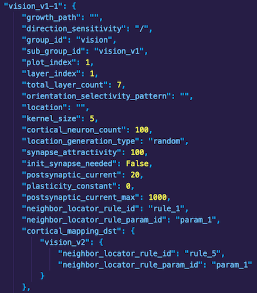
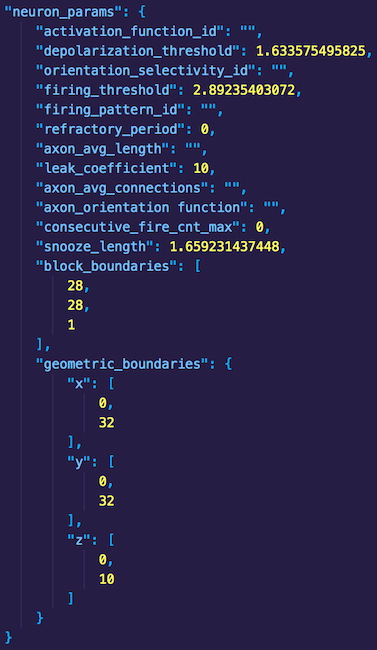

# Genome Development

The genome is a data structure comprised of key-value pairs that provides user-configurable anatomical and physiological parameters to FEAGI for artificial brain development. The neuroembryogenesis unit (`src/evo/neuroembryogenesis.py`) processes genome data and generates virtual anatomical features within the artificial brain (cortical regions, cortical layers, neurons, synapses), which are stored in the connectome data structure. Users may generate an artificial brain capable of processing various input data types (via the Input Processing Unit - `src/ipu/source/`) solely through modification of the seed genome. To better familiarize users with the genome (`src/evo/static_genome.py`), a brief overview of its structure and how to modify it (e.g. create new cortical areas) is presented below.

   
**Fig. 1: A section of cortical area data in the genome data structure showing various parameters.**    

The existing genome contains cortical areas for processing image and LIDAR input data, which can be found under the `"blueprint"` key in `src/evo/static_genome.py` and are useful examples for developing new cortical areas. Other keys at the `"blueprint"` level (e.g. `"firing_patterns"`, `"neighbor_locator_rule"`) are used for further defining neurophysiologic and synaptogenic properties within a cortical area. The figure above shows a layer of the vision cortical area. Note the hierarchical nature of the data; properties such as `"growth_path"` are nested under the `"vision_v1-1"` key. Each cortical area belongs to a specific group (`"group_id"`) and subgroup ("`sub_group_id`"), possesses a user-defined cortical neuron count (among other parameters) and is mapped to another region in the artificial brain (`"cortical_mapping_dst"`).

    
**Fig. 2: More data from the same cortical area showing geometric and neurophysiologic parameters.**

Cortical areas in the genome have virtual dimensions for accommodating the proliferation of neurons and formation of synapses within the defined area. In **Fig. 2**, note the `"geometric_boundaries"` listed for the _x_, _y_ and _z_ dimensions. Each neuron cell body created via neurogenesis is associated with a point _(x, y, z)_ existing within these boundaries. Users must define boundaries according to the nature of the input data to ensure its appropriate translation to neuronal activity. Users can subdivide cortical areas by setting block boundaries (see the `"block_boundaries"` key in **Fig. 2**), which define the dimensions of a block. Blocks are cortical area subregions that facilitate the localization of neurons for activation following translation of brain input data. To better illustrate the concept, if a user defined a 100x100x100 cortical area with 10x10x10 (_x_, _y_, _z_) block boundaries, the cortical area will be subdivided into 10 blocks.

 - add step-by-step walkthrough of how to edit genome file?
 - mention JSON syntax?
 - provide another example using the proximity area and turtlebot?
 - optimizing parameters for use cases
 - troubleshooting issues
