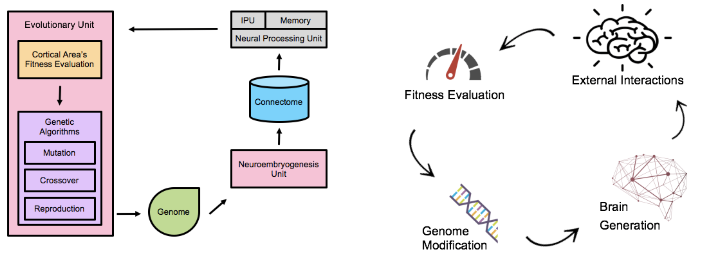
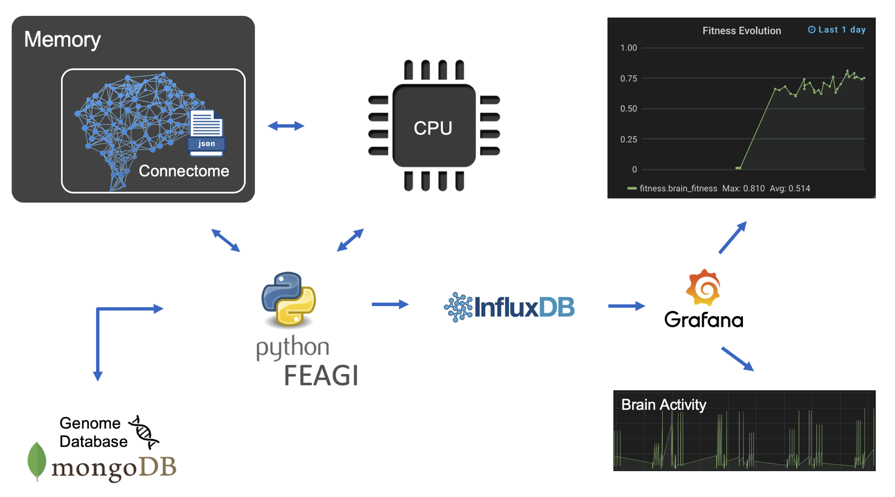
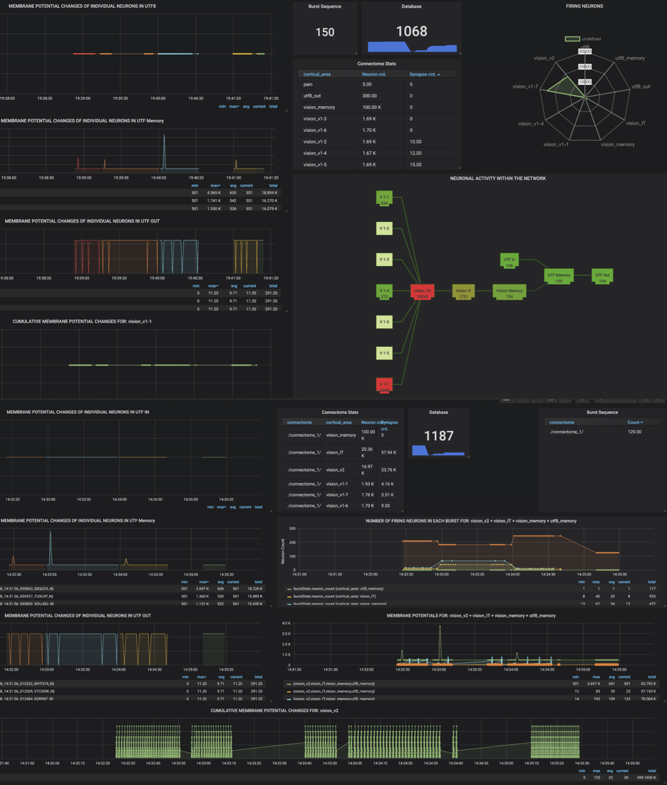

# Hello and welcome to FEAGI! 

[](https://github.com/feagi/feagi/releases) [](https://discord.gg/PTVC8fyGN8) [](https://www.apache.org/licenses/LICENSE-2.0.txt)

* For the most up to date information about our platform and approach, please reference our [Wiki](https://github.com/feagi/feagi/wiki).
* To get started using our platform please follow our [**Deployment Guide**](https://github.com/feagi/feagi/wiki/Deployment) and start by following our [**tutorials**](https://github.com/feagi/feagi/wiki/Tutorials)
* To learn more and get involved in the community, join our the FEAGI [Linkedin group](https://www.linkedin.com/groups/12777894/).

# About FEAGI
The Framework for Evolutionary Artificial General Intelligence (FEAGI) is an open-source framework designed from the 
ground up as a brain-inspired platform to help develop artificial general intelligence. FEAGI has been under development 
since 2016 and has been publicly introduced in 2020 through 
"[A Brain-Inspired Framework for Evolutionary Artificial General Intelligence](https://ieeexplore.ieee.org/document/9034490)", 
a journal paper published in IEEE Transactions on Neural Networks. Thus far, [Neuraville](https://neuraville.com) has 
been the biggest contributor to this open-source software but we hope others would join in building an amazing solution.

To learn more and get involved, join the FEAGI [LinkedIn group](https://www.linkedin.com/groups/12777894/).

Here are some key highlights of the framework differentiating it from others:
* Inspired by the evolutionary process that developed the human brain over millions of years
* Inspired by the maturity process that grows a human brain from a few cells within a human embryo and transforms it 
  into an adult brain
* Based on Spiking Neural Network concept
* Developed using Python programming language
* Event-based implementation making it suitable for low power deployments
* Designed with a highly modular architecture making it easy to adapt to new hardware environments
* Built-in tooling for powerful data visualization and functional insights 

&nbsp;
# Deployment
For deployment instructions, please refer to the ***[Deployment Guide](./DEPLOY.md)***.

&nbsp;
# Framework Overview
There are a few key aspects to FEAGI: the evolutionary aspect, the maturity aspect, and the brain-inspired anatomical 
aspects. The process begins with what we call a "*seed genome*." The seed genome is a densely coded data structure that 
captures the anatomical properties of the artificial brain, which can be used in conjunction with a set of growth algorithms 
to develop a fully functional artificial brain in the form of a neural network. The evolutionary aspect of the framework 
has the capability of using the seed genome as a starting point and evolving it through time, leading to a more capable 
and more functional artificial brain over generations.


The process of evolving an artificial brain.

We have decided to build integration with [MongoDb](https://www.mongodb.com) as the repository for maintaining 
artificial genomes. We have also built an integration with [InfluxDb](https://www.influxdata.com/products/influxdb/) as a 
repository for all the time-bound or sequential statistics that can be collected from the artificial brain. The design 
is highly modular, and other databases can be utilized as needed.


An overview of the FEAGI ecosystem.

&nbsp;
# Monitoring
FEAGI has been designed with the capability of monitoring artificial brain activities through selective sampling. 
When sampling is enabled, select metrics are measured and stored in a time-series database, currently InfluxDb. From 
there, any monitoring software can be utilized to visualize the activities. We have chosen [Grafana](https://grafana.com) 
as our web-based software of choice to build insightful visualization, but this should not limit you from going with your 
favorite.


Similar to how fMRI helps us visualize the activities of a functioning brain, we have developed tools to help you gain
insights into how the artificial brain operates.


Another powerful tool to help gain insights into how the artificial brain developed by FEAGI operates is the use of 
time-series dashboards that provide an EEG like visualization but much cooler!



&nbsp;
# Device Integration
FEAGI acts as the brain and requires embodiment to interact with the environment. FEAGI utilizes an open-source universal 
messaging library called [ZeroMQ](https://zeromq.org/) to communicate with its peripheral devices. 


* Available integrations:
  * Pyserial
  * [ROS (Robot Operating System)](third_party/gazebo/smart_car/README.md)
  
&nbsp;
# Definitions
Here is a list of terminologies and common terms used throughout the documentation. 
###

**Artificial Brain (Robot Control System)**
* A system consisted of a combination of hardware and software working in harmony to process internally and externally 
  generated information.

**Connectome (Artificial Neural Network)**
* A centralized or distributed data structure representing the physical structure and properties of a working artificial 
  brain consisted of artificial neurons and the synaptic connectivity in between them.

**Genome (Neural Network Parameters File)**
* A data structure containing a set of properties needed to build a Connectome

**Genome repository (Database of configuration files)**
* A distributed or centralized database housing a collection of genome instances

**Gene (Parameter)**
* A portion of the genome capturing the properties of a particular section of the artificial brain

**Cortical Area (Neural Network Layer)**
* A virtual 3D space consisted of a collection of neurons scattered across its virtual 3d space

**Neurogenesis (Creation of a Neuron)**
* The process of reading neuron properties from the genome, creating an entry in the connectome, and having the 
  associated with a particular cortical area

**Synaptogenesis (Creation of neural network edges or connecting between neurons)**
* The process of reading rules of connectivity from a neuron to its neighbors from the genome and creating an entry in 
  the connectome and associated with a neuron outlining the information about the neighboring neuron it is connected with

**Input Processing Unit (IPU)**
* A software program designed to create an interface between an input device such as a microphone or camera and the 
  connectome by translating the data packets received from the input device to a set of neuronal stimulation as part 
  of the connectome

**Output Processing Unit (OPU)**
* A software program designed to create an interface between the connectome and with an output device such as a speaker by 
  translating the neuronal activities as part of a specific region of connectome to data packets so the output device 
  can process it.

**Neuron Processing Unit (NPU)**
* A software program designed to process all the operations associated with neuron firing across the entire connectome


## Citation

If you use FEAGI for published research, please cite:

```
@ARTICLE{9034490,
  author={Nadji-Tehrani, Mohammad and Eslami, Ali},
  journal={IEEE Transactions on Neural Networks and Learning Systems}, 
  title={A Brain-Inspired Framework for Evolutionary Artificial General Intelligence}, 
  year={2020},
  volume={31},
  number={12},
  pages={5257-5271},
  keywords={Neural networks;Brain modeling;Genetic programming;Character recognition;Artificial intelligence;Artificial general intelligence;evolutionary algorithms;genetic programming;indirect encoding;spiking neural networks},
  doi={10.1109/TNNLS.2020.2965567}}
```

## License and Disclaimer

Copyright 2025 Neuraville Inc.

Source code is licensed under the Apache License, Version 2.0. You may obtain a
copy of the License at https://www.apache.org/licenses/LICENSE-2.0.
