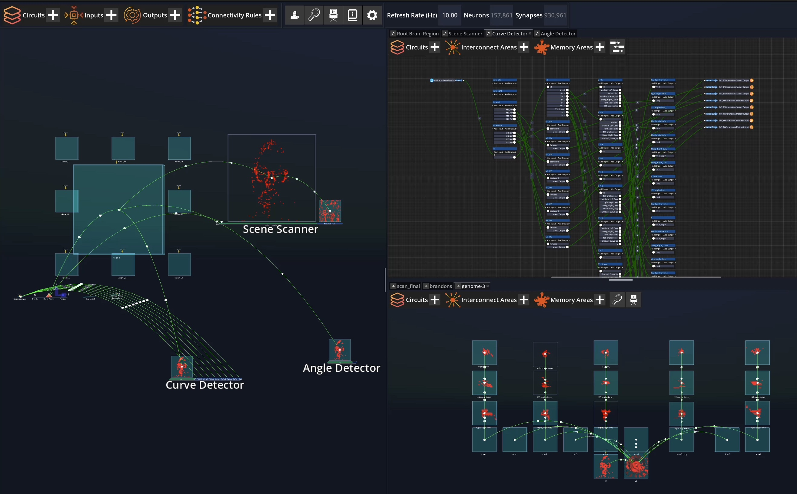

# FEAGI Python SDK

**Build AI agents that learn like biological brains**

[](https://pypi.org/project/feagi/) [](https://pypi.org/project/feagi/) [](https://discord.gg/PTVC8fyGN8) [](https://opensource.org/licenses/Apache-2.0)



---

## What is FEAGI?

**FEAGI (Framework for Evolutionary Artificial General Intelligence)** is a biologically inspired, modular neural execution engine designed for **embodied AI and robotics**. FEAGI enables perception, cognition, and control through **spiking neural circuits** across simulated and physical embodiments, with a strong emphasis on **real-time interaction, modularity, and cross-platform deployment**.

FEAGI includes a [**3D brain visualizer**](https://github.com/feagi/brain-visualizer) for real-time neural activity and official open source SDKs for [Python](https://github.com/feagi/feagi-python-sdk) (this repository), [Rust](https://github.com/feagi/feagi-core/tree/staging/crates/feagi-agent), and [Java](https://github.com/feagi/feagi-java-sdk). Together they support a growing ecosystem of reusable neural components ("brains"), tools, and integrations for robotics and physical AI.

[**Neurorobotics Studio**](http://brainsforrobots.com/nrs) is FEAGI's desktop application for working with brains, simulations, and embodiments in a unified environment.

### The FEAGI Python SDK

The FEAGI Python SDK provides the tools you need to:

- **Connect robots and devices** to FEAGI's neural network
- **Build learning agents** for robots, simulators, and games
- **Visualize neural activity** in real-time with Brain Visualizer
- **Control and manage FEAGI** from Python code
- **Interface with diverse embodiments** through standardized communication protocols

---

## Quick Start

```bash
pip install feagi
feagi start
feagi bv start
```

That installs the **`feagi`** package (engine, Brain Visualizer, and SDK), starts FEAGI with default configuration, and opens the Brain Visualizer. The same flow works on Linux, macOS, and Windows.

---

## Installation

Quick Start uses **`feagi`**. If you need a smaller install without Brain Visualizer, use **`feagi-core`** instead. Imports are the same for both (`from feagi import ...`).

| Command | What you get |
| --- | --- |
| **`pip install feagi`** | Full install: neuronal engine, [**Brain Visualizer**](https://github.com/feagi/brain-visualizer) (adds ~196MB of platform binaries), Rust-backed Python bindings, and the agent SDK. **Recommended for most users.** |
| **`pip install feagi-core`** | Engine, bindings, and agent SDK **only**—no Brain Visualizer. **Recommended for production, CI, or headless setups.** |

---

## Key Concepts

* **Neuromorphic by Design** – FEAGI is built as a neuromorphic framework inspired by biological neural computation. While it currently runs on conventional CPUs and GPUs, **native support for neuromorphic hardware is a near-term roadmap item**, enabling direct execution on event-driven, spike-based accelerators as they mature.

* **Embodied Intelligence First** – FEAGI is designed to control bodies (robots, agents, simulations), not just process static data.

* **Spiking Neural Networks (SNNs)** – Uses event-driven neuron firing rather than frame-based inference.

* **Modular Neural Architecture** – Neural circuits can be composed like building blocks (Lego-like micro-circuits).

* **Real-Time Closed Loop** – Continuous perception → cognition → action loop.

* **Cross-Simulator & Hardware Support** – One brain, many bodies.

---

## Documentation

- [Documentation](https://github.com/feagi/feagi/tree/main/docs)
- [Examples](./examples/)

---

### Configuration Management

Initialize FEAGI environment with default configuration:

```bash
feagi init
```

This creates:
- Configuration: `~/.feagi/config/feagi_configuration.toml`
- Genomes directory: `~/Documents/FEAGI/Genomes/` (macOS/Windows) or `~/FEAGI/genomes/` (Linux)
- Connectomes directory: `~/Documents/FEAGI/Connectomes/` or `~/FEAGI/connectomes/`
- Logs and cache directories

**For complete configuration options and customization, see [DEPLOY.md](./DEPLOY.md).**

### Start FEAGI Engine from Python

```python
from feagi.engine import FeagiEngine

engine = FeagiEngine()
engine.load_config()  # Uses default config
engine.load_genome("my_brain.json")  # Loads from genomes directory
engine.start()
```

Or from command line:

```bash
feagi start --config ~/.feagi/config/feagi_configuration.toml --genome my_brain.json
```

### SDK Architecture

```
feagi/
├── agent/           # Agent framework (BaseAgent)
├── pns/             # Peripheral Nervous System (communication)
├── engine/          # Engine control
├── config/          # Configuration management
├── paths/           # Cross-platform path utilities
├── cli/             # Command-line tools
├── genome/          # Runtime genome manipulation (coming soon)
├── connectome/      # Brain state management (coming soon)
└── packaging/       # Marketplace packages (coming soon)
```


## Examples

See [`examples/`](./examples/) for complete agent implementations:
- Basic sensory agent
- Robot agent (SDK-based)
- Simulator agent (Webots)
- Vision processing

---


## Community & Support

- **Discord**: [Join our community](https://discord.gg/PTVC8fyGN8)
- **Issues**: [Report bugs](https://github.com/feagi/feagi-python-sdk/issues)
- **Neurorobotics Studio**: [Design and deployment desktop application](https://brainsforrobots.com/nrs)
- **Homepage**: [feagi.org](https://feagi.org)

---

## Requirements

- Python 3.10 or higher
- Works on Linux, macOS, and Windows

---

## License

Apache 2.0 - See [LICENSE](LICENSE) for details.

**Copyright 2016-2025 Neuraville Inc. All Rights Reserved.**

---

## About Neuraville

FEAGI is developed by **Neuraville**, a company focused on democratizing robotics and enabling the next generation of embodied AI through modular, biologically inspired intelligence systems.
