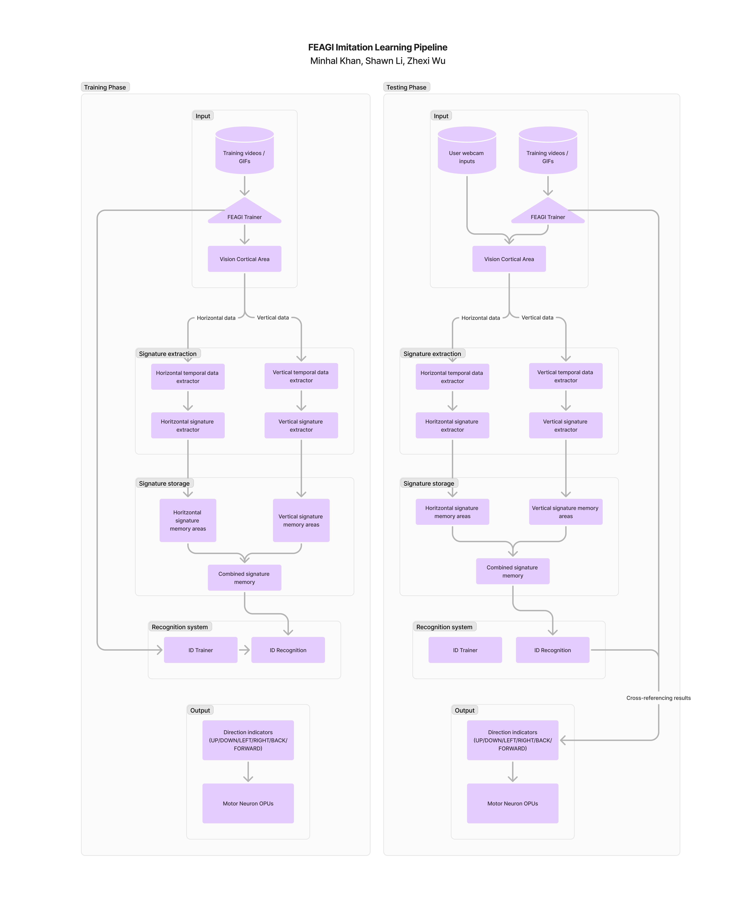

# Gesture Recognition

## Authors: Minhal Khan, Shawn Li, Zhexi Wu

### Overview

This genome is designed to recognize basic movement gestures by training and testing an AI model on visual inputs.

Our current implementation can be described in four parts:

1. **Input**: The visual cortical area registers all visual data that is fed into FEAGI. This is also where we process the inputs to remove any excess noise, either by tweaking the firing thresholds of the cortical area or by using lighting enhancement areas.

2. **Processing**: The input data is processed extensively to build a kind of “signature” that can uniquely identify a particular gesture. This data is combined and stored within a memory unit, which in turn passes that data to the training and testing region.

3. **Training**: We use a supervised training approach where labeled videos are fed into the genome by means of an external controller script. Each video’s label corresponds to the voxels of the ID Trainer. For example, a video containing a leftward motion might be labeled 0-2-0, meaning it would correspond to the third voxel of the Trainer (because of zero-based indexing!). At the same time, this video is sent through the processing pipeline described in the previous section and its signatures are stored in the memory unit, which feeds them to the ID Recognition area via a *neuroplastic* connection. The ID trainer holds two important connections to the ID recognition area—the first is an excitatory connection that promotes “correct” associations, meaning that the ID recognition should flash the same voxel as the ID Trainer. The second is an inhibitory connection that suppresses wrong associations. In tandem, both connections help the model associate each video with the corresponding voxel.

4. **Testing**: After the model has been sufficiently trained, it is tested by feeding it new data in the form of visual inputs through the webcam embodiment. Ideally, the recognition area should recognize the gesture being performed, associate it with one of its learned labels, and route its output to one of the indicator areas.