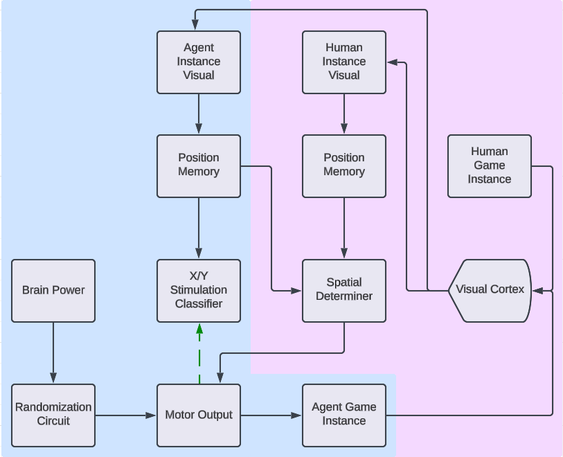

# Learning V1.1B

## Authors: Mason Gobat and Zac Chen

### General Structure

1. **Visual Cortex**: Is able to see the game screens. This is in Red, Green, and Blue in default, but for each game instance (Human vs AI) they are currently reduced to grayscale.
2. **X/Y Stimulus Decoder**: Attached to the AI visual cortex, this reduces the screen to x and y input. These are used to keep track of the AI agent in space as well as determine what the last input was used. This is combined with what the actual input pressed was for the ai to learn what actions each button causes.
3. **Human Spatial Comparator**: Attached to the human visual cortex, this also reduces the screen to x and y input. These are also used to keep track of the human in space, but is also compared to the left and right options from the X/Y stimulus decoder to give the ai an idea of how to move to mimic the human.

### Image Overview

