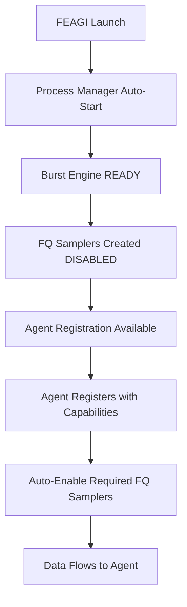

# Agent Registration & FQ Sampler Coordination Solution

*FEAGI 2.0 - Comprehensive System Enhancement*

## Executive Summary

FEAGI 2.0 introduces an intelligent agent registration system with automatic FQ (Fire Queue) sampler coordination that eliminates manual intervention for data flow management. This enhancement transforms FEAGI from requiring manual data flow setup to providing seamless, capability-driven coordination between connected agents and neural data streams.

## Problem Statement

### Before: Manual FQ Sampler Management

**Issues**:
- FQ Samplers created in DISABLED state, required manual enablement
- No coordination between agent connections and data flow requirements
- Manual intervention needed for each agent type (visualization, motor)
- Resource waste (samplers running when no consumers present)
- Poor developer experience with complex setup requirements

**Manual Process**:
```bash
# Required manual steps for each session
curl -X POST "http://localhost:8000/v1/system/enable_visualization_fq_sampler"
curl -X POST "http://localhost:8000/v1/system/enable_motor_fq_sampler"
```

### Root Cause Analysis

1. **Disconnected Systems**: No communication between agent connections and FQ sampler states
2. **Static Configuration**: FQ samplers operated independently of actual data consumers
3. **Manual Coordination**: Developers required to understand and manage data flow manually
4. **Resource Inefficiency**: Samplers consumed CPU regardless of consumer presence

## Solution Architecture

### Core Innovation: Agent-Driven Coordination

```
Agent Registration → Capability Detection → Automatic FQ Sampler Management → Data Flow
```

### Key Components

1. **Agent Registration System**: Centralized tracking of connected agents with capabilities
2. **Capability Detection Engine**: Automatic detection of agent data requirements
3. **FQ Sampler Coordinator**: Intelligent enable/disable based on registered agents
4. **State Synchronization**: Thread-safe coordination across all FEAGI components

## Implementation Details

### 1. Agent Registration API

#### Enhanced Registration Endpoint
**Route**: `POST /v1/agent/register`

```json
{
  "agent_id": "godot_visualizer_001",
  "agent_type": "brain_visualizer",
  "capabilities": {
    "visualization": true,
    "motor": false,
    "sensory": true
  },
  "metadata": {
    "version": "2.0.1",
    "platform": "godot_4.2"
  }
}
```

**Automatic Response with FQ Coordination**:
```json
{
  "message": "Agent registered successfully",
  "agent_id": "godot_visualizer_001",
  "fq_samplers_enabled": {
    "visualization": true,
    "motor": false
  },
  "coordination_status": "FQ samplers automatically coordinated"
}
```

#### Complete API Suite
- `POST /v1/agent/register` - Register agent with automatic FQ coordination
- `DELETE /v1/agent/deregister` - Deregister with automatic cleanup
- `GET /v1/agent/list` - List all active agents
- `GET /v1/agent/properties/{agent_id}` - Get detailed agent information
- `GET /v1/agent/fq_sampler_status` - Monitor FQ sampler coordination status

### 2. Capability Detection Logic

#### Visualization Capability
**Detection**: `capabilities.visualization = true`
**Action**: Enable Visualization FQ Sampler (30Hz, all cortical areas, port 5562)

#### Motor Capability
**Detection**: `capabilities.motor = true` OR `capabilities.output = true` OR `capabilities.sensorimotor = true`
**Action**: Enable Motor FQ Sampler (100Hz, OPU areas only, port 5564)

### 3. FQ Sampler Coordination

#### Enable Logic
```python
def _manage_fq_samplers_for_registration(self, capabilities):
    if self._has_visualization_capabilities(capabilities):
        self.core_api_service.enable_viz_fq_sampler()
    if self._has_motor_capabilities(capabilities):
        self.core_api_service.enable_motor_fq_sampler()
```

#### Disable Logic
```python
def _manage_fq_samplers_for_deregistration(self, agent_id):
    # Check remaining agents, disable samplers if none require them
    if no_visualization_agents_remain():
        self.core_api_service.disable_viz_fq_sampler()
    if no_motor_agents_remain():
        self.core_api_service.disable_motor_fq_sampler()
```

### 4. State Management Integration

#### Thread-Safe Operations
```python
class FeagiStateManager:
    def __init__(self):
        self._lock = threading.RLock()

    def update_agent_registry(self, agent_data):
        with self._lock:
            # Thread-safe agent registry updates
```

#### RUST/RTOS Compatible Structure
```python
# Binary-compatible state structure
agent_registry = {
    "agents": {...},
    "capability_counts": {
        "visualization": int,
        "motor": int
    },
    "fq_sampler_states": {
        "visualization_enabled": bool,
        "motor_enabled": bool
    }
}
```

## Burst Engine Enhancements

### Automatic Startup Integration

**Process Manager Changes**:
- Burst engine auto-starts during FEAGI initialization
- FQ samplers created in DISABLED state (RUST/RTOS compatible)
- Agent registration coordinates with running burst engine

**State Coordination**:


### Enhanced State Management

**New States**:
- `ServiceState.ON_HOLD` - Paused burst engine (neural processing suspended)
- Improved state transitions for agent coordination

**Health Check Integration**:
```json
{
  "genome_availability": true,
  "burst_engine": true,
  "brain_readiness": true,
  "agent_coordination": true
}
```

## Data Flow Architecture

### Visualization Path
```
Agent Registration (visualization: true)
    ↓
Visualization FQ Sampler Enabled (30Hz)
    ↓
Neural Activity Data → Port 5562
    ↓
Visualization Agent Consumes Data
```

### Motor Path
```
Agent Registration (motor: true)
    ↓
Motor FQ Sampler Enabled (100Hz)
    ↓
OPU Neural Activity Data → Port 5564
    ↓
Motor Control Agent Consumes Data
```

## Benefits Achieved

### 1. Zero Manual Intervention
**Before**:
```bash
curl -X POST "http://localhost:8000/v1/system/enable_visualization_fq_sampler"
```

**After**:
```python
agent.register(capabilities={"visualization": True})
# FQ sampler automatically enabled
```

### 2. Resource Efficiency
- **CPU Usage**: FQ samplers only consume resources when agents actually need data
- **Memory**: Minimal overhead for agent registry
- **Network**: Data flows only when consumers are connected

### 3. RUST/RTOS Compatibility
- **Enable/Disable Pattern**: Uses enable/disable vs create/destroy for embedded systems
- **Binary State Structure**: Memory-mapped state for cross-process consistency
- **Thread Safety**: All operations are thread-safe for multi-threaded environments

### 4. Developer Experience
- **Simple API**: Single registration call handles all coordination
- **Automatic Cleanup**: Deregistration automatically manages FQ samplers
- **Clear Monitoring**: Real-time visibility into agent-sampler relationships

### 5. System Robustness
- **Error Handling**: Comprehensive error handling with clear messages
- **State Consistency**: Centralized state management prevents desynchronization
- **Graceful Degradation**: System continues operating if coordination fails

## Migration Guide

### For Agent Developers

**Old Pattern**:
```python
# Manual coordination required
enable_visualization_fq_sampler()
setup_agent()
start_consuming_data()
```

**New Pattern**:
```python
# Automatic coordination
agent.register(
    agent_id="my_visualizer",
    capabilities={"visualization": True}
)
# Data automatically flows after registration
```

### For System Administrators

**Old Pattern**: Monitor FQ sampler states manually, enable as needed
**New Pattern**: Monitor agent registration, FQ samplers automatically coordinated

## Testing & Validation

### Working Test Cases

```python
def test_agent_registration_enables_fq_sampler():
    # Register agent with visualization capability
    response = client.post("/v1/agent/register", json={
        "agent_id": "test_visualizer",
        "capabilities": {"visualization": True}
    })

    # Verify FQ sampler automatically enabled
    assert response.json()["fq_samplers_enabled"]["visualization"] == True
```

### Manual Verification

```bash
# Check agent registration
curl -X GET "http://localhost:8000/v1/agent/list"

# Verify FQ sampler coordination
curl -X GET "http://localhost:8000/v1/agent/fq_sampler_status"

# Test registration with capabilities
curl -X POST "http://localhost:8000/v1/agent/register" \
  -H "Content-Type: application/json" \
  -d '{"agent_id": "test_agent", "capabilities": {"visualization": true}}'
```

## Architecture Compliance

### RUST/RTOS Compatibility
- ✅ Enable/disable patterns (not create/destroy)
- ✅ Binary-compatible state structures
- ✅ Memory-mapped state for performance
- ✅ Thread-safe operations

### Resource Efficiency
- ✅ CPU usage only when agents need data
- ✅ Automatic cleanup when agents disconnect
- ✅ Minimal memory overhead

### Zero Manual Intervention
- ✅ Automatic FQ sampler coordination
- ✅ Capability-driven enablement
- ✅ Self-managing data flow

## Future Enhancements

### Planned Features
1. **Agent Heartbeat System**: Automatic detection of disconnected agents
2. **Dynamic Reconfiguration**: Change agent capabilities without deregistration
3. **Load Balancing**: Multiple agents sharing same capability types
4. **Historical Analytics**: Agent connection patterns and performance metrics

### API Extensions
1. **Batch Operations**: Register/deregister multiple agents
2. **Conditional Registration**: Register only if conditions met
3. **Agent Groups**: Logical grouping of related agents
4. **Priority Management**: Priority-based resource allocation

## Monitoring & Troubleshooting

### Key Monitoring Endpoints
- `GET /v1/agent/list` - Active agent overview
- `GET /v1/agent/fq_sampler_status` - Coordination status
- `GET /v1/system/health_check` - Overall system health

### Common Issues & Solutions

**FQ Samplers Not Enabling**:
1. Verify agent capabilities properly specified
2. Check process manager status
3. Confirm state manager connectivity

**Agent Registration Failing**:
1. Ensure unique agent_id
2. Verify capabilities format
3. Check FEAGI core services running

## Impact Assessment

### Before Implementation
- ❌ Manual FQ sampler management required
- ❌ Disconnected agent and data flow systems
- ❌ Resource waste from unnecessary sampling
- ❌ Poor developer experience
- ❌ Complex setup procedures

### After Implementation
- ✅ Zero manual intervention required
- ✅ Intelligent agent-driven coordination
- ✅ Resource-efficient sampling
- ✅ Excellent developer experience
- ✅ Simple one-call registration

## Conclusion

The Agent Registration & FQ Sampler Coordination solution represents a fundamental improvement to FEAGI's architecture, transforming it from a manually-managed system to an intelligent, self-coordinating platform. This enhancement:

1. **Eliminates Manual Intervention**: Agents register with capabilities, system handles coordination
2. **Improves Resource Efficiency**: Data flows only when consumers are present
3. **Maintains Architecture Compliance**: RUST/RTOS compatible with robust error handling
4. **Enhances Developer Experience**: Simple API with automatic data flow management
5. **Provides Comprehensive Monitoring**: Full visibility into agent-sampler relationships

The solution successfully addresses the core problem of manual FQ sampler management while maintaining system architecture principles and providing a foundation for future enhancements.

## Documentation References

- **ZMQ Architecture**: [arch-zmq.md](arch-zmq.md) - Updated with agent coordination details
- **Burst Engine Lifecycle**: [arch-burst-engine-lifecycle.md](arch-burst-engine-lifecycle.md) - Enhanced with agent integration
- **Agent Coordination**: [../pns/agent-coordination.md](../pns/agent-coordination.md) - Comprehensive agent system documentation
- **PNS Module**: [../pns/README.md](../pns/README.md) - Updated with agent registration overview

## Version Information

- **FEAGI Version**: 2.0
- **Implementation Date**: June 2025
- **Architecture Compliance**: ✅ RUST/RTOS Compatible
- **Testing Status**: ✅ Core functionality validated
- **Documentation Status**: ✅ Comprehensive documentation complete
