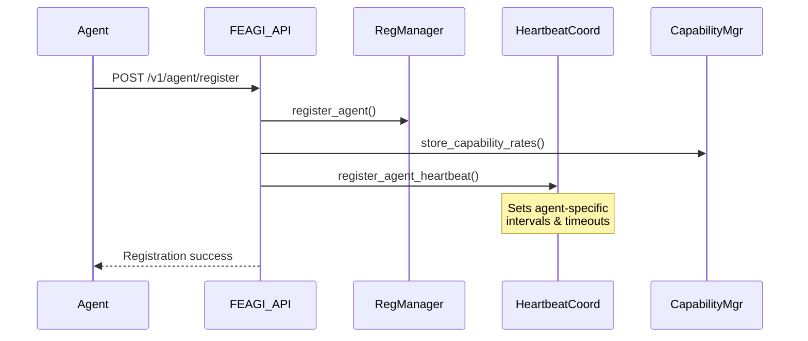
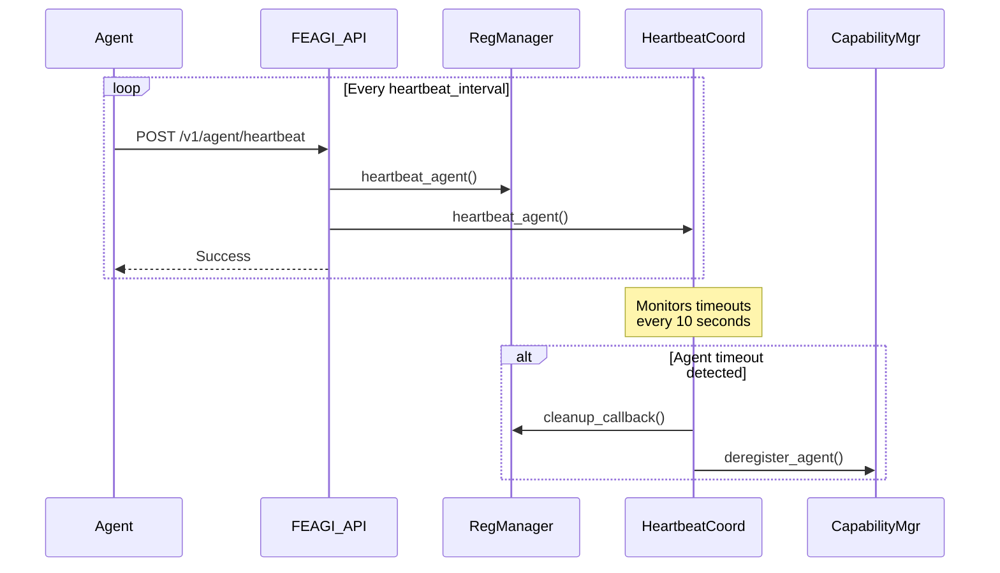

# Agent Lifecycle and Heartbeat Management System

## Overview

This document describes FEAGI's robust agent lifecycle management system, designed to prevent agents from being incorrectly removed due to infrastructure issues rather than genuine disconnections.

## Problem Analysis

### Root Cause Identified

The brain visualizer was being removed simultaneously with the video agent due to an overly aggressive cleanup system in `feagi/api/zmq/server.py`. The cleanup mechanism was:

1. **Running every 30 seconds** 
2. **Using a 60-second timeout threshold** (too short)
3. **Removing ALL agents** without heartbeat timestamps, instead of giving them grace periods
4. **Not differentiating** between agent types and their expected heartbeat patterns

### Key Issues Fixed

1. **Aggressive Timeouts**: Increased default timeout from 60s to 180s with minimum 30s
2. **Timestamp Handling**: Agents without `last_seen` timestamps now get grace periods instead of immediate removal
3. **Better Logging**: Added detailed timeout tracking with agent activity duration
4. **Capability Cleanup**: Integrated cleanup with the capability rate manager

## New Architecture Components

### 1. Agent Heartbeat Coordinator (`feagi/api/v1/agent_heartbeat_coordinator.py`)

A centralized heartbeat management system that:

- **Tracks heartbeat status** for all registered agents
- **Monitors timeout thresholds** based on agent type
- **Provides cleanup callbacks** for proper deregistration
- **Supports different heartbeat intervals** per agent type

```python
# Agent-specific heartbeat intervals
brain_visualizer: 15s interval, 60s timeout
video_agent: 10s interval, 45s timeout  
default: 30s interval, 90s timeout
```

### 2. Enhanced Agent Registration

**Automatic Heartbeat Registration**: When agents register via `/v1/agent/register`, they're automatically enrolled in heartbeat monitoring with appropriate timeouts.

**Integrated Cleanup**: Timeout callbacks handle deregistration from:
- Registration Manager
- Capability Rate Manager  
- State Manager
- Shared Memory cleanup

### 3. Dual Heartbeat System

**Two heartbeat endpoints** for different use cases:

1. **`POST /v1/agent/heartbeat`** - General agent heartbeat
2. **`POST /v1/visualization/heartbeat`** - Specialized for visualization clients

Both endpoints update both the Registration Manager and Heartbeat Coordinator.

## Implementation Details

### Agent Registration Flow



### Heartbeat Monitoring Flow



### Cleanup Prevention

**Grace Period Logic**: Agents without `last_seen` timestamps get their heartbeat updated instead of being removed:

```python
if not last_seen_iso:
    # Give benefit of the doubt - likely brain visualizer or agent without heartbeat
    if agent_id and reg.heartbeat_agent(agent_id):
        logger.info(f"⏰ Gave heartbeat grace to agent '{agent_id}' without timestamp")
    continue
```

**Minimum Timeout**: Enforced 30-second minimum timeout prevents overly aggressive cleanup.

## Client Implementation Guidelines

### Example Brain Visualizer Client

A complete example is provided in `examples/robust_brain_visualizer_client.py` demonstrating:

- **Proper registration** with capability declaration
- **Regular heartbeat sending** with failure recovery
- **Graceful shutdown** handling  
- **Network error resilience**
- **Re-registration** on consecutive failures

### Key Client Responsibilities

1. **Send heartbeats regularly** at the registered interval
2. **Handle network failures gracefully** with retries
3. **Re-register on consecutive heartbeat failures**
4. **Deregister properly on shutdown**

### Heartbeat Intervals by Agent Type

| Agent Type | Heartbeat Interval | Timeout Threshold |
|------------|-------------------|-------------------|
| `brain_visualizer` | 15 seconds | 60 seconds |
| `video_agent` | 10 seconds | 45 seconds |
| `default` | 30 seconds | 90 seconds |

## Configuration

### TOML Configuration

The system respects the `inactive_client_timeout` setting in the FEAGI configuration:

```toml
[timeouts]
inactive_client_timeout = 180000  # 3 minutes in milliseconds
```

**Default Values**:
- Minimum timeout: 30 seconds
- Default timeout: 180 seconds (3 minutes) 
- Cleanup check interval: 30 seconds
- Heartbeat coordinator check: 10 seconds

## Monitoring and Debugging

### Log Messages

**Registration**:
```
💗 Heartbeat monitoring enabled for brain_visualizer 'agent_id' (interval=15s, timeout=60s)
```

**Heartbeat Success**:
```
💗 Heartbeat recorded for agent 'agent_id' (reg_mgr=true, coordinator=true)
```

**Timeout Warning**:
```
🕐 Auto-deregistering stale agent 'agent_id' (inactive for 95.3s, threshold=90s)
```

**Grace Period**:
```
⏰ Gave heartbeat grace to agent 'agent_id' without timestamp
```

### Health Checks

**Agent Status Check**: Use `/v1/agent/list` to verify agents are properly registered.

**Heartbeat Statistics**: The example client includes statistics tracking for debugging.

## System Integration

### Startup Integration

The Heartbeat Coordinator is automatically started during FEAGI initialization in `ProcessManager.start()`.

### Shutdown Integration  

Proper cleanup is integrated into `ProcessManager.shutdown()` to stop heartbeat monitoring gracefully.

### Cross-System Coordination

The system integrates with:
- **Registration Manager**: Primary agent registry
- **Capability Rate Manager**: Multi-rate polling system
- **State Manager**: Legacy compatibility
- **ZMQ Server**: Network transport layer

## Benefits

1. **Prevents Premature Removal**: Agents stay registered until genuinely disconnected
2. **Agent-Type Awareness**: Different timeout policies for different agent types
3. **Network Resilience**: Handles temporary network issues gracefully
4. **Comprehensive Cleanup**: Proper deregistration from all system components
5. **Easy Debugging**: Detailed logging and monitoring capabilities
6. **Future-Proof**: Extensible architecture for additional agent types

## Migration Guide

### For Existing Agents

1. **No immediate action required** - the system provides backward compatibility
2. **Recommended**: Implement regular heartbeat sending for reliability
3. **Optional**: Use the example client as a reference for best practices

### For New Agents

1. **Must implement heartbeat** sending at regular intervals
2. **Use appropriate agent_type** during registration
3. **Handle heartbeat failures** with retry logic
4. **Implement graceful shutdown** with deregistration

This robust system ensures that only truly disconnected agents are removed, while maintaining the responsiveness needed for real-time neural processing.
