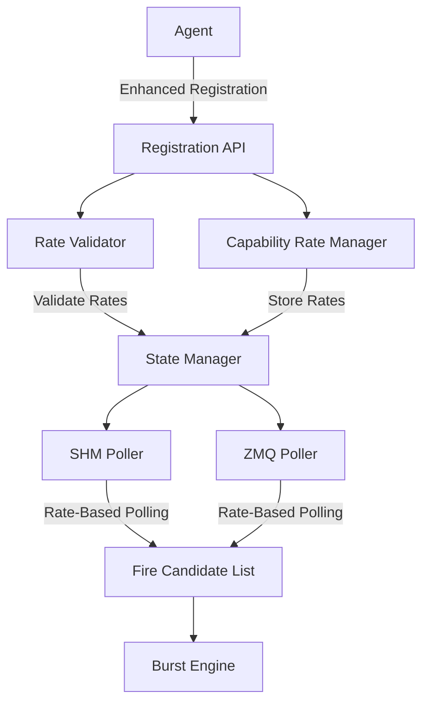

# Agent Registration & Multi-Rate Capability Architecture

**Document Version**: 1.0  
**Created**: 2024  
**Last Updated**: 2024

## Overview

This document describes FEAGI's enhanced agent registration system with multi-rate capability architecture. This system addresses the critical temporal pattern replay bug caused by frequency mismatches between agents and FEAGI's processing rate, while providing sophisticated capability-aware polling.

## Problem Statement

### Original Issue: Temporal Pattern Replay Bug

**Symptoms:**
- Neural activity continues long after agent disconnection
- Same temporal patterns repeat cyclically 
- FCL (Fire Candidate List) shows persistent neuron activity from "ghost" data

**Root Cause:**
```
Agent Data Rate:    20 Hz (video frames every 50ms)
SHM Polling Rate:   200 Hz (every 5ms) 
FEAGI Burst Rate:   1 Hz (every 1000ms)

Problem: During each 1000ms burst window, SHM poller reads 
the same frame data 200 times, injecting identical temporal 
patterns repeatedly into FCL.
```

**Architecture Flaw:**
The original design used fixed polling rates that were decoupled from agent data rates and FEAGI processing rates, causing massive temporal data buffering and replay.

## Solution Architecture

### Core Principles

1. **Rate Negotiation**: Agents specify desired rates during registration
2. **Capability Isolation**: Each capability (sensory, motor, etc.) has independent rates
3. **Rate Validation**: System prevents capability rates exceeding FEAGI global rate
4. **Synchronized Polling**: Polling frequency matches registered capability rates
5. **Temporal Consistency**: Each data point is processed exactly once

### Architecture Overview



## Component Details

### 1. Enhanced Agent Registration

#### Registration Protocol

**Endpoint**: `/v1/agents/register/enhanced`

**Request Structure**:
```json
{
  "agent_id": "video_agent_001",
  "agent_type": "vision_sensor",
  "agent_data_port": 5000,
  "agent_version": "1.2.0",
  "controller_version": "2.1.0",
  "agent_ip": "192.168.1.100",
  
  "feagi_rate_request": {
    "requested_feagi_rate_hz": 15.0,
    "justification": "High-speed video processing requires 15Hz"
  },
  
  "capability_rates": [
    {
      "capability_type": "sensory",
      "requested_rate_hz": 30.0,
      "required": true,
      "metadata": {
        "sensor_type": "camera",
        "resolution": "1920x1080"
      }
    },
    {
      "capability_type": "visualization", 
      "requested_rate_hz": 5.0,
      "required": false
    }
  ]
}
```

**Response Structure**:
```json
{
  "success": true,
  "agent_id": "video_agent_001",
  "message": "Agent registered with 2 capabilities",
  
  "feagi_rate_approved": true,
  "current_feagi_rate_hz": 15.0,
  "requested_feagi_rate_hz": 15.0,
  
  "capability_results": [
    {
      "capability_type": "sensory",
      "requested_rate_hz": 30.0,
      "approved_rate_hz": 15.0,
      "approved": true
    },
    {
      "capability_type": "visualization",
      "requested_rate_hz": 5.0, 
      "approved_rate_hz": 5.0,
      "approved": true
    }
  ],
  
  "approved_capabilities": ["sensory", "visualization"],
  "rejected_capabilities": []
}
```

#### Registration Flow

1. **Request Validation**: Validate request format and required fields
2. **FEAGI Rate Negotiation**: Process request to adjust global FEAGI rate
3. **Rate Validation**: Validate all capability rates against system limits
4. **Capability Registration**: Register approved capabilities with rate manager
5. **Legacy Registration**: Complete standard agent registration process
6. **Response Generation**: Build comprehensive response with negotiation results

### 2. Capability Types

#### Standard Capability Types

| Type | Description | Typical Rate Range | Default Rate |
|------|-------------|-------------------|--------------|
| `sensory` | Sensor data input | 1-60 Hz | 10 Hz |
| `motor` | Motor command output | 1-100 Hz | 20 Hz |  
| `visualization` | Visual activity data | 1-30 Hz | 5 Hz |
| `control` | Control messages | 0.1-10 Hz | 1 Hz |
| `neurons_stream` | Legacy neuron data | 1-50 Hz | 10 Hz |

#### Capability Rate Specification

```python
class CapabilityRateSpec(BaseModel):
    capability_type: CapabilityType
    requested_rate_hz: float = Field(gt=0, le=1000)
    required: bool = Field(default=True)
    metadata: Optional[Dict[str, Any]] = None
```

### 3. Rate Validation System

#### Validation Rules

1. **Global Rate Constraint**: `capability_rate <= feagi_global_rate`
2. **Range Limits**: `0.1 Hz <= capability_rate <= 1000 Hz`  
3. **FEAGI Rate Limits**: `0.1 Hz <= feagi_rate <= 100 Hz`
4. **Rate Change Limits**: FEAGI rate increases limited to 2x current rate

#### Validation Process

```python
def validate_capability_rates(self, capability_specs: List[CapabilityRateSpec]) -> Dict[CapabilityType, str]:
    """
    Validate capability rates against FEAGI global rate.
    Returns dict mapping capability types to rejection reasons.
    """
    rejections = {}
    
    for spec in capability_specs:
        if spec.requested_rate_hz > self.feagi_global_rate_hz:
            rejections[spec.capability_type] = f"Rate {spec.requested_rate_hz}Hz exceeds FEAGI rate {self.feagi_global_rate_hz}Hz"
    
    return rejections
```

#### Rate Optimization

The system suggests optimal rates that are divisors of the FEAGI global rate for efficiency:

```python
def suggest_optimal_rate(self, capability_type: CapabilityType, requested_rate_hz: float) -> float:
    """Find the largest divisor of FEAGI rate that's <= requested rate."""
    for divisor in [1, 2, 3, 4, 5, 6, 8, 10, 12, 15, 20, 24, 30, 40, 50, 60]:
        candidate_rate = self.feagi_global_rate_hz / divisor
        if candidate_rate <= requested_rate_hz and candidate_rate >= 0.1:
            return candidate_rate
    return requested_rate_hz
```

### 4. Capability Rate Manager

#### Core Responsibilities

- **Rate Storage**: Store per-agent, per-capability rate configurations
- **Polling Coordination**: Determine which agents should be polled when
- **Rate Updates**: Handle dynamic rate changes during runtime
- **State Persistence**: Integrate with FEAGI's state management system

#### Rate Configuration Storage

```python
@dataclass
class AgentCapabilityRate:
    agent_id: str
    capability_type: CapabilityType
    approved_rate_hz: float
    last_poll_time_ns: int = 0
    poll_count: int = 0
    
    @property
    def poll_interval_ns(self) -> int:
        return int(1_000_000_000 / self.approved_rate_hz)
    
    def should_poll_now(self, current_time_ns: int) -> bool:
        if self.last_poll_time_ns == 0:
            return True
        elapsed_ns = current_time_ns - self.last_poll_time_ns
        return elapsed_ns >= self.poll_interval_ns
```

#### Polling Coordination

```python
def get_agents_for_capability_polling(
    self, 
    capability_type: CapabilityType,
    current_time_ns: Optional[int] = None
) -> List[AgentCapabilityRate]:
    """Get agents whose specified capability should be polled now."""
    if current_time_ns is None:
        current_time_ns = time.time_ns()
    
    agents_to_poll = []
    for registry in self._agent_registries.values():
        rate_config = registry.get_capability_rate(capability_type)
        if rate_config and rate_config.should_poll_now(current_time_ns):
            agents_to_poll.append(rate_config)
    
    return agents_to_poll
```

### 5. Smart Polling Implementation

#### Rate-Based SHM Polling

The enhanced SHM polling system replaces fixed-rate polling with capability-aware scheduling:

**Before (Fixed Rate)**:
```python
while self.running:
    # Process all agents every 5ms regardless of their rates
    for agent_id, reader in self._slot_readers.items():
        slot_data = reader.read_latest()
        if slot_data:
            await self._process_neural_payload_bytes(slot_data.data)
    
    await asyncio.sleep(0.005)  # Fixed 5ms = 200Hz
```

**After (Capability-Aware)**:
```python
while self.running:
    current_time_ns = time.time_ns()
    
    # Only poll agents whose rates indicate they should be polled now
    agents_to_poll = capability_manager.get_agents_for_capability_polling(
        CapabilityType.SENSORY, current_time_ns
    )
    
    for agent_id, rate_config in agents_to_poll.items():
        reader = self._slot_readers[agent_id]
        slot_data = reader.read_latest()
        if slot_data:
            await self._process_neural_payload_bytes(slot_data.data)
            capability_manager.mark_capability_polled(
                agent_id, rate_config.capability_type, current_time_ns
            )
    
    # Smart sleep: sleep until next agent needs to be polled
    next_poll_time_ns = self._calculate_next_poll_time(capability_manager, current_time_ns)
    sleep_duration_ms = (next_poll_time_ns - current_time_ns) / 1_000_000.0
    await asyncio.sleep(max(0.001, min(0.1, sleep_duration_ms / 1000.0)))
```

#### Intelligent Sleep Calculation

```python
def _calculate_next_poll_time(self, capability_manager, current_time_ns: int) -> int:
    """Calculate when the next agent should be polled based on registered rates."""
    next_poll_times = []
    
    for agent_id in capability_manager.get_all_registered_agents():
        registry = capability_manager.get_agent_capabilities(agent_id)
        if registry:
            for capability_rate in registry.capabilities.values():
                next_poll = capability_rate.last_poll_time_ns + capability_rate.poll_interval_ns
                if next_poll > current_time_ns:
                    next_poll_times.append(next_poll)
    
    return min(next_poll_times) if next_poll_times else current_time_ns + 10_000_000  # 10ms default
```

### 6. Backward Compatibility

#### Legacy Registration Support

The system maintains full backward compatibility through automatic conversion:

**Legacy Endpoint**: `/v1/agents/register`  
**Behavior**: Automatically converts legacy requests to enhanced format with default rates

```python
def _convert_legacy_to_enhanced(self, legacy_request: AgentRegistrationRequest) -> EnhancedAgentRegistrationRequest:
    """Convert legacy registration to enhanced format with default rates."""
    default_rates = {
        "sensory": 10.0,
        "motor": 20.0,
        "visualization": 5.0,
        "neurons_stream": 10.0,
        "control": 1.0
    }
    
    capability_specs = []
    for cap_name, cap_config in legacy_request.capabilities.items():
        # Map to standard capability type and apply default rate
        capability_specs.append(
            CapabilityRateSpec(
                capability_type=self._map_legacy_capability(cap_name),
                requested_rate_hz=default_rates.get(cap_name.lower(), 10.0),
                required=True
            )
        )
    
    return EnhancedAgentRegistrationRequest(
        # ... copy legacy fields ...
        capability_rates=capability_specs
    )
```

## Configuration Examples

### High-Speed Vision Agent

```json
{
  "agent_id": "high_speed_camera",
  "agent_type": "vision_sensor",
  "feagi_rate_request": {
    "requested_feagi_rate_hz": 60.0,
    "justification": "High-speed visual processing for robotics"
  },
  "capability_rates": [
    {
      "capability_type": "sensory",
      "requested_rate_hz": 60.0,
      "required": true,
      "metadata": {
        "camera_fps": 120,
        "processing_mode": "real_time"
      }
    }
  ]
}
```

### Multi-Modal IoT Agent

```json
{
  "agent_id": "iot_sensor_hub",
  "agent_type": "environmental_sensor",
  "capability_rates": [
    {
      "capability_type": "sensory",
      "requested_rate_hz": 1.0,
      "required": true,
      "metadata": {
        "sensors": ["temperature", "humidity", "pressure"]
      }
    },
    {
      "capability_type": "motor",
      "requested_rate_hz": 0.5,
      "required": false,
      "metadata": {
        "actuators": ["ventilation", "heating"]
      }
    }
  ]
}
```

### Robotic Agent with Multiple Capabilities

```json
{
  "agent_id": "mobile_robot",
  "agent_type": "autonomous_vehicle", 
  "feagi_rate_request": {
    "requested_feagi_rate_hz": 20.0,
    "justification": "Real-time navigation and control"
  },
  "capability_rates": [
    {
      "capability_type": "sensory",
      "requested_rate_hz": 30.0,
      "required": true,
      "metadata": {"sensors": ["lidar", "camera", "imu"]}
    },
    {
      "capability_type": "motor",
      "requested_rate_hz": 50.0,
      "required": true,
      "metadata": {"actuators": ["wheels", "steering", "brakes"]}
    },
    {
      "capability_type": "visualization",
      "requested_rate_hz": 5.0,
      "required": false
    }
  ]
}
```

## System Integration

### State Manager Integration

Capability rates are stored in the FEAGI State Manager for persistence and system-wide access:

```python
# Store capability rates in agent registry
connected_agents[agent_id]["capability_rates"] = {
    "sensory": {
        "approved_rate_hz": 15.0,
        "poll_interval_ns": 66666666,
        "created_at": 1703123456.789
    }
}
```

### Monitoring and Statistics

The system provides comprehensive monitoring through the capability rate manager:

```python
def get_capability_statistics(self) -> Dict[str, Any]:
    """Get statistics about registered capabilities and polling rates."""
    return {
        "total_agents": len(self._agent_registries),
        "feagi_rate_hz": self._cached_feagi_rate_hz,
        "capabilities_by_type": {
            "sensory": 5,
            "motor": 3,
            "visualization": 2
        },
        "rate_distribution": {
            "1.0": 2,    # 2 capabilities at 1Hz
            "10.0": 4,   # 4 capabilities at 10Hz
            "15.0": 4    # 4 capabilities at 15Hz
        },
        "agents": {
            "agent_001": {
                "capability_count": 2,
                "capabilities": {
                    "sensory": {"rate_hz": 15.0, "poll_count": 1240},
                    "motor": {"rate_hz": 20.0, "poll_count": 1653}
                }
            }
        }
    }
```

## Performance Considerations

### Polling Efficiency

**Before**: Fixed 200Hz polling regardless of need
- **CPU Usage**: High (constant polling)
- **Memory**: Moderate (ring buffers)
- **Network**: High (unnecessary data transfers)
- **Temporal Accuracy**: Poor (data replay)

**After**: Rate-matched polling based on capability needs
- **CPU Usage**: Low (only poll when needed)
- **Memory**: Low (latest-only slots)  
- **Network**: Minimal (fresh data only)
- **Temporal Accuracy**: Excellent (no replay)

### Scalability

The system scales linearly with agent count rather than exponentially with polling frequency:

- **O(1)** time complexity for rate validation
- **O(n)** space complexity for n agents
- **O(log n)** time complexity for next-poll-time calculation
- **Bounded memory usage** with latest-only slots

### Resource Usage

| Component | Memory Usage | CPU Usage | Network Impact |
|-----------|--------------|-----------|----------------|
| Rate Manager | ~1KB per agent | Minimal | None |
| Validation | Constant | Low | None |
| Smart Polling | ~100B per capability | Variable (rate-dependent) | Reduced |
| Legacy Support | None (conversion only) | Minimal | None |

## Error Handling

### Registration Failures

| Error Scenario | HTTP Status | Response Handling |
|----------------|-------------|-------------------|
| Invalid rate format | 400 Bad Request | Validation error details |
| Rate exceeds FEAGI limit | 400 Bad Request | Rate limit explanation |
| Required capability rejected | 400 Bad Request | Specific rejection reasons |
| FEAGI rate change failed | 500 Internal Error | System error message |
| State manager unavailable | 503 Service Unavailable | Service dependency error |

### Runtime Error Recovery

- **Rate Manager Failure**: Falls back to legacy fixed-rate polling
- **State Persistence Error**: Continues with in-memory rates
- **Agent Disconnection**: Automatic cleanup of rate configurations
- **Invalid Rate Data**: Uses default rates with warning logs

## Migration Guide

### For Existing Agents

**No changes required** - existing agents continue working through automatic legacy conversion.

**Optional enhancements**:
1. Add explicit capability rate specifications
2. Request optimal FEAGI rates for your use case
3. Utilize enhanced response data for better coordination

### For New Agents

**Recommended approach**:
1. Use enhanced registration endpoint: `/v1/agents/register/enhanced`
2. Specify explicit capability rates based on your data characteristics
3. Request appropriate FEAGI rates if your application has specific timing needs
4. Handle rate negotiation results in your agent logic

### System Configuration

**FEAGI Configuration**:
```toml
[npu.burst_engine]
# Allow agents to request rate changes
allow_agent_rate_requests = true
max_rate_increase_factor = 2.0
min_global_rate_hz = 0.1
max_global_rate_hz = 100.0

[api.agent_registration]  
# Rate validation settings
max_capability_rate_hz = 1000.0
min_capability_rate_hz = 0.1
default_sensory_rate_hz = 10.0
default_motor_rate_hz = 20.0
```

## Testing

### Unit Tests

```python
def test_rate_validation():
    validator = CapabilityRateValidator(feagi_global_rate_hz=10.0)
    specs = [CapabilityRateSpec(
        capability_type=CapabilityType.SENSORY,
        requested_rate_hz=15.0  # Exceeds global rate
    )]
    rejections = validator.validate_capability_rates(specs)
    assert CapabilityType.SENSORY in rejections

def test_polling_schedule():
    manager = CapabilityRateManager(state_manager)
    # Register agent with 5Hz rate
    manager.register_agent_capabilities("test_agent", [
        CapabilityRateSpec(CapabilityType.SENSORY, 5.0)
    ])
    
    # Should not poll immediately after marking polled
    agents = manager.get_agents_for_capability_polling(CapabilityType.SENSORY)
    assert len(agents) == 0
    
    # Should poll after sufficient time passes
    time.sleep(0.21)  # > 200ms for 5Hz rate
    agents = manager.get_agents_for_capability_polling(CapabilityType.SENSORY) 
    assert len(agents) == 1
```

### Integration Tests

```python
async def test_enhanced_registration_flow():
    request = EnhancedAgentRegistrationRequest(
        agent_id="test_agent",
        capability_rates=[
            CapabilityRateSpec(CapabilityType.SENSORY, 10.0)
        ]
    )
    
    api = EnhancedAgentRegistrationAPI(core_api_service)
    response = await api.register_agent_enhanced(request)
    
    assert response.success
    assert len(response.approved_capabilities) == 1
    assert CapabilityType.SENSORY in response.approved_capabilities
```

### Performance Tests

```python
def test_polling_performance():
    # Test that rate-based polling reduces CPU usage
    # compared to fixed-rate polling
    
    # Setup agents with various rates
    setup_agents_with_rates([1, 5, 10, 15, 20])  # Hz
    
    # Measure CPU usage over time
    cpu_usage = measure_cpu_usage_over_time(duration=60)  # 60 seconds
    
    # Should be significantly lower than 200Hz fixed polling
    assert cpu_usage.average < FIXED_RATE_CPU_BASELINE * 0.3
```

## Security Considerations

### Rate Limit Protection

- **FEAGI Rate Changes**: Limited to 2x current rate to prevent system overload
- **Capability Rate Bounds**: Enforced minimums and maximums prevent abuse
- **Registration Rate Limiting**: Prevent rapid registration/deregistration attacks

### Validation Security

- **Input Sanitization**: All rate values validated for type and range
- **Agent Identity**: Rate configurations tied to authenticated agent IDs
- **State Isolation**: Agent rate configs isolated from each other

### Resource Protection  

- **Memory Bounds**: Rate manager uses bounded data structures
- **CPU Protection**: Smart polling prevents excessive CPU usage
- **Network Limits**: Rate validation prevents network flooding

## Future Enhancements

### Planned Features

1. **Dynamic Rate Adjustment**: Allow rate changes during runtime
2. **Rate Profiles**: Predefined rate configurations for common agent types  
3. **Adaptive Rates**: Automatically adjust rates based on system load
4. **Rate Analytics**: Detailed analysis and optimization recommendations
5. **Rate Scheduling**: Advanced scheduling algorithms for complex scenarios

### Research Areas

1. **Machine Learning Integration**: Predict optimal rates based on data patterns
2. **Resource-Aware Scheduling**: Adjust rates based on system resource availability
3. **Multi-Agent Coordination**: Coordinate rates across related agents
4. **Quality of Service**: Priority-based rate allocation

## Conclusion

The enhanced agent registration system with multi-rate capability architecture successfully addresses the temporal pattern replay bug while providing a sophisticated framework for agent-FEAGI communication. The system maintains backward compatibility while enabling fine-grained control over data flow rates, resulting in improved performance, temporal consistency, and resource efficiency.

Key benefits:

- **Eliminates temporal pattern replay bugs**
- **Provides per-capability rate control**
- **Maintains backward compatibility**
- **Reduces resource usage through intelligent polling**
- **Enables agent-driven rate optimization**
- **Supports complex multi-modal agents**

The architecture is designed for extensibility and can accommodate future enhancements while maintaining the core principles of rate negotiation and capability isolation.
