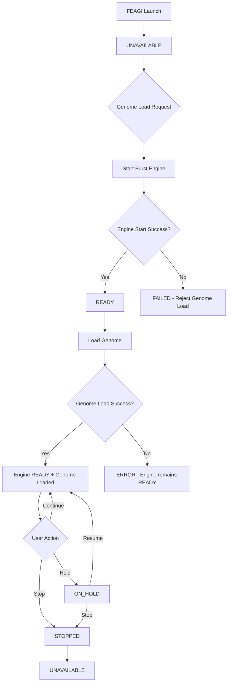

# Burst Engine Lifecycle Architecture

## Overview

The FEAGI burst engine follows a strict lifecycle that enforces system integrity and ensures proper neural processing management. This document outlines the complete burst engine lifecycle, states, and design principles.

## Design Principles

### 1. Engine-First Genome Loading
**Critical Design Rule**: The burst engine MUST be started before any genome can be loaded.

- **FEAGI Launch**: Burst engine starts in `UNAVAILABLE` state
- **Genome Load Request**: 
  1. ✅ **First**: Start burst engine → `READY` state
  2. ✅ **If engine start succeeds**: Proceed with genome loading
  3. ❌ **If engine start fails**: Reject genome load with error

### 2. State Integrity
The state manager is the single source of truth for burst engine status across all system components.

### 3. Fail-Fast Logic
Operations that require the burst engine will fail immediately with clear error messages rather than hanging or producing inconsistent results.

## Burst Engine States

### ServiceState Enumeration

```python
class ServiceState(Enum):
    UNAVAILABLE = "UNAVAILABLE"     # Engine not started
    INITIALIZING = "INITIALIZING"   # Engine starting up
    READY = "READY"                 # Engine running, processing neurons
    ON_HOLD = "ON_HOLD"            # Engine alive but paused (NEW)
    DEGRADED = "DEGRADED"          # Engine running with issues
    ERROR = "ERROR"                # Engine error state
    FAILED = "FAILED"              # Engine failed to start
    STOPPED = "STOPPED"            # Engine cleanly stopped
```

### New State: ON_HOLD

The `ON_HOLD` state represents a paused burst engine:
- Engine process remains alive
- Neural processing is suspended
- Configuration operations still available
- Can be resumed to `READY` state
- Useful for debugging, analysis, or controlled stepping

## Complete Lifecycle Workflow



## API Endpoints

### Core Control Endpoints

#### Start Engine
```http
POST /v1/burst_engine/start
```
- Transitions: `UNAVAILABLE` → `READY`
- **Required before genome loading**

#### Stop Engine  
```http
POST /v1/burst_engine/stop
```
- Transitions: `READY|ON_HOLD` → `UNAVAILABLE`

#### Hold Engine (NEW)
```http
POST /v1/burst_engine/hold
```
- Transitions: `READY` → `ON_HOLD`
- Pauses neural processing while keeping engine alive

#### Resume Engine (NEW)
```http
POST /v1/burst_engine/resume
```
- Transitions: `ON_HOLD` → `READY`
- Resumes neural processing

### Configuration Endpoints

#### Get Stimulation Period
```http
GET /v1/burst_engine/stimulation_period
```
- **Dependency**: Requires engine in `READY` or `ON_HOLD` state
- Returns: `1 / burst_frequency` in seconds
- **Fails** when engine is `UNAVAILABLE`

#### Get Status
```http
GET /v1/burst_engine/status
```
- Available in all states
- Returns current engine state and configuration

## Health Check Integration

The system health check enforces the design principle:

```json
{
  "genome_availability": true,
  "burst_engine": true,        // true if READY or ON_HOLD
  "brain_readiness": true
}
```

**Health Check Logic**:
- If `genome_loaded == true` AND `burst_engine != (READY|ON_HOLD)`:
  - **Auto-fix**: Start burst engine
  - **Log**: Design violation warning
  - **Result**: Enforce burst engine READY state

## Dependency Checks

### Standard Burst Engine Dependency
```python
async def check_burst_engine(request: Request):
    # Requires engine in READY state
    # Blocks all operations if engine not running
```

### Configuration Operations Dependency  
```python
async def check_burst_engine_or_allow_config_ops(request: Request):
    # Allows read-only config operations even when engine not READY
    # Used for: stimulation_period, config, status
```

### Processing Operations Dependency
```python
async def check_burst_engine_for_processing(request: Request):
    # Blocks if engine is ON_HOLD (paused)
    # Requires active neural processing
```

## Error Handling

### Engine Not Running
```json
{
  "success": false,
  "message": "Burst engine is not running!",
  "error_code": "HTTP_400"
}
```

### Engine On Hold
```json
{
  "success": false,
  "message": "Burst engine is on hold (paused) - resume to perform this operation",
  "error_code": "HTTP_400"
}
```

### Genome Load Failure
```json
{
  "success": false,
  "error": "Failed to start burst engine - genome load aborted"
}
```

## Implementation Architecture

### State Manager Integration
- **Singleton Pattern**: Single FeagiStateManager instance across all services
- **Memory-Mapped Storage**: High-performance state synchronization
- **Cross-Process Consistency**: FastAPI and ZMQ share same state

### Service Layer
```python
class BrainService:
    def start_burst_engine(self) -> bool:
        # Sets exit_condition = False
        # Sets burst_engine_state = ServiceState.READY
        
    def hold_burst_engine(self) -> bool:
        # Sets burst_engine_state = ServiceState.ON_HOLD
        # Keeps process alive, pauses neural processing
        
    def resume_burst_engine(self) -> bool:
        # Sets burst_engine_state = ServiceState.READY
        # Resumes neural processing
```

### Genome Service Integration
```python
def load_genome(self, genome_data, filename):
    # STEP 1: Start burst engine FIRST
    if not brain_service.start_burst_engine():
        return {"success": False, "error": "Failed to start burst engine"}
    
    # STEP 2: Proceed with genome loading
    # ... genome loading logic
```

## Rust/RTOS Compatibility

This design translates perfectly to Rust/RTOS environments:

### Memory Management
- **Lock-free**: Uses atomic state transitions
- **Deterministic**: Predictable memory access patterns
- **Real-time**: No garbage collection interference

### State Synchronization
```rust
use std::sync::atomic::{AtomicU8, Ordering};
use std::sync::Once;

static BURST_ENGINE_STATE: AtomicU8 = AtomicU8::new(0); // UNAVAILABLE

fn set_burst_engine_state(state: ServiceState) {
    BURST_ENGINE_STATE.store(state as u8, Ordering::SeqCst);
}
```

### Process Management
- **No Subprocesses**: Uses async tasks instead
- **Direct Memory**: Shared memory instead of environment variables
- **Zero-Copy**: Memory-mapped state structures

## Testing Strategy

### Unit Tests
- State transitions validation
- Dependency check behavior
- Error condition handling

### Integration Tests
- Full genome loading workflow
- Health check auto-recovery
- Cross-service state consistency

### Performance Tests
- State transition latency
- Memory-mapped synchronization overhead
- Burst engine start/stop times

## Monitoring and Observability

### Metrics
- Engine state transition counts
- Time in each state
- Auto-recovery trigger frequency
- Genome load success/failure rates

### Logging
```
🏠 Creating new state file: /tmp/feagi_state_1234567890.bin
🔗 Using shared state file from environment: /tmp/feagi_state_shared.bin
💥 Burst Engine state changed: UNAVAILABLE → READY
🧬 Genome state changed: LOADING → LOADED
⚠️ DESIGN VIOLATION: Genome loaded but burst engine not running - auto-fixing
✅ Auto-started burst engine to enforce design principle
```

## Migration Notes

### From Legacy System
1. **Remove subprocess architecture**: Use async tasks
2. **Eliminate environment variable IPC**: Use direct memory sharing  
3. **Replace exit_condition logic**: Use explicit state management
4. **Add hold/resume support**: Implement pause/resume capabilities

### Breaking Changes
- Genome loading now requires burst engine start
- New dependency check behavior
- Additional API endpoints for hold/resume

## Security Considerations

### State Integrity
- State manager singleton prevents race conditions
- Memory-mapped storage ensures consistency
- Atomic state transitions prevent partial updates

### Access Control
- Engine control operations require appropriate permissions
- State queries available to monitoring systems
- Configuration changes logged for audit trails

---

**Last Updated**: 2025-05-23  
**Version**: 2.0  
**Authors**: FEAGI Development Team 