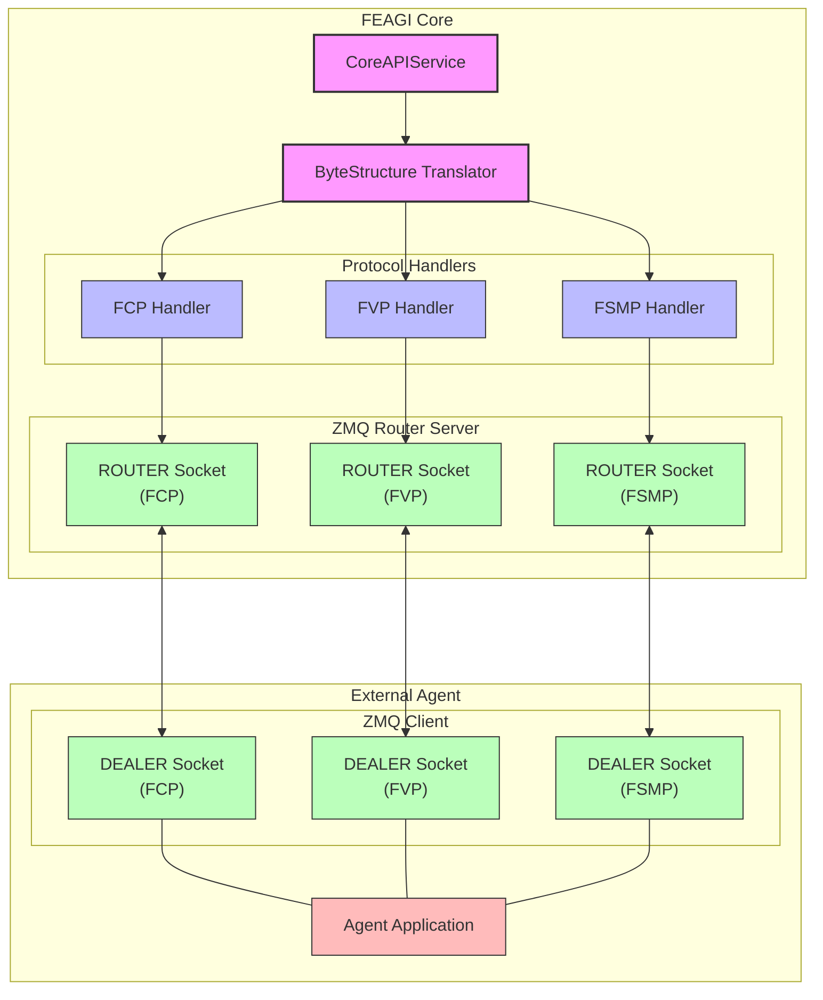
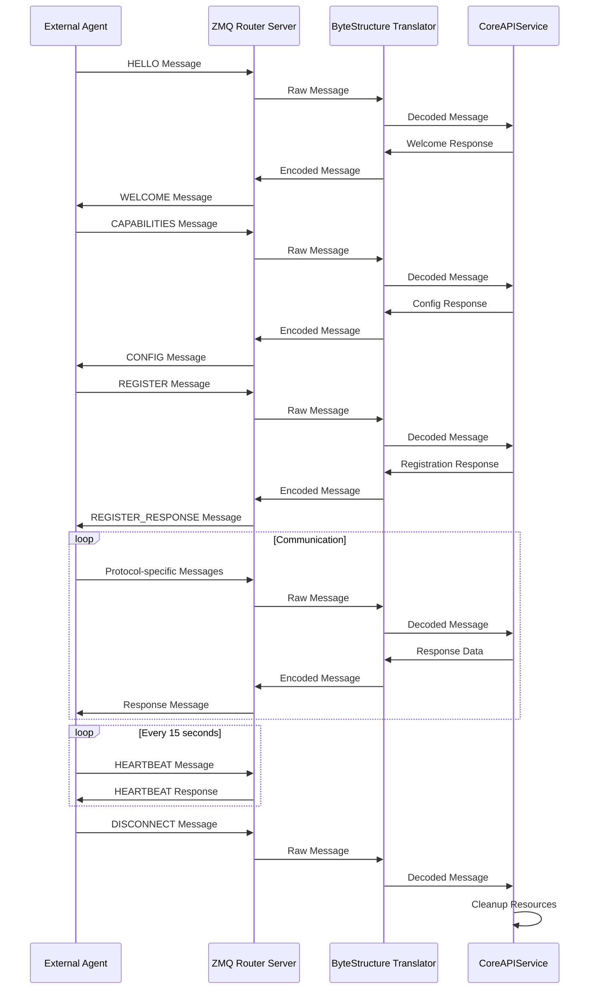
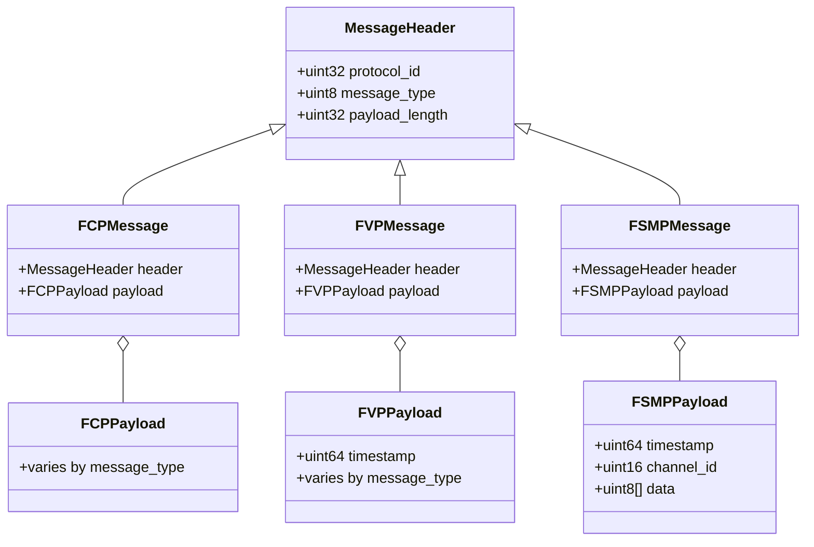

# FEAGI Protocol Architecture Diagram

*Last Updated: May 15, 2025*

This file contains Mermaid diagrams illustrating the protocol architecture of FEAGI.

## Protocol Architecture Overview

## Protocol Message Flow

## Protocol Binary Structure

