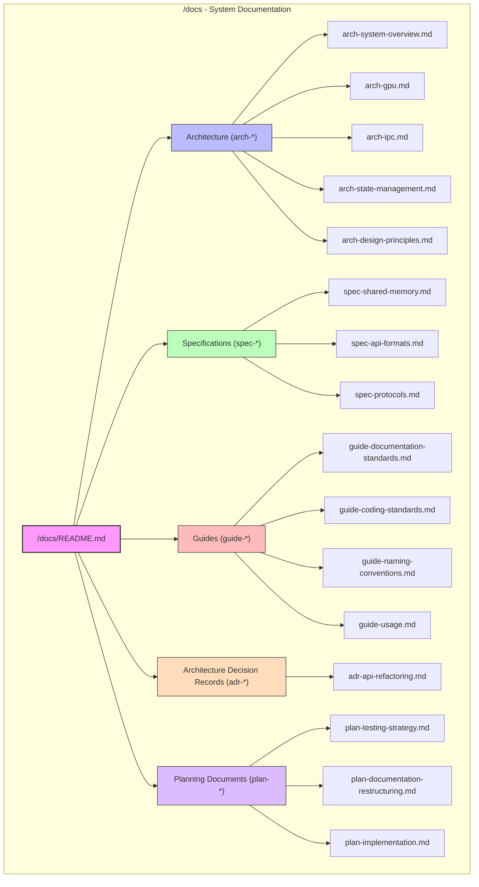
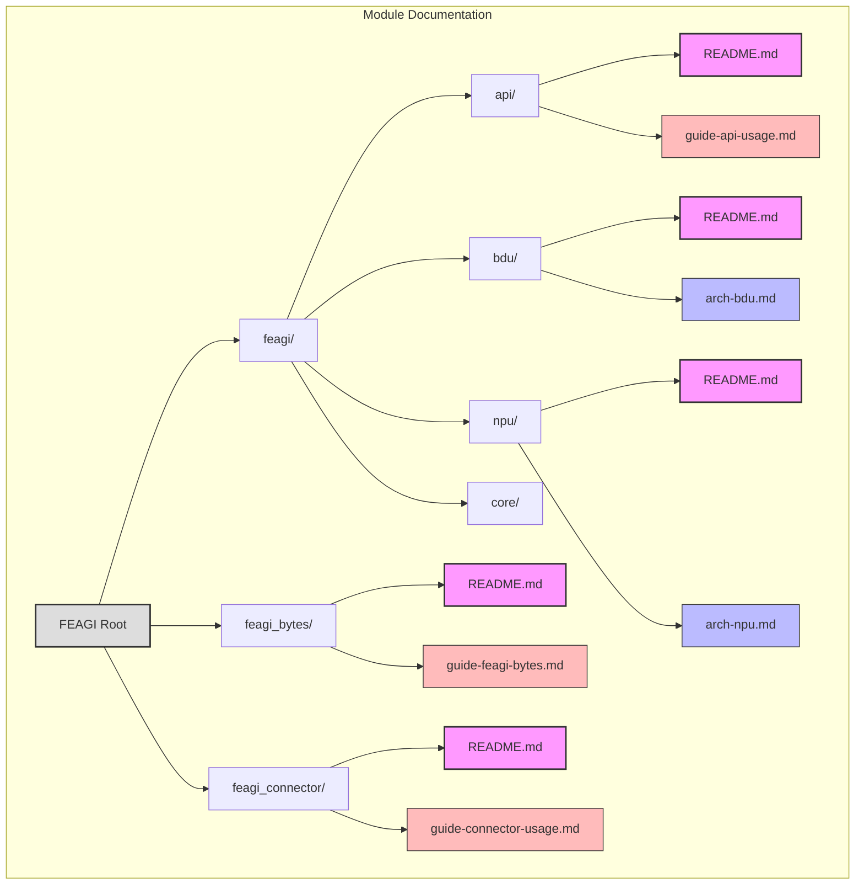

# FEAGI Documentation Structure Diagram

*Last Updated: May 15, 2025*

The following diagram illustrates the new FEAGI documentation structure.

## System Documentation Structure

## Module-Level Documentation Structure

## Documentation Category Legend

| Category | Prefix | Color | Purpose |
|----------|--------|-------|---------|
| Architecture | `arch-` | Blue | System design and component architecture |
| Specification | `spec-` | Green | Technical specifications and protocols |
| Guide | `guide-` | Red | Usage guides and standards |
| ADR | `adr-` | Orange | Architecture Decision Records |
| Planning | `plan-` | Purple | Project planning documents |
| README | `README.md` | Pink | Directory overviews | 