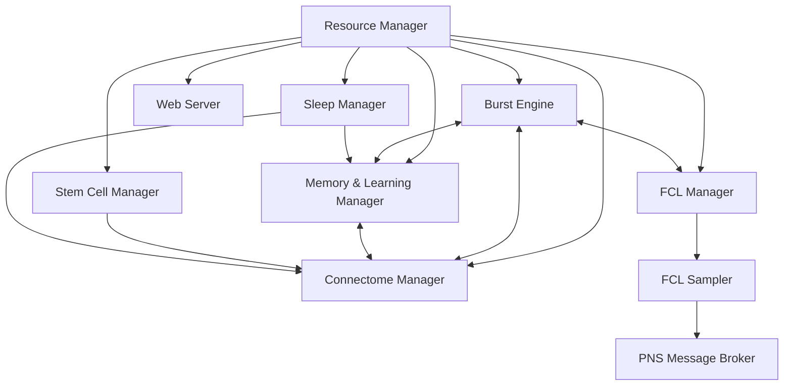

# FEAGI Processes and System Architecture

This document outlines the process architecture, system workflow, and component interactions within the Framework for Evolutionary Artificial General Intelligence (FEAGI). It focuses on optimizing performance, leveraging GPU acceleration, and ensuring proper prioritization of critical processes.

## Process Prioritization Framework

FEAGI employs a tiered prioritization system to ensure that critical neural processing operations receive appropriate computational resources, while allowing lower-priority processes to operate when resources permit.

### Priority 1 (Critical Real-Time Processes)

These processes require guaranteed computational resources and must run in real-time with minimal latency:

| Process | Description | Acceleration | Resource Requirements |
|---------|-------------|--------------|------------------------|
| **Burst Engine** | Core neural firing simulation | GPU preferred, CPU fallback | High compute, moderate memory |
| **Connectome Manager** | Manages synaptic weights and membrane potentials | GPU for weights/potentials, CPU for structure | Moderate compute, high memory |
| **Memory & Learning Manager** | Handles memory formation based on FCL dynamics | GPU for pattern detection, CPU for coordination | Moderate compute, moderate memory |
| **FCL Manager** | Maintains and updates Fire Candidate Lists | GPU for bitmap operations, CPU for management | Moderate compute, moderate memory |

### Priority 2 (Important but Interruptible Processes)

These processes are important for system function but can tolerate occasional delays:

| Process | Description | Acceleration | Resource Requirements |
|---------|-------------|--------------|------------------------|
| **FCL Sampler** | Samples FCL for visualization and motor output | CPU | Low compute, low memory |
| **PNS Message Broker** | Manages communication with peripherals | CPU | Low compute, low memory |

### Priority 3 (Background Processes)

These processes run in the background and can be delayed or paused without affecting core functionality:

| Process | Description | Acceleration | Resource Requirements |
|---------|-------------|--------------|------------------------|
| **Web Server (FastAPI)** | Provides REST API for management | CPU | Low compute, low memory |
| **Stem Cell Manager** | Handles neurogenesis and synaptogenesis | CPU | Moderate compute, moderate memory |
| **Sleep Manager** | Handles offline memory consolidation and learning | GPU when available, CPU fallback | High compute, moderate memory |

## System Architecture


### Core Process Interactions



## Backend Selection Strategy

FEAGI implements a flexible backend selection strategy to optimize performance across different hardware environments while maintaining consistency and reliability. This strategy allows FEAGI to automatically adapt to available hardware resources, with specific emphasis on GPU utilization when available.

### Detection and Selection Process

The backend selection follows a well-defined process:

1. **Resource Detection**:
   - During initialization, the ResourceManager detects available hardware resources
   - CPU cores and memory are enumerated
   - GPU availability is checked using multiple detection mechanisms
   - Available GPU memory and capabilities are cataloged

2. **Backend Preference Hierarchy**:
   - GPU with WebGPU (preferred for cross-platform compatibility)
   - GPU with specific libraries (CUDA/CuPy, PyTorch, TensorFlow)
   - Multi-core CPU with SIMD instructions
   - Standard CPU implementation

3. **Configuration-Based Overrides**:
   - Global configuration allows forcing CPU-only mode
   - Per-process backend preferences can be specified
   - Memory fraction controls for GPU utilization
   - Task-specific backend selection based on workload characteristics

### Implementation Design

```python
# Pseudocode example of backend selection
class BackendSelector:
    def __init__(self, resource_manager, config):
        self.resource_manager = resource_manager
        self.config = config
        self.available_backends = self._detect_available_backends()
        
    def _detect_available_backends(self):
        """Detect all available computation backends"""
        backends = ["cpu"]  # CPU is always available
        
        # Check for WebGPU support
        if self._check_webgpu_support():
            backends.append("webgpu")
            
        # Check for CUDA/CuPy support
        if self._check_cuda_support():
            backends.append("cuda")
            
        # Check for other specialized backends
        if self._check_metal_support():  # Apple's Metal API
            backends.append("metal")
            
        return backends
        
    def select_backend_for_task(self, task_name, task_requirements):
        """Select the best backend for a specific task"""
        # Respect configuration overrides
        if self.config.get("force_cpu_only", False):
            return "cpu"
            
        # Check task-specific requirements
        if task_requirements.get("requires_gpu", False) and not any(b != "cpu" for b in self.available_backends):
            raise RuntimeError(f"Task {task_name} requires GPU, but no GPU backend is available")
            
        # Select best available backend based on task characteristics and available resources
        if "parallel_friendly" in task_requirements and "webgpu" in self.available_backends:
            return "webgpu"
        elif "memory_intensive" in task_requirements and "cuda" in self.available_backends:
            return "cuda"
        
        # Default to CPU for tasks that don't benefit from GPU
        return "cpu"
```

### Multi-Backend Implementation

FEAGI implements a dual-path strategy for critical neural processing operations:

1. **GPU Path**:
   - Optimized using WebGPU for cross-platform compatibility
   - Compute shader implementations for key neural operations
   - Memory layout designed for GPU coalesced access patterns
   - Batch processing of neurons for optimal GPU utilization

2. **CPU Path**:
   - Vectorized implementation using SIMD instructions where possible
   - Multithreaded processing using thread pool
   - Cache-friendly memory layouts
   - Fallback for systems without GPU support

3. **Dynamic Dispatch**:
   - Runtime selection between paths based on available hardware
   - Seamless fallback if GPU becomes unavailable
   - Performance monitoring and automatic switching if needed

### Backend-Specific Optimizations

Each backend implementation is optimized for its target hardware:

#### WebGPU Implementation:
```wgsl
// Example WebGPU compute shader for neuron updating
@group(0) @binding(0) var<storage, read> neuron_props: array<NeuronProperties>;
@group(0) @binding(1) var<storage, read_write> membrane_potentials: array<f32>;
@group(0) @binding(2) var<storage, read> stimuli: array<f32>;
@group(0) @binding(3) var<storage, write> fired_neurons: array<u32>;

@compute @workgroup_size(256)
fn update_neurons(@builtin(global_invocation_id) global_id: vec3<u32>) {
    let neuron_id = global_id.x;
    if (neuron_id >= arrayLength(&neuron_props)) {
        return;
    }
    
    // Update membrane potential
    membrane_potentials[neuron_id] = membrane_potentials[neuron_id] * 
                                     neuron_props[neuron_id].decay +
                                     stimuli[neuron_id];
                                     
    // Check for firing
    if (membrane_potentials[neuron_id] >= neuron_props[neuron_id].threshold) {
        fired_neurons[neuron_id] = 1u;
        membrane_potentials[neuron_id] = neuron_props[neuron_id].reset_potential;
    } else {
        fired_neurons[neuron_id] = 0u;
    }
}
```

#### CPU Implementation:
```python
# Example CPU implementation with vectorization
def update_neurons_cpu(neuron_props, membrane_potentials, stimuli):
    # Vectorized operations using NumPy
    membrane_potentials *= neuron_props['decay']
    membrane_potentials += stimuli
    
    # Identify firing neurons
    firing_mask = membrane_potentials >= neuron_props['threshold']
    fired_neurons = np.where(firing_mask)[0]
    
    # Reset membrane potentials for fired neurons
    membrane_potentials[firing_mask] = neuron_props['reset_potential'][firing_mask]
    
    return fired_neurons
```

### Runtime Adaptation

FEAGI's backend system is designed to adapt during runtime:

1. **Dynamic Resource Monitoring**:
   - Continuous monitoring of GPU memory usage
   - Detection of thermal throttling or performance degradation
   - Adaptation to changing resource availability

2. **Graceful Degradation**:
   - If GPU resources become constrained, critical processes maintain GPU access
   - Lower-priority processes automatically shift to CPU
   - System maintains functionality with reduced performance

3. **Workload Splitting**:
   - Some workloads are split between GPU and CPU
   - Compute-bound operations on GPU
   - Memory-bound or serial operations on CPU
   - Dynamic load balancing based on current performance characteristics

### Configuration and Tuning

The backend selection system is highly configurable:

1. **Global Configuration**:
   ```json
   {
     "computing": {
       "default_backend": "auto",  // "auto", "gpu", "cpu"
       "gpu_memory_fraction": 0.8,
       "force_cpu_only": false,
       "enable_mixed_precision": true,
       "webgpu": {
         "preferred_adapter": "discrete",  // "discrete", "integrated", "cpu"
         "workgroup_size": 256
       }
     }
   }
   ```

2. **Process-Specific Settings**:
   ```json
   {
     "burst_engine": {
       "backend": "gpu",
       "fallback_allowed": true,
       "priority": "high"
     },
     "fcl_manager": {
       "backend": "gpu",
       "operations": {
         "bitmap_operations": "gpu",
         "query_processing": "cpu"
       }
     }
   }
   ```

### Testing and Validation

To ensure consistent behavior across backends:

1. **Numerical Validation**:
   - Regular comparison of GPU and CPU results for consistency
   - Tolerance thresholds for floating-point differences
   - Automated validation tests in CI pipeline

2. **Performance Benchmarking**:
   - Benchmarks for each backend to guide selection
   - Performance profiles for different hardware configurations
   - Calibration of threshold points for switching between backends

### Apple Silicon Support

FEAGI includes specialized support for Apple Silicon (M-series) SOCs, leveraging their unique architecture for neural processing:

1. **Metal API Integration**:
   - Native Metal compute shaders for accelerated processing
   - Metal Performance Shaders (MPS) for optimized neural operations
   - Direct memory access without PCIe transfer overhead

2. **Unified Memory Advantages**:
   - Exploitation of shared memory architecture of Apple Silicon
   - Zero-copy transfers between CPU and GPU domains
   - Memory pool allocation strategy to avoid redundant copies

3. **SOC-Specific Optimizations**:
   - Detection and utilization of Apple Neural Engine (ANE) when appropriate
   - Dynamic allocation of workloads across CPU, GPU, and ANE
   - Power-aware scheduling to maximize battery life on mobile devices

#### Metal Implementation Example:

```objc
// Example Metal shader for neuron updates on Apple Silicon
#include <metal_stdlib>
using namespace metal;

struct NeuronProperties {
    float threshold;
    float decay;
    float reset_potential;
};

kernel void update_neurons(
    device const NeuronProperties* neuron_props [[buffer(0)]],
    device float* membrane_potentials [[buffer(1)]],
    device const float* stimuli [[buffer(2)]],
    device atomic_uint* fired_neurons [[buffer(3)]],
    uint neuron_id [[thread_position_in_grid]])
{
    // Update membrane potential
    membrane_potentials[neuron_id] = membrane_potentials[neuron_id] * 
                                    neuron_props[neuron_id].decay +
                                    stimuli[neuron_id];
    
    // Check for firing
    if (membrane_potentials[neuron_id] >= neuron_props[neuron_id].threshold) {
        atomic_store_explicit(&fired_neurons[neuron_id], 1, memory_order_relaxed);
        membrane_potentials[neuron_id] = neuron_props[neuron_id].reset_potential;
    } else {
        atomic_store_explicit(&fired_neurons[neuron_id], 0, memory_order_relaxed);
    }
}
```

4. **Apple Silicon Detection and Configuration**:
   ```python
   def detect_apple_silicon():
       """Detect Apple Silicon and its capabilities"""
       import platform
       import subprocess
       
       is_apple_silicon = False
       has_neural_engine = False
       gpu_model = None
       
       if platform.system() == "Darwin":
           # Check processor type
           try:
               arch = subprocess.check_output(["uname", "-m"]).decode().strip()
               is_apple_silicon = arch == "arm64"
               
               if is_apple_silicon:
                   # Attempt to detect specific chip model
                   try:
                       sysctl_output = subprocess.check_output(
                           ["sysctl", "-n", "machdep.cpu.brand_string"]
                       ).decode().strip()
                       
                       # Parse chip model
                       if "M1" in sysctl_output:
                           gpu_model = "M1"
                           has_neural_engine = True
                       elif "M2" in sysctl_output:
                           gpu_model = "M2"
                           has_neural_engine = True
                       elif "M3" in sysctl_output:
                           gpu_model = "M3"
                           has_neural_engine = True
                   except:
                       pass
           except:
               pass
               
       return {
           "is_apple_silicon": is_apple_silicon,
           "has_neural_engine": has_neural_engine,
           "gpu_model": gpu_model
       }
   ```

5. **Memory Management for Apple Silicon**:
   ```python
   class AppleSiliconMemoryManager:
       """Specialized memory management for Apple Silicon"""
       
       def __init__(self):
           self.shared_pools = {}
           self.metal_device = self._get_metal_device()
           
       def _get_metal_device(self):
           """Get the Metal device for the integrated GPU"""
           # Implementation would use PyObjC or a Metal binding
           # to access the Metal device
           ...
           
       def allocate_shared_buffer(self, size, name):
           """Allocate a buffer in unified memory visible to both CPU and GPU"""
           # Create a buffer that can be accessed by both CPU and GPU
           # without transfers
           ...
           
       def optimize_for_neural_engine(self, tensor_data):
           """Prepare data in a format suitable for the Neural Engine"""
           # Convert and prepare data for the Neural Engine
           # with appropriate quantization if needed
           ...
   ```

6. **Performance Characteristics**:
   
   Apple Silicon performance for neural processing has some unique characteristics:
   
   | Operation | Performance Note |
   |-----------|------------------|
   | Matrix Multiplication | Excellent on GPU and ANE, benefits from half-precision |
   | Convolutions | Very efficient on ANE, good on GPU |
   | Element-wise Operations | Good throughput on GPU with unified memory |
   | Memory Bandwidth | Exceptionally high due to unified memory |
   | Power Efficiency | Superior performance-per-watt compared to discrete GPUs |

7. **Integration with WebGPU**:
   
   Apple Silicon supports WebGPU through Metal:
   
   - Native WebGPU implementations map directly to Metal
   - Near-native performance for compute operations
   - Consistent API between macOS, iOS, and other platforms
   - Allows single codebase to work efficiently across platforms

## Process Implementation

### Resource Manager

The Resource Manager serves as the orchestrator for all FEAGI processes. It:

1. Initializes data structures
2. Allocates computational resources based on process priority
3. Monitors system health and process performance
4. Implements quality-of-service policies
5. Manages process lifecycle (start, stop, restart)

```python
# Pseudocode example
class ResourceManager:
    def __init__(self, config):
        self.config = config
        self.processes = {}
        self.resource_allocations = self._calculate_resource_allocations()
        
    def _calculate_resource_allocations(self):
        # Determine CPU cores and GPU resources for each process
        # based on available hardware and priority levels
        ...
        
    def start_all(self):
        # Start all processes with appropriate resource limits
        self._start_priority_1_processes()
        self._start_priority_2_processes()
        self._start_priority_3_processes()
        
    def _start_priority_1_processes(self):
        # Start critical processes with highest resource allocation
        self.processes['burst_engine'] = self._start_process(
            BurstEngine, 
            cpu_cores=self.resource_allocations['burst_engine']['cpu'],
            gpu_memory=self.resource_allocations['burst_engine']['gpu']
        )
        ...
```

### Burst Engine Process

The Burst Engine is responsible for the core neural simulation:

1. Receives neuron states and connectivity from Connectome Manager
2. Updates membrane potentials based on inputs
3. Determines which neurons fire
4. Updates the FCL via the FCL Manager
5. Propagates signals through synapses

```python
# Pseudocode example
class BurstEngine:
    def __init__(self, connectome, fcl_manager):
        self.connectome = connectome
        self.fcl_manager = fcl_manager
        self.use_gpu = self._check_gpu_availability()
        
    def run_cycle(self):
        # Get active neurons
        active_neurons = self.connectome.get_active_neurons()
        
        if self.use_gpu:
            # GPU implementation
            self._update_potentials_gpu(active_neurons)
            firing_neurons = self._determine_firing_neurons_gpu(active_neurons)
        else:
            # CPU implementation
            self._update_potentials_cpu(active_neurons)
            firing_neurons = self._determine_firing_neurons_cpu(active_neurons)
            
        # Update FCL with firing neurons
        self.fcl_manager.update_fcl(self.timestep, firing_neurons)
        
        # Propagate signals
        self._propagate_signals(firing_neurons)
        
        self.timestep += 1
```

### Connectome Manager Process

The Connectome Manager maintains the neural network structure and parameters:

1. Stores neuron properties in Structure of Arrays format
2. Maintains synapse connectivity and weights
3. Provides efficient access patterns for both CPU and GPU processing
4. Handles frequent updates to weights and potentials

```python
# Pseudocode example
class ConnectomeManager:
    def __init__(self):
        # Initialize Structure of Arrays for neurons
        self.neuron_properties = {
            'membrane_potentials': np.zeros(MAX_NEURONS, dtype=np.float32),
            'resting_potentials': np.zeros(MAX_NEURONS, dtype=np.float32),
            'thresholds': np.zeros(MAX_NEURONS, dtype=np.float32),
            # ...other properties
        }
        
        # Initialize synapse storage
        self.synapse_manager = SynapseManager()
        
    def update_membrane_potentials(self, neuron_ids, new_potentials):
        # Update membrane potentials for specified neurons
        self.neuron_properties['membrane_potentials'][neuron_ids] = new_potentials
        
    def get_active_neurons(self):
        # Return neurons that may be active (potential > some percentage of threshold)
        active_indices = np.where(
            self.neuron_properties['membrane_potentials'] > 
            0.5 * self.neuron_properties['thresholds']
        )[0]
        return active_indices
```

### FCL Manager Process

The FCL Manager handles the Fire Candidate List maintenance and queries:

1. Maintains the global FCL history
2. Maintains area-specific FCL histories with custom window sizes
3. Provides efficient query capabilities for temporal patterns
4. Supports both CPU and GPU-accelerated bitmap operations

```python
# Already implemented as part of your previous work
class EnhancedHierarchicalFCL:
    # ... implementation details from fcl_manager.py
```

### Memory & Learning Manager Process

The Memory & Learning Manager facilitates neural plasticity and memory formation:

1. Analyzes FCL patterns to detect memory formation
2. Applies synaptic weight updates based on activity
3. Implements various plasticity rules (STDP, homeostatic scaling)
4. Coordinates with Connectome Manager for weight updates

```python
# Pseudocode example
class MemoryLearningManager:
    def __init__(self, fcl_manager, connectome_manager):
        self.fcl_manager = fcl_manager
        self.connectome_manager = connectome_manager
        self.plasticity_rules = self._initialize_plasticity_rules()
        
    def process_learning(self):
        # Get recent firing patterns
        recent_patterns = self.fcl_manager.get_neurons_fired_in_last_n_steps(5)
        
        # Apply plasticity rules
        for rule in self.plasticity_rules:
            weight_updates = rule.compute_updates(recent_patterns)
            self.connectome_manager.apply_weight_updates(weight_updates)
            
    def _initialize_plasticity_rules(self):
        return [
            STDPRule(),
            HomeostasisRule(),
            # Other plasticity rules
        ]
```

### FCL Sampler Process

The FCL Sampler asynchronously samples the FCL for visualization and motor control:

1. Samples FCL at a configurable frequency
2. Extracts motor neuron activity for peripheral control
3. Prepares visualization data
4. Forwards data to PNS Message Broker

```python
# Pseudocode example
class FCLSampler:
    def __init__(self, fcl_manager, pns_broker, config):
        self.fcl_manager = fcl_manager
        self.pns_broker = pns_broker
        self.sampling_rate = config.get('sampling_rate', 30)  # Hz
        self.sampling_mode = config.get('sampling_mode', 'frequency')  # 'frequency' or 'ratio'
        self.last_sample_time = 0
        
    def sample_loop(self):
        while True:
            current_time = time.time()
            
            # Determine if we should sample based on configuration
            should_sample = False
            if self.sampling_mode == 'frequency':
                if current_time - self.last_sample_time >= 1.0 / self.sampling_rate:
                    should_sample = True
            else:  # ratio mode
                if random.random() <= self.sampling_rate:
                    should_sample = True
                    
            if should_sample:
                # Get current FCL state
                fcl_data = self.fcl_manager.get_fcl_by_area()
                
                # Extract motor neuron activity
                motor_data = self._extract_motor_data(fcl_data)
                
                # Prepare visualization data
                viz_data = self._prepare_visualization_data(fcl_data)
                
                # Send to PNS broker
                self.pns_broker.send_motor_data(motor_data)
                self.pns_broker.send_visualization_data(viz_data)
                
                self.last_sample_time = current_time
                
            # Sleep to prevent CPU hogging
            time.sleep(0.001)  # 1ms sleep
```

### PNS Message Broker Process

The PNS Message Broker handles communication with external systems:

1. Sends motor control signals to peripherals
2. Sends visualization data to display systems
3. Receives sensory input from peripherals
4. Manages multiple communication channels (ZMQ, WebSockets, etc.)

```python
# Pseudocode example
class PNSMessageBroker:
    def __init__(self, config):
        self.config = config
        self.zmq_context = zmq.Context()
        self.motor_socket = self._setup_motor_socket()
        self.viz_socket = self._setup_viz_socket()
        self.sensory_socket = self._setup_sensory_socket()
        
    def _setup_motor_socket(self):
        socket = self.zmq_context.socket(zmq.PUB)
        socket.bind(f"tcp://*:{self.config['motor_port']}")
        return socket
        
    def send_motor_data(self, motor_data):
        # Serialize and send motor control data
        serialized = json.dumps(motor_data)
        self.motor_socket.send_string(serialized)
        
    def send_visualization_data(self, viz_data):
        # Serialize and send visualization data
        serialized = json.dumps(viz_data)
        self.viz_socket.send_string(serialized)
        
    def receive_sensory_data(self):
        # Non-blocking receive of sensory data
        try:
            data = self.sensory_socket.recv_string(flags=zmq.NOBLOCK)
            return json.loads(data)
        except zmq.Again:
            return None
```

### Web Server Process (FastAPI)

The Web Server provides a REST API for FEAGI management:

1. Exposes endpoints for monitoring and control
2. Provides configuration interfaces
3. Offers visualizations and dashboards
4. Handles authentication and authorization

```python
# Pseudocode example
from fastapi import FastAPI, Depends, HTTPException

app = FastAPI(title="FEAGI API")

@app.get("/status")
async def get_status():
    # Return system status
    return {
        "status": "running",
        "uptime": get_uptime(),
        "process_stats": get_process_stats()
    }

@app.post("/cortical-areas")
async def create_cortical_area(area: CorticalAreaCreate):
    # Create a new cortical area
    try:
        area_id = connectome_manager.create_cortical_area(area)
        return {"id": area_id}
    except Exception as e:
        raise HTTPException(status_code=400, detail=str(e))
```

### Stem Cell Manager Process

The Stem Cell Manager handles neurogenesis and synaptogenesis:

1. Creates new neurons based on developmental rules
2. Establishes new synaptic connections
3. Modifies neural structure based on activity patterns
4. Runs asynchronously to avoid impacting critical processes

```python
# Pseudocode example
class StemCellManager:
    def __init__(self, connectome_manager, fcl_manager):
        self.connectome_manager = connectome_manager
        self.fcl_manager = fcl_manager
        self.development_rules = self._load_development_rules()
        
    def run_development_cycle(self):
        # Check activity patterns that might trigger neurogenesis
        recent_activity = self.fcl_manager.get_neurons_fired_in_last_n_steps(100)
        
        # Apply development rules
        for rule in self.development_rules:
            if rule.should_trigger(recent_activity):
                new_neurons = rule.generate_neurons()
                new_synapses = rule.generate_synapses()
                
                # Add to connectome
                self.connectome_manager.add_neurons(new_neurons)
                self.connectome_manager.add_synapses(new_synapses)
                
    def _load_development_rules(self):
        # Load rules from configuration
        return [
            ActivityBasedNeurogenesis(),
            HebbianSynaptogenesis(),
            # Other development rules
        ]
```

### Sleep Manager Process

The Sleep Manager handles offline memory consolidation and learning:

1. Activates during specified "sleep" periods
2. Reorganizes memories for better recall
3. Performs offline learning based on recent experiences
4. Runs cleanup and optimization operations

```python
# Pseudocode example
class SleepManager:
    def __init__(self, connectome_manager, fcl_manager, memory_manager):
        self.connectome_manager = connectome_manager
        self.fcl_manager = fcl_manager
        self.memory_manager = memory_manager
        self.sleep_stages = [
            RapidEyeMovementStage(),
            SlowWaveStage(),
            # Other sleep stages
        ]
        
    def enter_sleep(self, duration):
        # Notify system that sleep is starting
        logging.info(f"Entering sleep for {duration} seconds")
        
        start_time = time.time()
        end_time = start_time + duration
        
        while time.time() < end_time:
            # Cycle through sleep stages
            for stage in self.sleep_stages:
                if time.time() >= end_time:
                    break
                    
                # Execute stage-specific processes
                stage.process(
                    self.connectome_manager,
                    self.fcl_manager,
                    self.memory_manager
                )
                
        # Notify system that sleep is ending
        logging.info("Exiting sleep mode")
```

## Process Communication Architecture

FEAGI employs a hybrid communication architecture to balance performance with flexibility:

1. **Shared Memory** for high-performance critical processes:
   - Used between Priority 1 processes for minimal overhead
   - Implemented using NumPy arrays, memory mapping, or similar techniques
   - Careful synchronization to prevent race conditions

2. **Message Queues** for asynchronous communication:
   - ZeroMQ for high-performance messaging between process boundaries
   - Used for communications between different priority levels
   - Enables decoupling of producers and consumers

3. **REST API** for external communication:
   - HTTP-based interface for management and monitoring
   - Stateless design for easy scaling
   - Authentication and authorization mechanisms

## GPU Acceleration Strategy

FEAGI employs a comprehensive GPU acceleration strategy using WebGPU:

1. **WebGPU Advantages**:
   - Cross-platform support (Windows, macOS, Linux)
   - No vendor lock-in (works with NVIDIA, AMD, Intel, Apple)
   - Modern API with explicit memory control
   - Support for compute shaders and efficient memory management

2. **Key Accelerated Operations**:
   - Neuron membrane potential updates
   - Fire detection (threshold crossing)
   - Synapse weight updates
   - Learning rule application
   - Pattern detection for memory formation

3. **Hybrid Processing Strategy**:
   - GPU for massively parallel operations (neuron firing, weight updates)
   - CPU for complex logic and coordination
   - Automatic fallback to CPU when GPU is unavailable
   - Dynamic workload distribution based on hardware capabilities

4. **Memory Optimization**:
   - Structure of Arrays (SoA) layout for optimal GPU memory access
   - Efficient data packing to maximize GPU bandwidth utilization
   - Minimized CPU-GPU transfer overhead
   - Reuse of GPU buffers to prevent allocation overhead

## Quality of Service and Fault Tolerance

FEAGI implements several strategies to ensure reliable operation:

1. **Process Isolation**:
   - Critical processes run in separate OS processes for fault isolation
   - Failure of non-critical processes doesn't affect core simulation

2. **Resource Limiting**:
   - CPU and memory limits for each process based on priority
   - Prevents lower-priority processes from impacting critical ones

3. **Health Monitoring**:
   - Heartbeat mechanism for all processes
   - Automatic restart of failed processes
   - Graceful degradation when resources are constrained

4. **Checkpointing**:
   - Regular state saves for recovery after crashes
   - Ability to resume from last stable checkpoint
   - Incremental checkpoints to minimize performance impact

## System Workflow

The typical FEAGI system workflow follows these steps:

1. **Initialization**:
   - Resource Manager starts and allocates resources
   - Critical Priority 1 processes are launched
   - Initial connectome is loaded or created
   - Priority 2 and 3 processes are started

2. **Runtime Operation**:
   - Burst Engine continuously processes neural activity
   - FCL Manager maintains and updates firing history
   - Memory & Learning Manager applies plasticity rules
   - FCL Sampler periodically extracts data for visualization and motor control
   - PNS Message Broker handles communication with peripherals

3. **Development and Learning**:
   - Stem Cell Manager periodically runs to create new neurons and connections
   - Memory & Learning Manager continuously updates synaptic weights
   - Sleep Manager activates during specified periods for memory consolidation

4. **Monitoring and Management**:
   - Web Server provides API for monitoring and control
   - Resource Manager monitors system health and adjusts resource allocation

## Deployment Considerations

FEAGI supports multiple deployment scenarios:

1. **Single Machine**:
   - All processes run on one physical or virtual machine
   - Resource allocation optimized for available hardware
   - Suitable for development and smaller simulations

2. **Distributed Deployment**:
   - Critical processes run on high-performance compute nodes
   - Visualization and API services run on separate nodes
   - ZMQ messaging for inter-node communication
   - Suitable for large-scale simulations

3. **Container-Based Deployment**:
   - Each process group runs in a separate container
   - Kubernetes or Docker Compose for orchestration
   - Resource limits enforced at container level
   - Enables easy scaling and management

## Implementation Roadmap

1. **Phase 1: Core Framework**:
   - Resource Manager implementation
   - Process prioritization framework
   - Basic inter-process communication

2. **Phase 2: Critical Processes**:
   - Burst Engine with CPU and GPU paths
   - Connectome Manager with efficient data structures
   - FCL Manager with hierarchical support
   - Memory & Learning Manager for basic plasticity

3. **Phase 3: Secondary Processes**:
   - FCL Sampler for visualization and motor control
   - PNS Message Broker for peripheral communication
   - Web Server with basic API endpoints

4. **Phase 4: Background Processes**:
   - Stem Cell Manager for neurogenesis
   - Sleep Manager for memory consolidation
   - Advanced monitoring and management

5. **Phase 5: Performance Optimization**:
   - Profiling and optimization of critical paths
   - Advanced GPU acceleration
   - Distributed deployment support

## Conclusion

The FEAGI process architecture is designed to maximize performance, ensure proper resource allocation, and enable scalable brain simulation. By separating processes based on priority and leveraging GPU acceleration where appropriate, FEAGI can efficiently simulate complex neural networks while providing rich visualization and control capabilities.

This architecture supports the evolutionary approach to artificial general intelligence, allowing the system to grow, adapt, and learn from experience while maintaining high performance and stability. 