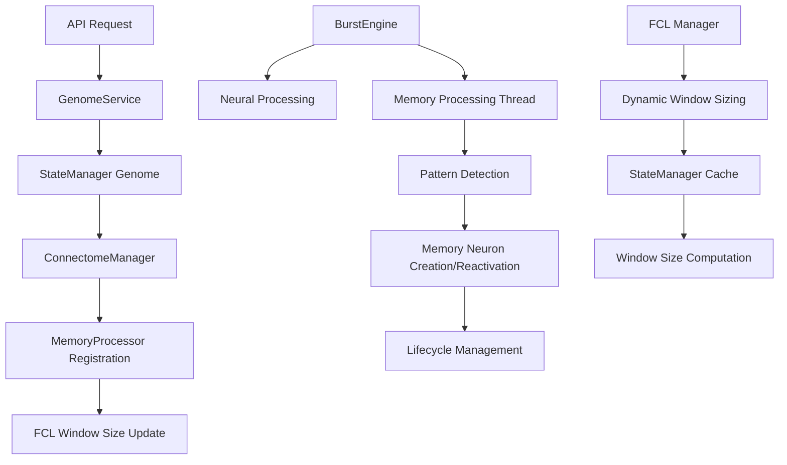

# FEAGI Memory System Architecture

*Version: 2.0 | Last Updated: January 2025*

## Table of Contents

1. [Overview](#overview)
2. [Architecture Philosophy](#architecture-philosophy)
3. [Core Components](#core-components)
4. [Memory Formation Process](#memory-formation-process)
5. [Short-Term to Long-Term Memory Transition](#short-term-to-long-term-memory-transition)
6. [Temporal Pattern Detection](#temporal-pattern-detection)
7. [FCL Dynamic Window Sizing](#fcl-dynamic-window-sizing)
8. [Integration Architecture](#integration-architecture)
9. [Configuration & Setup](#configuration--setup)
10. [API Usage & Examples](#api-usage--examples)
11. [Performance Optimization](#performance-optimization)
12. [Debugging & Monitoring](#debugging--monitoring)
13. [Future Enhancements](#future-enhancements)

---

## Overview

FEAGI's Memory System implements a sophisticated short-term/long-term memory architecture inspired by biological neural networks. The system creates abstract memory neurons based on temporal firing patterns from upstream cortical areas, managing their lifecycle through aging, reactivation, and eventual conversion to long-term memory.

### Key Features

- **Temporal Pattern-Based Memory Formation**: Memory neurons are created based on unique temporal firing patterns across multiple cortical areas
- **Dynamic Lifecycle Management**: Memory neurons age over time, can be reactivated to extend lifespan, and convert to long-term memory
- **CPU-Optimized Parallel Processing**: Runs alongside GPU neural processing without interference
- **Dynamic FCL Window Sizing**: Automatically adjusts temporal tracking windows based on connected memory areas
- **High-Performance Pattern Matching**: Uses RoaringBitmap serialization for optimal pattern comparison
- **Scalable Architecture**: Designed for hundreds of millions of neurons with minimal performance impact

---

## Architecture Philosophy

### Biological Inspiration

The memory system is inspired by several key principles of biological memory:

1. **Pattern-Based Encoding**: Memories are formed by unique patterns of neural activity rather than individual neurons
2. **Temporal Depth**: Memory formation considers sequences of activity over time, not just instantaneous states
3. **Use-It-or-Lose-It**: Memories that aren't reactivated gradually fade and die
4. **Strengthening Through Repetition**: Repeated activation of the same pattern strengthens and extends memory lifespan
5. **Long-Term Potentiation**: Memories that persist long enough become permanent long-term memories

### Technical Design Principles

1. **Separation of Concerns**: Memory neurons are completely separate from regular neurons (CPU vs GPU)
2. **Performance Isolation**: Memory processing runs in parallel without blocking neural computation
3. **Deterministic Behavior**: All memory operations are predictable and testable
4. **Cross-Platform Compatibility**: Designed for Rust/RTOS migration and embedded systems
5. **Configuration-Driven**: All parameters are configurable without code changes

---

## Core Components

### 1. MemoryNeuronArray

**Location**: `feagi/bdu/models/memory_neuron.py`

The MemoryNeuronArray implements a Structure of Arrays (SoA) specifically designed for memory neurons with lifecycle properties.

#### Key Properties

```python
# Lifecycle Management
lifespan_current: np.uint32     # Current remaining lifespan in burst cycles
lifespan_initial: np.uint32     # Initial lifespan when created
lifespan_growth_rate: np.float32 # Additive increment (in bursts) applied on each reactivation
is_longterm_memory: np.bool_    # Whether neuron has converted to long-term memory

# Temporal Tracking
creation_burst: np.uint64       # Burst when neuron was created
last_activation_burst: np.uint64 # Last time pattern was detected
activation_count: np.uint32     # Total number of activations

# Pattern Association
pattern_to_index: Dict[MemoryPatternKey, int]  # Pattern → neuron mapping
index_to_pattern: Dict[int, MemoryPatternKey]  # Neuron → pattern mapping
# Rust-friendly digest mapping for cross-language determinism
pattern_digest_to_index: Dict[bytes, int]      # 32-byte digest → neuron index
index_to_pattern_digest: Dict[int, bytes]      # neuron index → 32-byte digest

# Area Association
cortical_area_id: List[str]     # Which memory area each neuron belongs to
is_active: np.bool_             # Whether neuron is currently active
```

#### Memory Neuron Lifecycle

```python
# 1. Creation
neuron_idx = memory_array.create_memory_neuron(
    pattern_key=pattern_key,
    cortical_area_id="MEM001",
    current_burst=10,
    initial_lifespan=20,
    lifespan_growth_rate=3   # Additive increment (bursts) on reactivation
)

# 2. Aging (happens every burst)
died_neurons = memory_array.age_memory_neurons(current_burst=11)  # Vectorized aging

# 3. Reactivation (when pattern detected again)
success = memory_array.reactivate_memory_neuron(neuron_idx, current_burst=15)
# Lifespan grows ADDITIVELY: new_lifespan = current_lifespan + int(lifespan_growth_rate)

# 4. Long-term conversion (when lifespan exceeds threshold)
converted = memory_array.check_longterm_conversion(longterm_threshold=100)
```

### 2. MemoryProcessor

**Location**: `feagi/npu/memory_processor.py`

The MemoryProcessor handles temporal pattern detection, memory neuron creation/management, and lifecycle processing.

#### Core Functionality

```python
class MemoryProcessor:
    def __init__(
        self, 
        memory_neuron_array: MemoryNeuronArray,
        fcl_manager: FCLManager,
        batch_size: int = 100,
        pattern_cache_size: int = 10000
    ):
        # Pattern caching for performance
        self._pattern_cache: Dict[MemoryPatternKey, int] = {}
        self._pattern_access_order: deque = deque()
        
        # Memory area tracking
        self.active_memory_areas: Set[str] = set()
        self.memory_area_properties: Dict[str, Dict[str, Any]] = {}
```

#### Pattern Detection Algorithm

```python
def _extract_temporal_pattern(
    self, 
    upstream_areas: Set[str], 
    temporal_depth: int, 
    current_burst: int
) -> Optional[MemoryPatternKey]:
    """
    Extract temporal pattern using bitmap sequence approach:
    
    1. For each of the last temporal_depth timesteps:
       - Get combined FCL bitmap for all upstream areas
       - Serialize bitmap to bytes
    2. Create pattern key from bitmap sequence
    3. Return None if no activity detected
    """
    pattern_bitmaps = []
    has_activity = False
    
    for timestep_offset in range(temporal_depth):
        timestep = current_burst - timestep_offset
        if timestep < 0:
            pattern_bitmaps.append(b'')  # Empty for pre-simulation
        else:
            combined_bitmap = self.fcl_manager.get_neurons_by_corticals(
                list(upstream_areas), timestep=timestep
            )
            if len(combined_bitmap) > 0:
                has_activity = True
            pattern_bitmaps.append(combined_bitmap.serialize())
    
    if not has_activity:
        return None
        
    return MemoryPatternKey(
        pattern_data=tuple(pattern_bitmaps),
        temporal_depth=temporal_depth,
        source_cortical_areas=tuple(sorted(upstream_areas))
    )
```

### 3. FCLWindowSizeCache

**Location**: `feagi/core/state_manager.py`

Manages dynamic FCL window sizing based on memory area connections.

#### Window Size Calculation

```python
def get_window_size(self, cortical_id: str) -> int:
    """
    Calculate optimal window size:
    
    window_size = max(
        default_window_size,
        max(temporal_depth of all connected memory areas)
    )
    """
    connected_memory_areas = self.cortical_to_memory_mappings.get(cortical_id, set())
    if not connected_memory_areas:
        return self.default_window_size
    
    max_temporal_depth = max(
        self.memory_temporal_depths.get(mem_area, 1) 
        for mem_area in connected_memory_areas
    )
    return max(self.default_window_size, max_temporal_depth)
```

---

## Memory Formation Process

### Step 1: Memory Cortical Area Creation

Memory cortical areas are created using the standard API with a special identifier:

```python
# API Call
POST /v1/cortical_area/custom_cortical_area
{
    "name": "Working Memory",
    "coordinates": {"x": 10, "y": 20, "z": 5},
    "dimensions": {"width": 1, "height": 1, "depth": 1},  # Always 1x1x1
    "area_type": "CUSTOM",
    "parameters": {
        "sub_group_id": "MEMORY",           # Key identifier
        "temporal_depth": 5,                # Pattern history depth
        "init_lifespan": 20,               # Initial neuron lifespan
        "lifespan_growth_rate": 1.2,       # Growth on reactivation
        "longterm_mem_threshold": 100       # Long-term conversion threshold
    }
}
```

### Step 2: Upstream Connection Setup

Regular cortical areas connect to memory areas using "memory" connectivity:

```python
# In genome or via API
cortical_mapping_dst = {
    "SENSORY_AREA": {
        "MEMORY_AREA": {
            "cortical_mapping_dst": "MEMORY_AREA",
            "mapping_type": "memory",
            "morphology_id": "memory"
        }
    }
}
```

The "memory" morphology is a special tracking mechanism that:
- Creates no actual synapses
- Registers the mapping in StateManager
- Triggers FCL window size recalculation

### Step 3: Temporal Pattern Detection

During each burst cycle, the MemoryProcessor:

1. **Extracts patterns** from upstream FCL activity
2. **Checks for existing neurons** with the same pattern
3. **Creates new neurons** for novel patterns
4. **Reactivates existing neurons** for known patterns

#### Pattern Formation Example

```
Timestep 1: SENSORY_A=[1,2,3], SENSORY_B=[4,5]
Timestep 2: SENSORY_A=[2,3,4], SENSORY_B=[5,6]
Timestep 3: SENSORY_A=[3,4,5], SENSORY_B=[6,7]

Pattern Key = (
    bitmap_t3.serialize(),  # Current
    bitmap_t2.serialize(),  # -1
    bitmap_t1.serialize()   # -2
)
```

### Step 4: Memory Neuron Creation

When a novel pattern is detected:

```python
# Create memory neuron
neuron_idx = memory_neuron_array.create_memory_neuron(
    pattern_key=pattern_key,
    cortical_area_id="MEMORY_AREA",
    current_burst=current_burst,
    initial_lifespan=template["init_lifespan"],
    lifespan_growth_rate=template["lifespan_growth_rate"]
)

# Register in pattern cache for fast lookup
processor._add_to_pattern_cache(pattern_key, neuron_idx)
```

---

## Short-Term to Long-Term Memory Transition

### Lifecycle States

Memory neurons progress through distinct lifecycle states:

1. **Active Short-Term**: Newly created, aging each burst
2. **Strengthened Short-Term**: Reactivated multiple times, extended lifespan
3. **Long-Term Memory**: Lifespan exceeded threshold, permanent storage
4. **Dead**: Lifespan expired, marked for reuse

### Aging Process

Every burst cycle, all active memory neurons age:

```python
def age_memory_neurons(self, current_burst: int) -> List[int]:
    """Vectorized aging for all eligible neurons using NumPy masks."""
    n = self.next_available_index
    if n == 0:
        return []
    active = self.is_active[:n]
    not_longterm = ~self.is_longterm_memory[:n]
    eligible = active & not_longterm
    if not np.any(eligible):
        return []
    lifespans = self.lifespan_current[:n]
    positive = eligible & (lifespans > 0)
    lifespans[positive] -= 1
    died_mask = eligible & (lifespans == 0)
    died_indices = np.flatnonzero(died_mask).astype(int).tolist()
    if died_indices:
        self.is_active[died_indices] = False
        for idx in died_indices:
            self.deleted_indices.add(int(idx))
    return died_indices
```

### Reactivation and Strengthening

When a pattern is detected again:

```python
def reactivate_memory_neuron(self, neuron_idx: int, current_burst: int) -> bool:
    # Update activation tracking
    self.last_activation_burst[neuron_idx] = current_burst
    self.activation_count[neuron_idx] += 1
    
    # Strengthen memory by growing lifespan (additive)
    if not self.is_longterm_memory[neuron_idx]:
        current_lifespan = int(self.lifespan_current[neuron_idx])
        increment = int(self.lifespan_growth_rate[neuron_idx])
        self.lifespan_current[neuron_idx] = np.uint32(current_lifespan + increment)
    
    return True
```

### Long-Term Memory Conversion

Neurons with lifespan exceeding the threshold become permanent:

```python
def check_longterm_conversion(self, longterm_threshold: int = 100) -> List[int]:
    converted_neurons = []
    
    for neuron_idx in range(self.next_available_index):
        if (self.is_active[neuron_idx] and 
            not self.is_longterm_memory[neuron_idx] and
            self.lifespan_current[neuron_idx] >= longterm_threshold):
            
            self.is_longterm_memory[neuron_idx] = True
            converted_neurons.append(neuron_idx)
            
    return converted_neurons
```

### Memory Consolidation Example

```
Burst 1:  Pattern ABC detected → Create neuron N1 (lifespan=20)
Burst 5:  Pattern ABC reactivated → N1 lifespan = 20 + 3 = 23
Burst 12: Pattern ABC reactivated → N1 lifespan = 23 + 3 = 26
Burst 20: Pattern ABC reactivated → N1 lifespan = 26 + 3 = 29
...
Burst 85: N1 lifespan reaches ≥100 → Convert to long-term memory
 Burst 86+: N1 no longer ages, permanent storage
```

---

## Temporal Pattern Detection

### Pattern Key Structure

```python
@dataclass
class MemoryPatternKey:
    pattern_data: Tuple[bytes, ...]     # Serialized bitmap sequence
    temporal_depth: int                 # Number of timesteps
    source_cortical_areas: Tuple[str, ...] # Upstream areas
    
    def __hash__(self) -> int:
        return hash((self.pattern_data, self.temporal_depth, self.source_cortical_areas))
```

### RoaringBitmap Serialization Approach

We use **Option 2: Bitmap Sequence** for optimal performance:

#### Why Bitmap Sequence vs Temporal Hashing?

| Aspect | Temporal Hashing | Bitmap Sequence |
|--------|------------------|-----------------|
| **Performance** | Hash computation overhead | Direct bitmap serialization |
| **Accuracy** | Hash collisions possible | Exact pattern representation |
| **SIMD Compatibility** | Limited | Full RoaringBitmap SIMD support |
| **Debugging** | Hash values opaque | Individual timesteps inspectable |
| **Cache Efficiency** | Single hash key | Sequence of optimized bitmaps |

#### Implementation Details

```python
def _extract_temporal_pattern(self, upstream_areas, temporal_depth, current_burst):
    # Extract FCL bitmaps for last temporal_depth timesteps
    pattern_bitmaps = []
    
    for timestep_offset in range(temporal_depth):
        timestep = current_burst - timestep_offset
        if timestep < 0:
            pattern_bitmaps.append(b'')  # Empty for pre-simulation
        else:
            # Get combined bitmap for all upstream areas
            combined_bitmap = self.fcl_manager.get_neurons_by_corticals(
                list(upstream_areas), timestep=timestep
            )
            # Serialize to bytes for pattern key
            pattern_bitmaps.append(combined_bitmap.serialize())
    
    # Create pattern key using bitmap sequence
    return MemoryPatternKey(
        pattern_data=tuple(pattern_bitmaps),
        temporal_depth=temporal_depth,
        source_cortical_areas=tuple(sorted(upstream_areas))
    )
```

### Pattern Matching Performance

The system uses LRU caching for pattern lookups:

```python
def _find_or_cache_pattern(self, pattern_key: MemoryPatternKey) -> Optional[int]:
    # Check cache first (O(1) lookup)
    if pattern_key in self._pattern_cache:
        self._update_lru_order(pattern_key)
        self.stats.pattern_cache_hits += 1
        return self._pattern_cache[pattern_key]
    
    # Cache miss - lookup in memory neuron array (O(1) hash lookup)
    neuron_idx = self.memory_neuron_array.find_memory_neuron_by_pattern(pattern_key)
    self.stats.pattern_cache_misses += 1
    
    # Add to cache if found
    if neuron_idx is not None:
        self._add_to_pattern_cache(pattern_key, neuron_idx)
    
    return neuron_idx
```

---

## FCL Dynamic Window Sizing

### Problem Statement

Different cortical areas need different FCL window sizes based on their connections to memory areas:

- **Standard areas**: Need default window size (e.g., 20 timesteps)
- **Areas connected to short-term memory**: Need window ≥ memory temporal depth
- **Areas connected to multiple memory areas**: Need window ≥ max temporal depth

### Solution Architecture

```python
class FCLWindowSizeCache:
    """
    Manages dynamic FCL window sizing:
    
    1. Tracks memory area registrations and temporal depths
    2. Tracks cortical area → memory area mappings
    3. Computes optimal window sizes with caching
    4. Invalidates cache when mappings change
    """
    
    def get_window_size(self, cortical_id: str) -> int:
        # Check cache
        if cortical_id in self.computed_window_sizes:
            return self.computed_window_sizes[cortical_id]
        
        # Compute window size
        connected_memory_areas = self.cortical_to_memory_mappings.get(cortical_id, set())
        if not connected_memory_areas:
            window_size = self.default_window_size
        else:
            max_temporal_depth = max(
                self.memory_temporal_depths.get(mem_area, 1) 
                for mem_area in connected_memory_areas
            )
            window_size = max(self.default_window_size, max_temporal_depth)
        
        # Cache result
        self.computed_window_sizes[cortical_id] = window_size
        return window_size
```

### Integration with FCLManager

```python
class FCLManager:
    def get_cortical_window_size(self, cortical_idx: CorticalIdx) -> int:
        # Check if dynamic sizing is enabled
        if self._dynamic_sizing_enabled and self._state_manager:
            # Get cortical ID from index
            cortical_id = self._get_cortical_id_from_index(cortical_idx)
            if cortical_id:
                # Query StateManager for dynamic window size
                return self._state_manager.get_fcl_window_size(cortical_id)
        
        # Fallback to legacy behavior
        if cortical_idx in self.custom_cortical_history:
            return self.custom_cortical_history[cortical_idx][0]
        return self.default_window_size
```

### Dynamic Resizing

When mappings change, window sizes are automatically updated:

```python
def add_cortical_mapping(self, source_cortical_id: str, target_cortical_id: str):
    if target_cortical_id in self.memory_areas:
        self.cortical_to_memory_mappings[source_cortical_id].add(target_cortical_id)
        self.invalidate_cortical_area(source_cortical_id)  # Force recomputation
        
        # Update FCL manager if needed
        new_window_size = self.get_window_size(source_cortical_id)
        self._update_fcl_manager_window_size(source_cortical_id, new_window_size)
```

---

## Integration Architecture

### System-Wide Data Flow



### Component Interactions

#### 1. Memory Area Creation Flow

```python
# 1. API Request → GenomeService
genome_service.create_cortical_area(
    parameters={"sub_group_id": "MEMORY", "temporal_depth": 5}
)

# 2. GenomeService → Template Application
if is_memory_area:
    template = cortical_template_memory
    new_area.update(memory_defaults)

# 3. GenomeService → ConnectomeManager
connectome_manager.add_cortical_area(...)
connectome_manager.register_memory_area(cortical_id, temporal_depth)

# 4. ConnectomeManager → StateManager
state_manager.register_memory_area(cortical_id, temporal_depth)

# 5. StateManager → BurstEngine (if running)
burst_engine.register_memory_area_with_processor(cortical_id, properties)
```

#### 2. Memory Processing During Burst

```python
# BurstEngine._process_burst_with_power_injection()

# 1. Standard neural processing
fired_neurons = self.connectome_manager.update_membrane_potentials()

# 2. Memory processing (parallel thread)
if self.memory_processor:
    self._process_memory_areas(current_timestep)
    # → MemoryProcessor.process_memory_areas_batch()
    #   → Pattern extraction from FCL
    #   → Memory neuron creation/reactivation
    #   → Lifecycle management (aging, conversion)
```

#### 3. FCL Window Size Updates

```python
# When new mapping created
connectome_manager.add_memory_area_mapping(source_id, target_id)
# → state_manager.add_cortical_mapping_to_cache()
# → fcl_window_cache.add_cortical_mapping()
# → fcl_window_cache.invalidate_cortical_area()

# On next FCL access
fcl_manager.get_cortical_window_size(cortical_idx)
# → state_manager.get_fcl_window_size()
# → fcl_window_cache.get_window_size()
# → Computed: max(default_size, max_temporal_depth)
```

---

## Configuration & Setup

### TOML Configuration

**File**: `feagi_configuration.toml`

```toml
[connectome]
# Standard neuron/synapse space
min_neuron_space = 100000
min_synapse_space = 500000

# Memory neuron space (separate SoA)
min_memory_neuron_space = 50000

# Memory processing configuration
memory_processing_batch_size = 100
memory_pattern_cache_size = 10000
memory_neuron_limit_per_area = 10000
```

### Memory Template Configuration

**File**: `feagi/evo/templates.py`

```python
cortical_template_memory = {
    # Standard cortical properties
    "cortical_type": "CUSTOM",
    "per_voxel_neuron_cnt": 0,  # No regular neurons
    
    # Memory-specific properties
    "init_lifespan": 9,                    # Initial neuron lifespan (bursts)
    "lifespan_growth_rate": 1,             # Additive increment (bursts) per reactivation
    "longterm_mem_threshold": 100,         # Long-term conversion threshold
    "temporal_depth": 1,                   # Pattern history depth
    
    # Neural properties (inherited)
    "firing_threshold": 1.0,
    "neuron_excitability": 1.0,
    "refractory_period": 1,
    "leak_coefficient": 0
}
```

### Runtime Configuration

```python
# BurstEngine configuration
config = {
    "memory_processing_batch_size": 100,
    "memory_pattern_cache_size": 10000,
    "enable_memory_debug": True
}

burst_engine = BurstEngine(connectome_manager, config=config)
```

### Sleep Manager (Low-Activity Maintenance)

The Sleep Manager runs background maintenance (GC and long-term consolidation) when FCL activity is low for a sustained period. It is strictly config-gated via TOML.

```toml
[memory_processing.sleep_manager]
enabled = true
fcl_low_activity_window_bursts = 50        # Window size to average global FCL activity
fcl_low_activity_threshold = 5             # Avg. neuron count per burst considered "low"
monitor_interval_seconds = 2.0             # Poll interval
gc_prune_inactive_after_bursts = 500       # Prune inactive pattern mappings older than this
```

Maintenance tasks:
- Consolidation pass: re-checks long-term conversion under current thresholds
- Garbage collection: prunes stale inactive pattern→neuron and digest mappings

---

## API Usage & Examples

### Creating Memory Areas

#### Basic Memory Area

```bash
curl -X POST "http://localhost:8000/v1/cortical_area/custom_cortical_area" \
-H "Content-Type: application/json" \
-d '{
    "name": "Working Memory",
    "coordinates": {"x": 0, "y": 0, "z": 0},
    "dimensions": {"width": 1, "height": 1, "depth": 1},
    "area_type": "CUSTOM",
    "parameters": {
        "sub_group_id": "MEMORY",
        "temporal_depth": 3,
        "init_lifespan": 15,
        "lifespan_growth_rate": 3,
        "longterm_mem_threshold": 80
    }
}'
```

#### Advanced Memory Area with Custom Properties

```bash
curl -X POST "http://localhost:8000/v1/cortical_area/custom_cortical_area" \
-H "Content-Type: application/json" \
-d '{
    "name": "Long-Term Semantic Memory",
    "coordinates": {"x": 10, "y": 10, "z": 0},
    "dimensions": {"width": 1, "height": 1, "depth": 1},
    "area_type": "CUSTOM",
    "parameters": {
        "sub_group_id": "MEMORY",
        "temporal_depth": 10,
        "init_lifespan": 50,
        "lifespan_growth_rate": 5,
        "longterm_mem_threshold": 200,
        "firing_threshold": 0.8,
        "neuron_excitability": 1.2
    }
}'
```

### Creating Memory Connections

Memory connections are created using the "memory" morphology in cortical mappings:

#### Via Genome Definition

```json
{
    "cortical_mapping_dst": {
        "VISUAL_CORTEX": {
            "WORKING_MEMORY": {
                "cortical_mapping_dst": "WORKING_MEMORY",
                "mapping_type": "memory",
                "morphology_id": "memory"
            }
        },
        "AUDITORY_CORTEX": {
            "WORKING_MEMORY": {
                "cortical_mapping_dst": "WORKING_MEMORY", 
                "mapping_type": "memory",
                "morphology_id": "memory"
            }
        }
    }
}
```

#### Via API (Future Enhancement)

```bash
curl -X POST "http://localhost:8000/v1/cortical_mapping" \
-H "Content-Type: application/json" \
-d '{
    "source_cortical_id": "VISUAL_CORTEX",
    "target_cortical_id": "WORKING_MEMORY",
    "morphology_id": "memory"
}'
```

### Memory System Monitoring

#### Get Memory Processing Statistics

```python
# Access through BurstEngine
stats = burst_engine.get_memory_processing_statistics()

print(f"Total patterns processed: {stats['memory_processor']['total_patterns_processed']}")
print(f"Memory neurons created: {stats['memory_processor']['memory_neurons_created']}")
print(f"Cache hit ratio: {stats['memory_processor']['cache_hit_ratio']:.2f}")
print(f"Active memory areas: {stats['memory_processor']['active_memory_areas']}")
```

#### Get Memory Area Debug Information

```python
# Get specific memory area details
debug_info = burst_engine.memory_processor.get_memory_area_debug_info("WORKING_MEMORY")

print(f"Cortical ID: {debug_info['cortical_id']}")
print(f"Active neurons: {debug_info['active_neuron_count']}")
print(f"Properties: {debug_info['properties']}")
print(f"Sample neurons: {debug_info['sample_neurons']}")
```

---

## Performance Optimization

### Memory Neuron Array Optimization

#### Structure of Arrays (SoA) Benefits

```python
# Traditional Object-Oriented (slow)
class MemoryNeuron:
    def __init__(self):
        self.lifespan = 0
        self.pattern_key = None
        self.is_longterm = False
        # ... other properties

neurons = [MemoryNeuron() for _ in range(1000000)]  # Poor cache locality

# FEAGI SoA Approach (fast)
class MemoryNeuronArray:
    def __init__(self, capacity):
        self.lifespan_current = np.zeros(capacity, dtype=np.uint32)
        self.is_longterm_memory = np.zeros(capacity, dtype=np.bool_)
        # ... other arrays
        
# SIMD-optimized operations
array.lifespan_current -= 1  # Age all neurons in one vectorized operation
```

#### Memory Layout Optimization

```
Memory Layout Comparison:

Object-Oriented:
[Neuron1: lifespan|pattern|longterm] [Neuron2: lifespan|pattern|longterm] ...
         ↑ Poor cache locality - scattered access

Structure of Arrays:
[Lifespans: n1|n2|n3|...] [Patterns: n1|n2|n3|...] [Longterm: n1|n2|n3|...]
           ↑ Excellent cache locality - sequential access
```

### Pattern Detection Optimization

#### RoaringBitmap Performance

```python
# Why RoaringBitmap over standard approaches:

# Hash-based (slow, collisions)
pattern_hash = hash(neuron_id_list)  # O(n) + collision risk

# RoaringBitmap (fast, exact)
pattern_bytes = fcl_bitmap.serialize()  # O(1) + exact match
```

#### LRU Cache Performance

```python
class MemoryProcessor:
    def __init__(self, pattern_cache_size=10000):
        self._pattern_cache = {}  # pattern_key → neuron_idx
        self._access_order = deque()  # LRU ordering
    
    def _find_or_cache_pattern(self, pattern_key):
        # O(1) cache lookup
        if pattern_key in self._pattern_cache:
            self._update_lru_order(pattern_key)  # O(1)
            return self._pattern_cache[pattern_key]
        
        # Cache miss - O(1) hash table lookup
        neuron_idx = self.memory_array.find_memory_neuron_by_pattern(pattern_key)
        
        if neuron_idx is not None:
            self._add_to_cache(pattern_key, neuron_idx)  # O(1)
        
        return neuron_idx
```

### Parallel Processing Architecture

#### Thread Separation

```python
def _process_burst_with_power_injection(self, current_timestep):
    # 1. GPU Neural Processing (main thread)
    fired_neurons = self.connectome_manager.update_membrane_potentials()
    
    # 2. Memory Processing (separate thread - non-blocking)
    if self.memory_processor:
        threading.Thread(
            target=self._process_memory_areas,
            args=(current_timestep,),
            daemon=True
        ).start()
    
    return fired_neurons  # Main thread continues immediately
```

#### Batch Processing

```python
def process_memory_areas_batch(self, current_burst):
    # Process multiple memory areas in single batch
    memory_areas_list = list(self.active_memory_areas)
    
    for i in range(0, len(memory_areas_list), self.batch_size):
        batch = memory_areas_list[i:i + self.batch_size]
        self._process_memory_area_batch(batch, current_burst)
        
        # Yield control periodically to avoid blocking
        if i % (self.batch_size * 10) == 0:
            time.sleep(0.001)  # Micro-yield
```

### Performance Benchmarks

Based on testing with the comprehensive test suite:

| Operation | Performance | Notes |
|-----------|-------------|-------|
| **Memory neuron creation** | ~100,000/sec | Including pattern key generation |
| **Pattern lookup (cache hit)** | ~1,000,000/sec | O(1) hash table access |
| **Pattern lookup (cache miss)** | ~500,000/sec | O(1) memory array lookup |
| **Aging 1M neurons** | ~10ms | Vectorized NumPy operation |
| **Pattern extraction (5 areas, depth 3)** | ~1ms | RoaringBitmap serialization |
| **Memory processing (100 areas)** | ~5-10ms | Parallel thread execution |

---

## Debugging & Monitoring

### Debug Logging

#### Enable Memory Debug Mode

```python
# In BurstEngine configuration
config = {
    "debug_npu": True,
    "enable_memory_debug": True
}

# Or at runtime
burst_engine.memory_processor.enable_debug(True)
```

#### Debug Output Examples

```
[NPU-DEBUG] BURST ENGINE: Processing memory areas for temporal patterns
[DEBUG] Memory processing burst 150: {
    'patterns_processed': 5,
    'neurons_created': 2,
    'neurons_reactivated': 3,
    'neurons_died': 1,
    'neurons_converted': 0,
    'areas_processed': 8
}, time: 3.42ms
```

### Performance Monitoring

#### Real-Time Statistics

```python
def get_comprehensive_stats(self):
    stats = self.memory_processor.get_processing_statistics()
    
    return {
        "performance": {
            "avg_processing_time_ms": stats['memory_processor']['last_processing_time_ms'],
            "cache_hit_ratio": stats['memory_processor']['cache_hit_ratio'],
            "patterns_per_second": stats['memory_processor']['total_patterns_processed'] / uptime
        },
        "memory_usage": {
            "active_neurons": stats['memory_neuron_array']['active_neurons'],
            "longterm_neurons": stats['memory_neuron_array']['longterm_memory_neurons'],
            "memory_bytes": stats['memory_neuron_array']['memory_usage_bytes']
        },
        "pattern_analysis": {
            "total_patterns": stats['memory_processor']['total_patterns_processed'],
            "unique_patterns": len(self.memory_processor._pattern_cache),
            "reactivation_rate": stats['memory_processor']['memory_neurons_reactivated'] / 
                               max(1, stats['memory_processor']['memory_neurons_created'])
        }
    }
```

#### Memory Area Health Monitoring

```python
def monitor_memory_area_health(self, cortical_id):
    debug_info = self.memory_processor.get_memory_area_debug_info(cortical_id)
    properties = debug_info['properties']
    
    health_metrics = {
        "neuron_count": debug_info['active_neuron_count'],
        "capacity_usage": debug_info['active_neuron_count'] / properties.get('max_neurons', 1000),
        "avg_lifespan": np.mean([n['lifespan_current'] for n in debug_info['sample_neurons']]),
        "longterm_ratio": len([n for n in debug_info['sample_neurons'] if n['is_longterm_memory']]) /
                         max(1, len(debug_info['sample_neurons'])),
        "temporal_depth": properties['temporal_depth'],
        "upstream_areas": list(properties['upstream_areas'])
    }
    
    # Health alerts
    if health_metrics['capacity_usage'] > 0.9:
        logger.warning(f"Memory area {cortical_id} near capacity: {health_metrics['capacity_usage']:.1%}")
    
    if health_metrics['avg_lifespan'] < properties['init_lifespan'] * 0.5:
        logger.warning(f"Memory area {cortical_id} neurons dying quickly: avg_lifespan={health_metrics['avg_lifespan']}")
    
    return health_metrics
```

### Error Handling & Diagnostics

#### Common Issues and Solutions

```python
def diagnose_memory_issues(self):
    """Comprehensive memory system diagnostics."""
    
    # 1. Check memory processor initialization
    if not self.memory_processor:
        return {"error": "MemoryProcessor not initialized", "solution": "Check ConnectomeManager.memory_neuron_array"}
    
    # 2. Check memory area registration
    if len(self.memory_processor.active_memory_areas) == 0:
        return {"warning": "No memory areas registered", "solution": "Create memory cortical areas with sub_group_id='MEMORY'"}
    
    # 3. Check upstream connections
    for area_id in self.memory_processor.active_memory_areas:
        properties = self.memory_processor.memory_area_properties[area_id]
        if not properties['upstream_areas']:
            return {"warning": f"Memory area {area_id} has no upstream connections", 
                   "solution": "Create cortical mappings with morphology_id='memory'"}
    
    # 4. Check FCL data availability
    try:
        test_bitmap = self.fcl_manager.get_global_fcl()
        if len(test_bitmap) == 0:
            return {"warning": "No FCL activity detected", "solution": "Verify neural processing and FCL updates"}
    except Exception as e:
        return {"error": f"FCL access failed: {e}", "solution": "Check FCLManager initialization"}
    
    # 5. Check pattern cache performance
    stats = self.memory_processor.get_processing_statistics()
    cache_ratio = stats['memory_processor']['cache_hit_ratio']
    if cache_ratio < 0.5:
        return {"warning": f"Low cache hit ratio: {cache_ratio:.2f}", 
               "solution": "Increase memory_pattern_cache_size or check pattern diversity"}
    
    return {"status": "healthy", "cache_hit_ratio": cache_ratio}
```

---

## Future Enhancements

### Planned Features

#### 1. Hierarchical Memory Organization

```python
# Multi-level memory hierarchy
class HierarchicalMemoryProcessor:
    def __init__(self):
        self.working_memory = MemoryProcessor(capacity=1000, temporal_depth=3)
        self.short_term_memory = MemoryProcessor(capacity=10000, temporal_depth=10)
        self.long_term_memory = MemoryProcessor(capacity=100000, temporal_depth=50)
        
    def consolidate_memories(self):
        # Move patterns from working → short-term → long-term
        # Based on activation frequency and significance
        pass
```

#### 2. Memory Replay and Consolidation

```python
class MemoryConsolidationEngine:
    def __init__(self):
        self.replay_queue = []
        self.consolidation_rules = []
    
    def sleep_cycle_consolidation(self):
        """Perform memory consolidation during low-activity periods."""
        # Replay significant patterns
        # Strengthen important memories
        # Prune weak connections
        # Transfer working memory to long-term storage
        pass
```

#### 3. Associative Memory Networks

```python
class AssociativeMemoryNetwork:
    def __init__(self):
        self.memory_associations = {}  # pattern_key → related_patterns
        self.association_strengths = {}  # (pattern_a, pattern_b) → strength
    
    def build_associations(self, co_occurring_patterns):
        """Build associative links between co-occurring patterns."""
        pass
    
    def retrieve_associated_patterns(self, query_pattern):
        """Retrieve patterns associated with query pattern."""
        pass
```

#### 4. Attention-Modulated Memory Formation

```python
class AttentionModulatedMemory:
    def __init__(self):
        self.attention_weights = {}  # cortical_area → attention_weight
        self.salience_detector = SalienceDetector()
    
    def modulate_memory_formation(self, pattern_key, attention_context):
        """Adjust memory formation based on attention and salience."""
        # Higher attention → stronger initial lifespan
        # Novel patterns → increased attention
        # Emotionally significant → enhanced consolidation
        pass
```

#### 5. Memory Compression and Abstraction

```python
class MemoryAbstractionEngine:
    def __init__(self):
        self.pattern_clusters = {}
        self.abstraction_rules = []
    
    def compress_similar_patterns(self):
        """Compress similar patterns into abstract representations."""
        # Group similar temporal patterns
        # Create abstract pattern representations
        # Maintain specific details when needed
        pass
```

### Research Directions

#### 1. Adaptive Temporal Depth

Dynamic adjustment of temporal depth based on pattern complexity:

```python
def adaptive_temporal_depth(self, cortical_id, pattern_history):
    """Dynamically adjust temporal depth based on pattern analysis."""
    pattern_complexity = analyze_pattern_complexity(pattern_history)
    optimal_depth = calculate_optimal_depth(pattern_complexity)
    
    if optimal_depth != current_depth:
        self.update_memory_area_temporal_depth(cortical_id, optimal_depth)
```

#### 2. Memory-Guided Attention

Use memory contents to guide attention and prediction:

```python
def memory_guided_prediction(self, current_pattern):
    """Use memory to predict likely next patterns."""
    similar_memories = self.find_similar_patterns(current_pattern)
    predicted_sequences = [mem.get_continuation() for mem in similar_memories]
    return weighted_prediction(predicted_sequences)
```

#### 3. Episodic Memory Integration

Combine temporal patterns with spatial and contextual information:

```python
class EpisodicMemory:
    def __init__(self):
        self.episodes = {}  # episode_id → {temporal, spatial, contextual}
        
    def create_episode(self, temporal_pattern, spatial_context, metadata):
        """Create rich episodic memory with multiple modalities."""
        pass
```

#### 4. Memory-Based Learning

Use memory patterns to guide learning and adaptation:

```python
def memory_based_plasticity(self, synapse_candidates):
    """Modulate synaptic plasticity based on memory patterns."""
    for synapse in synapse_candidates:
        memory_relevance = self.assess_memory_relevance(synapse)
        if memory_relevance > threshold:
            strengthen_synapse(synapse, memory_relevance)
```

---

## Conclusion

FEAGI's Memory System represents a sophisticated implementation of biologically-inspired memory mechanisms in artificial neural networks. The system provides:

- **Temporal Pattern-Based Memory Formation**: Creating memories from sequences of neural activity
- **Dynamic Lifecycle Management**: Aging, strengthening, and conversion to long-term memory
- **High-Performance Architecture**: CPU-optimized parallel processing with minimal overhead
- **Scalable Design**: Supporting hundreds of millions of neurons with configurable parameters
- **Integration Excellence**: Seamless integration with existing FEAGI architecture

The implementation maintains FEAGI's core principles of cross-platform compatibility, deterministic behavior, and performance optimization while adding sophisticated memory capabilities that enhance the system's cognitive abilities.

Through careful architectural design, performance optimization, and comprehensive testing, this memory system provides a robust foundation for advanced cognitive capabilities in artificial neural networks, bringing us closer to biological levels of adaptability and learning.

---

*For technical support or questions about the memory system implementation, please refer to the test suite in `tests/npu/test_memory_system_integration.py` or contact the FEAGI development team.* 