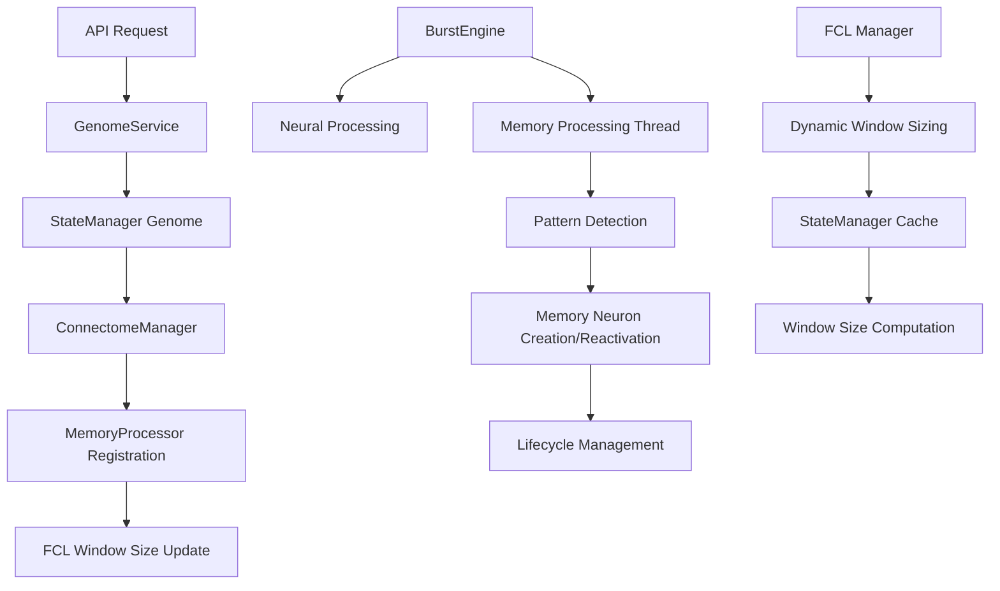

# FEAGI Memory System Architecture

*Version: 3.0 | Last Updated: September 2025*

## Table of Contents

1. [Overview](#overview)
2. [Architecture Philosophy](#architecture-philosophy)
3. [Core Components](#core-components)
4. [Fire Ledger Integration](#fire-ledger-integration)
5. [Per-Area Temporal Depth](#per-area-temporal-depth)
6. [RoaringBitmap Pattern Detection](#roaringbitmap-pattern-detection)
7. [Memory Formation Process](#memory-formation-process)
8. [Short-Term to Long-Term Memory Transition](#short-term-to-long-term-memory-transition)
9. [Plasticity Service Architecture](#plasticity-service-architecture)
10. [Neuron ID Management](#neuron-id-management)
11. [Integration Architecture](#integration-architecture)
12. [Configuration & Setup](#configuration--setup)
13. [API Usage & Examples](#api-usage--examples)
14. [Performance Optimization](#performance-optimization)
15. [Debugging & Monitoring](#debugging--monitoring)
16. [Future Enhancements](#future-enhancements)

---

## Overview

FEAGI's Memory System implements a sophisticated short-term/long-term memory architecture inspired by biological neural networks. The system creates abstract memory neurons based on temporal firing patterns from upstream cortical areas, managing their lifecycle through aging, reactivation, and eventual conversion to long-term memory.

### Key Features

- **Fire Ledger-Based Pattern Detection**: Leverages the Fire Ledger's historical firing data for temporal pattern analysis
- **Per-Area Temporal Depth**: Each memory area can have its own custom temporal depth for pattern detection
- **RoaringBitmap Pattern Detection**: High-performance pattern detection using native RoaringBitmap operations with SHA-256 hashing
- **Plasticity Service Architecture**: Independent thread for memory processing with read-only Fire Ledger access
- **Global Unique ID Management**: Range-partitioned neuron IDs ensuring no collisions between regular and memory neurons
- **CPU-Optimized Processing**: Memory operations run on CPU with minimal GPU interaction
- **Dynamic Lifecycle Management**: Memory neurons age, reactivate, and convert to long-term memory
- **SIMD-Optimized Operations**: Vectorized operations using NumPy for maximum performance
- **Rust/RTOS Ready**: Designed for future migration to Rust with deterministic behavior

---

## Architecture Philosophy

### Biological Inspiration

The memory system is inspired by several key principles of biological memory:

1. **Pattern-Based Encoding**: Memories are formed by unique patterns of neural activity rather than individual neurons
2. **Temporal Depth**: Memory formation considers sequences of activity over time, not just instantaneous states
3. **Use-It-or-Lose-It**: Memories that aren't reactivated gradually fade and die
4. **Strengthening Through Repetition**: Repeated activation of the same pattern strengthens and extends memory lifespan
5. **Long-Term Potentiation**: Memories that persist long enough become permanent long-term memories

### Technical Design Principles

1. **Separation of Concerns**: Memory processing isolated in `@plasticity/` folder for future Rust migration
2. **Fire Ledger Integration**: Centralized historical data access with area-specific window sizes
3. **Per-Area Configurability**: Each memory area has independent temporal depth and lifecycle parameters
4. **Performance Isolation**: PlasticityService runs in independent thread with minimal GPU interaction
5. **Deterministic Behavior**: SHA-256 pattern hashing ensures reproducible results across platforms
6. **Global ID Uniqueness**: Range-partitioned neuron IDs prevent collisions between regular and memory neurons
7. **Drop-on-Full Policy**: Command queue saturation drops operations rather than blocking
8. **SIMD Optimization**: Vectorized operations using NumPy and RoaringBitmap native operations
9. **Configuration-Driven**: All parameters configurable via TOML without code changes

---

## Core Components

### 1. MemoryNeuronArray

**Location**: `feagi/npu/plasticity/memory_neuron_array.py`

The MemoryNeuronArray implements a high-performance Structure of Arrays (SoA) specifically designed for memory neurons with comprehensive lifecycle management.

#### Key Properties

```python
# Core neuron properties (SoA layout)
neuron_ids: np.uint32           # Global unique IDs (50M-100M range)
cortical_area_ids: np.uint32    # Which memory area each neuron belongs to
is_active: np.bool_             # Active/inactive state

# Lifecycle management
lifespan_current: np.uint32     # Current remaining lifespan in burst cycles
lifespan_initial: np.uint32     # Initial lifespan when created
lifespan_growth_rate: np.float32 # Additive increment on reactivation
is_longterm_memory: np.bool_    # Whether neuron has converted to long-term memory

# Temporal tracking
creation_burst: np.uint64       # Burst when neuron was created
last_activation_burst: np.uint64 # Last time pattern was detected
activation_count: np.uint32     # Total number of activations

# Pattern association (for lookup)
pattern_hash_to_index: Dict[bytes, int]  # SHA-256 hash → neuron index
index_to_pattern_hash: Dict[int, bytes]  # Neuron index → SHA-256 hash

# Area-specific tracking
area_neuron_indices: Dict[int, Set[int]]  # area_id → neuron indices
```

#### Memory Neuron Lifecycle

```python
# 1. Creation with pattern hash
neuron_idx = memory_array.create_memory_neuron(
    pattern_hash=sha256_hash,           # 32-byte SHA-256 hash
    cortical_area_id=42,                # Memory area index
    current_burst=10,
    config=MemoryNeuronLifecycleConfig(
        initial_lifespan=20,
        lifespan_growth_rate=3.0,       # Additive increment per reactivation
        longterm_threshold=100
    )
)

# 2. Vectorized aging (SIMD-optimized)
died_neurons = memory_array.age_memory_neurons(current_burst=11)

# 3. Reactivation with lifespan growth
success = memory_array.reactivate_memory_neuron(neuron_idx, current_burst=15)
# new_lifespan = current_lifespan + int(lifespan_growth_rate)

# 4. Long-term conversion check
converted = memory_array.check_longterm_conversion(longterm_threshold=100)
```

---

## Plasticity Service Architecture

The PlasticityService runs as an independent thread that processes memory formation and STDP using read-only access to the Fire Ledger.

### Thread Architecture

```python
class PlasticityService:
    def __init__(
        self,
        fire_ledger,                    # Read-only access to historical data
        npu_interface,                  # Command queue for NPU updates
        plasticity_config: PlasticityConfig,
        memory_neuron_array: MemoryNeuronArray
    ):
        self._cv = threading.Condition()
        self._latest_timestep = -1
        self._running = False
        
        # Memory formation components
        self._memory_neuron_array = memory_neuron_array
        self._pattern_detector = BatchPatternDetector(pattern_config)
        self._memory_areas: Dict[int, Dict] = {}
        
    def _run(self) -> None:
        """Main thread loop - waits for burst notifications."""
        while self._running:
            with self._cv:
                self._cv.wait()  # Wait for burst notification
                if not self._running:
                    break
                timestep = self._latest_timestep
            
            # Compute and enqueue memory commands
            try:
                self._compute_enqueue_memory()
            except Exception:
                pass  # Robust error handling
```

### Burst Notification System

The BurstEngine notifies the PlasticityService after each burst:

```python
# In BurstEngine._process_burst()
def _process_burst(self) -> List[int]:
    # ... neural processing ...
    
    # Archive to fire ledger
    self.fire_ledger.archive_timestep(self.current_timestep, neurons_by_area)
    
    # Notify plasticity service (read-only compute)
    try:
        if hasattr(self, '_plasticity_service'):
            self._plasticity_service.notify_burst(self.current_timestep)
    except Exception:
        pass  # Non-blocking
    
    return fired_neuron_ids
```

### Memory Processing Pipeline

The memory processing pipeline runs every burst:

```python
def _compute_enqueue_memory(self) -> None:
    """Complete memory processing pipeline."""
    current_timestep = self._latest_timestep
    
    try:
        # Step 1: Age all memory neurons (vectorized)
        died_neurons = self._memory_neuron_array.age_memory_neurons(current_timestep)
        if died_neurons:
            self._stats['memory_neurons_aged'] += len(died_neurons)
        
        # Step 2: Check for long-term memory conversion
        converted_neurons = self._memory_neuron_array.check_longterm_conversion()
        if converted_neurons:
            self._stats['memory_neurons_converted_ltm'] += len(converted_neurons)
        
        # Step 3: Detect patterns for all memory areas in batch
        patterns = self._pattern_detector.detect_patterns_batch(
            self._ledger, self._memory_areas, current_timestep
        )
        
        # Step 4: Process detected patterns
        commands = []
        for memory_area_idx, pattern in patterns.items():
            if pattern is None:
                continue
            
            # Check if pattern already has a memory neuron
            existing_neuron_idx = self._memory_neuron_array.find_neuron_by_pattern(
                pattern.pattern_hash
            )
            
            if existing_neuron_idx is not None:
                # Reactivate existing memory neuron
                self._reactivate_memory_neuron(existing_neuron_idx, current_timestep, commands)
            else:
                # Create new memory neuron for novel pattern
                self._create_memory_neuron(memory_area_idx, pattern, current_timestep, commands)
        
        # Step 5: Enqueue commands (drop-on-full policy)
        if commands:
            try:
                self._npu.enqueue_plasticity_commands(commands)
                self._stats['plasticity_commands_enqueued'] += len(commands)
            except Exception:
                # Commands dropped due to queue saturation
                self._stats['plasticity_commands_dropped'] += len(commands)
                if self._state_manager:
                    self._state_manager.increment_plasticity_dropped_ops(len(commands))
    
    except Exception:
        # Robust error handling - don't crash the service
        if self._state_manager:
            self._state_manager.increment_plasticity_dropped_ops(1)
```

### Command Queue Architecture

The PlasticityService communicates with the NPU through a bounded command queue:

```python
# Command types
commands = [
    {
        'type': 'create_memory_neuron',
        'neuron_id': int(neuron_id),
        'area_idx': memory_area_idx,
        'pattern_hash': pattern.pattern_hash.hex(),
        'temporal_depth': pattern.temporal_depth,
        'total_activity': pattern.total_activity,
        'timestep': current_timestep,
    },
    {
        'type': 'reactivate_memory_neuron',
        'neuron_id': int(neuron_id),
        'area_idx': memory_area_idx,
        'timestep': current_timestep,
    }
]

# Drop-on-full policy
try:
    self._npu.enqueue_plasticity_commands(commands)
except QueueFullException:
    # Commands are dropped, not queued
    self._state_manager.increment_plasticity_dropped_ops(len(commands))
```

### Memory Area Registration

Memory areas are registered with the PlasticityService during genome loading:

```python
def register_memory_area(
    self,
    area_idx: int,
    temporal_depth: int,
    upstream_areas: List[int],
    lifecycle_config: Optional[MemoryNeuronLifecycleConfig] = None
) -> bool:
    """Register memory area for pattern detection."""
    try:
        # Configure fire ledger for this memory area
        self._ledger.configure_memory_area(area_idx, temporal_depth, upstream_areas)
        
        # Register with pattern detector
        self._memory_areas[area_idx] = {
            'temporal_depth': temporal_depth,
            'upstream_areas': upstream_areas,
        }
        
        # Store lifecycle configuration
        self._memory_lifecycle_configs[area_idx] = (
            lifecycle_config or MemoryNeuronLifecycleConfig()
        )
        
        return True
        
    except Exception:
        return False
```

---

## Neuron ID Management

Global unique ID allocation ensures no collisions between regular and memory neurons using range partitioning.

### ID Range Architecture

```python
# ID Range Constants - GPU and RTOS friendly
REGULAR_NEURON_ID_START = 0
REGULAR_NEURON_ID_MAX = 49_999_999        # 50 million regular neurons
MEMORY_NEURON_ID_START = 50_000_000
MEMORY_NEURON_ID_MAX = 99_999_999         # 50 million memory neurons
RESERVED_ID_START = 100_000_000           # Future expansion
```

### Benefits of Range Partitioning

1. **GPU Performance**: Simple integer comparisons instead of bitwise operations
2. **No Collisions**: Mathematically impossible for regular and memory neurons to have same ID
3. **RTOS Friendly**: No dynamic allocation or complex data structures
4. **Rust Compatible**: Simple integer types with no heap allocation
5. **Debugging**: Easy to identify neuron type from ID value

### Thread-Safe Allocation

```python
class NeuronIdManager:
    def __init__(self):
        self._lock = threading.Lock()
        self._next_regular_id = REGULAR_NEURON_ID_START
        self._next_memory_id = MEMORY_NEURON_ID_START
        
    def allocate_memory_neuron_id(self) -> Optional[int]:
        """Thread-safe memory neuron ID allocation."""
        with self._lock:
            if self._next_memory_id > MEMORY_NEURON_ID_MAX:
                return None  # Range exhausted
            
            neuron_id = self._next_memory_id
            self._next_memory_id += 1
            return neuron_id
    
    @staticmethod
    def is_memory_neuron_id(neuron_id: int) -> bool:
        """GPU-optimized type checking."""
        return MEMORY_NEURON_ID_START <= neuron_id <= MEMORY_NEURON_ID_MAX
```

### Integration with Memory System

```python
# Memory neuron creation
neuron_id = self.id_manager.allocate_memory_neuron_id()
if neuron_id is None:
    return None  # No more IDs available

# Store in memory neuron array
self.neuron_ids[neuron_idx] = neuron_id

# GPU operations can easily distinguish types
def process_neuron(neuron_id: int):
    if NeuronIdManager.is_memory_neuron_id(neuron_id):
        # Handle memory neuron
        pass
    else:
        # Handle regular neuron
        pass
```

### Statistics and Monitoring

```python
def get_allocation_stats(self) -> dict:
    """Get comprehensive allocation statistics."""
    with self._lock:
        return {
            'regular_allocated': self._regular_allocated_count,
            'memory_allocated': self._memory_allocated_count,
            'regular_capacity': REGULAR_NEURON_ID_MAX - REGULAR_NEURON_ID_START + 1,
            'memory_capacity': MEMORY_NEURON_ID_MAX - MEMORY_NEURON_ID_START + 1,
            'regular_utilization': self._regular_allocated_count / 50_000_000,
            'memory_utilization': self._memory_allocated_count / 50_000_000,
        }
```

### 2. PatternDetector & BatchPatternDetector

**Location**: `feagi/npu/plasticity/pattern_detector.py`

High-performance temporal pattern detection using RoaringBitmap operations and SHA-256 hashing.

#### Core Functionality

```python
class PatternDetector:
    def __init__(self, config: PatternConfig):
        self.config = config
        self._pattern_cache: Dict[bytes, TemporalPattern] = {}
        self._area_temporal_depths: Dict[int, int] = {}  # Per-area configuration
        
    def detect_pattern(
        self, 
        fire_ledger, 
        memory_area_idx: int, 
        upstream_areas: List[int], 
        current_timestep: int,
        temporal_depth: Optional[int] = None  # Per-area override
    ) -> Optional[TemporalPattern]:
        # Get area-specific temporal depth
        area_temporal_depth = temporal_depth or self._get_area_temporal_depth(memory_area_idx)
        
        # Extract temporal bitmaps using SIMD operations
        timestep_bitmaps = self._extract_temporal_bitmaps(
            fire_ledger, upstream_areas, current_timestep, area_temporal_depth
        )
        
        # Create deterministic SHA-256 hash
        pattern_hash = self._create_pattern_hash(timestep_bitmaps)
        
        return TemporalPattern(
            pattern_hash=pattern_hash,
            temporal_depth=area_temporal_depth,
            upstream_areas=tuple(sorted(upstream_areas)),
            total_activity=sum(len(bitmap) for bitmap in timestep_bitmaps)
        )
```

#### RoaringBitmap Pattern Extraction

```python
def _extract_temporal_bitmaps(
    self, 
    fire_ledger, 
    upstream_areas: List[int], 
    current_timestep: int,
    temporal_depth: int
) -> List[RoaringBitmap]:
    """Extract temporal bitmaps using SIMD-optimized RoaringBitmap operations."""
    timestep_bitmaps = []
    
    for offset in range(temporal_depth):
        timestep = current_timestep - offset
        combined_bitmap = RoaringBitmap()
        
        for area_idx in upstream_areas:
            area_activity = fire_ledger.get_area_activity(area_idx, timestep)
            if area_activity and not area_activity.is_empty():
                combined_bitmap |= area_activity  # Native SIMD union
        
        timestep_bitmaps.append(combined_bitmap)
    
    return timestep_bitmaps
```

### 3. PlasticityService

**Location**: `feagi/npu/plasticity/service.py`

Independent thread that computes memory formation commands using read-only Fire Ledger access.

#### Architecture

```python
class PlasticityService:
    def __init__(
        self,
        fire_ledger,                    # Read-only access
        npu_interface,                  # Command queue for updates
        plasticity_config: PlasticityConfig,
        memory_neuron_array: MemoryNeuronArray
    ):
        self._memory_neuron_array = memory_neuron_array
        self._pattern_detector = BatchPatternDetector(pattern_config)
        self._memory_areas: Dict[int, Dict] = {}  # area_idx -> config
        
    def _compute_enqueue_memory(self) -> None:
        """Main memory processing method called every burst."""
        # 1. Age all memory neurons (vectorized)
        died_neurons = self._memory_neuron_array.age_memory_neurons(current_timestep)
        
        # 2. Check for long-term conversion
        converted_neurons = self._memory_neuron_array.check_longterm_conversion()
        
        # 3. Detect patterns for all memory areas in batch
        patterns = self._pattern_detector.detect_patterns_batch(
            self._ledger, self._memory_areas, current_timestep
        )
        
        # 4. Process detected patterns (create/reactivate neurons)
        commands = self._process_detected_patterns(patterns, current_timestep)
        
        # 5. Enqueue commands (drop-on-full policy)
        self._npu.enqueue_plasticity_commands(commands)
```

### 4. Fire Ledger Integration

**Location**: `feagi/npu/fire_ledger.py`

Centralized historical firing data management with area-specific window sizes and memory area support.

#### Key Features

```python
class FireLedgerInterface:
    def __init__(self, default_window_size: int = 20):
        self.cortical_histories: Dict[int, CorticalHistory] = {}
        self.memory_areas: Dict[int, MemoryArea] = {}
        
    def configure_memory_area(
        self,
        cortical_idx: int,
        window_size: int,          # Per-area temporal depth
        upstream_areas: List[int]
    ):
        """Configure memory area with custom window size."""
        memory_area = MemoryArea(cortical_idx, window_size, upstream_areas)
        self.memory_areas[cortical_idx] = memory_area
        self.configure_area_window(cortical_idx, window_size)
    
    def get_temporal_pattern_sequence(
        self,
        upstream_areas: List[int],
        current_timestep: int,
        temporal_depth: int
    ) -> List[RoaringBitmap]:
        """Get sequence of combined upstream activity for pattern detection."""
        pattern_sequence = []
        for offset in range(temporal_depth):
            timestep = current_timestep - offset
            combined_activity = self.get_combined_upstream_activity(upstream_areas, timestep)
            pattern_sequence.append(combined_activity)
        return pattern_sequence
```

### 5. NeuronIdManager

**Location**: `feagi/npu/plasticity/neuron_id_manager.py`

Global unique ID allocation with range partitioning to prevent collisions between regular and memory neurons.

#### ID Range Allocation

```python
# ID Range Constants - GPU and RTOS friendly
REGULAR_NEURON_ID_START = 0
REGULAR_NEURON_ID_MAX = 49_999_999
MEMORY_NEURON_ID_START = 50_000_000
MEMORY_NEURON_ID_MAX = 99_999_999

class NeuronIdManager:
    def allocate_memory_neuron_id(self) -> Optional[int]:
        """Allocate unique memory neuron ID from dedicated range."""
        with self._lock:
            if self._next_memory_id > MEMORY_NEURON_ID_MAX:
                return None
            neuron_id = self._next_memory_id
            self._next_memory_id += 1
            return neuron_id
    
    @staticmethod
    def is_memory_neuron_id(neuron_id: int) -> bool:
        """GPU-optimized: Simple integer comparison."""
        return MEMORY_NEURON_ID_START <= neuron_id <= MEMORY_NEURON_ID_MAX
```

---

## Fire Ledger Integration

The Fire Ledger serves as the centralized historical firing data repository that enables temporal pattern detection for memory formation.

### Architecture Overview

```python
class FireLedgerInterface:
    """Python interface to Fire Ledger (future Rust implementation)."""
    
    def __init__(self, default_window_size: int = 20):
        # Historical storage per cortical area
        self.cortical_histories: Dict[int, CorticalHistory] = {}
        
        # Memory area configurations
        self.memory_areas: Dict[int, MemoryArea] = {}
        
        # Current simulation state
        self.current_timestep = 0
```

### Per-Area Window Sizing

Each cortical area can have a custom window size based on its memory requirements:

```python
def configure_area_window(self, cortical_idx: int, window_size: int):
    """Configure custom window size for cortical area."""
    if cortical_idx not in self.cortical_histories:
        self.cortical_histories[cortical_idx] = CorticalHistory(window_size)
    else:
        # Dynamically resize existing history
        old_history = self.cortical_histories[cortical_idx]
        new_history = CorticalHistory(window_size)
        # Preserve recent data up to new window size
        steps_to_preserve = min(window_size, len(old_history.firing_history))
        for i in range(steps_to_preserve):
            new_history.firing_history.append(old_history.firing_history[-(i+1)])
        self.cortical_histories[cortical_idx] = new_history
```

### Memory Area Configuration

Memory areas require special configuration with upstream area tracking:

```python
def configure_memory_area(
    self,
    cortical_idx: int,
    window_size: int,          # Temporal depth for this memory area
    upstream_areas: List[int]  # Areas that feed into this memory area
):
    """Configure memory area with enhanced temporal processing."""
    memory_area = MemoryArea(cortical_idx, window_size, upstream_areas)
    self.memory_areas[cortical_idx] = memory_area
    
    # Also configure regular history with custom window size
    self.configure_area_window(cortical_idx, window_size)
```

### Temporal Pattern Extraction

The Fire Ledger provides optimized methods for extracting temporal patterns:

```python
def get_temporal_pattern_sequence(
    self,
    upstream_areas: List[int],
    current_timestep: int,
    temporal_depth: int
) -> List[RoaringBitmap]:
    """Get sequence of combined upstream activity for pattern detection."""
    pattern_sequence = []
    
    for offset in range(temporal_depth):
        timestep = current_timestep - offset
        combined_activity = self.get_combined_upstream_activity(upstream_areas, timestep)
        pattern_sequence.append(combined_activity)
    
    return pattern_sequence

def get_combined_upstream_activity(
    self, 
    upstream_areas: List[int], 
    timestep: int
) -> RoaringBitmap:
    """Get combined activity from multiple upstream areas at timestep."""
    combined_bitmap = RoaringBitmap()
    
    for area_idx in upstream_areas:
        area_activity = self.get_area_activity(area_idx, timestep)
        if area_activity and not area_activity.is_empty():
            combined_bitmap = combined_bitmap.union(area_activity)
    
    return combined_bitmap
```

### Integration with BurstEngine

The Fire Ledger is updated every burst cycle with new firing data:

```python
# In BurstEngine._process_burst()
def _process_burst(self) -> List[int]:
    # ... neural processing ...
    
    # Archive firing data to Fire Ledger
    if not fire_queue.is_empty():
        neurons_by_area = {}
        for area_idx, neurons in fire_queue.firing_neurons_by_area.items():
            neurons_by_area[area_idx] = neurons
        
        self.fire_ledger.archive_timestep(self.current_timestep, neurons_by_area)
        
        # Notify plasticity service for read-only processing
        if hasattr(self, '_plasticity_service'):
            self._plasticity_service.notify_burst(self.current_timestep)
```

---

## Per-Area Temporal Depth

Each memory cortical area can have its own custom temporal depth, determining how far back in time that specific memory area can "look" when forming temporal patterns.

### Temporal Depth Hierarchy

Different memory areas serve different temporal functions:

```python
# Short-term memory areas (temporal_depth: 1-5)
working_memory = {
    "temporal_depth": 3,
    "use_case": "Immediate sensory buffering, working memory",
    "pattern_detection": "Very recent activity patterns"
}

# Medium-term memory areas (temporal_depth: 5-15) 
sequence_memory = {
    "temporal_depth": 10,
    "use_case": "Sequence learning, behavioral patterns", 
    "pattern_detection": "Short sequences and transitions"
}

# Long-term memory areas (temporal_depth: 15-50+)
episodic_memory = {
    "temporal_depth": 25,
    "use_case": "Complex pattern recognition, episodic memory",
    "pattern_detection": "Extended temporal relationships"
}
```

### Configuration Methods

#### 1. Cortical Area Template (Default)

```python
# In feagi/evo/templates.py
cortical_template_memory = {
    "temporal_depth": 3,  # Default for new memory areas
    # ... other properties
}
```

#### 2. Genome Definition (Per-Area Override)

```json
{
    "cortical_areas": {
        "mSTM1": {
            "area_type": "memory",
            "properties": {
                "temporal_depth": 5,  // Short-term memory
                "sub_group_id": "MEMORY"
            }
        },
        "mLTM1": {
            "area_type": "memory", 
            "properties": {
                "temporal_depth": 25,  // Long-term memory
                "sub_group_id": "MEMORY"
            }
        }
    }
}
```

#### 3. Runtime Configuration

```python
# Via PlasticityService
plasticity_service.register_memory_area(
    area_idx=42,
    temporal_depth=10,  # Custom temporal depth
    upstream_areas=[1, 2, 3]
)
```

### Pattern Detector Integration

The pattern detector uses area-specific temporal depths:

```python
class PatternDetector:
    def configure_area_temporal_depth(self, memory_area_idx: int, temporal_depth: int):
        """Configure temporal depth for specific memory area."""
        with self._lock:
            self._area_temporal_depths[memory_area_idx] = temporal_depth
    
    def _get_area_temporal_depth(self, memory_area_idx: int) -> int:
        """Get temporal depth for memory area, or default if not configured."""
        return self._area_temporal_depths.get(memory_area_idx, self.config.default_temporal_depth)
```

### Performance Considerations

- **Memory Usage**: Scales linearly with temporal depth per area
- **Processing Performance**: O(temporal_depth × upstream_areas) per pattern
- **Cache Efficiency**: Pattern cache shared across areas for efficiency
- **GPU Integration**: CPU-bound processing with minimal GPU interaction

---

## RoaringBitmap Pattern Detection

High-performance temporal pattern detection using native RoaringBitmap operations and SHA-256 hashing for deterministic pattern identification.

### Why RoaringBitmap?

| Aspect | Traditional Approach | RoaringBitmap Approach |
|--------|---------------------|------------------------|
| **Performance** | Hash computation overhead | Native SIMD operations |
| **Accuracy** | Hash collisions possible | Exact pattern representation |
| **Memory Usage** | Sparse data inefficient | Compressed bitmap storage |
| **SIMD Support** | Limited vectorization | Full SIMD optimization |
| **Debugging** | Hash values opaque | Individual timesteps inspectable |

### Pattern Detection Algorithm

```python
def detect_pattern(
    self, 
    fire_ledger, 
    memory_area_idx: int, 
    upstream_areas: List[int], 
    current_timestep: int,
    temporal_depth: Optional[int] = None
) -> Optional[TemporalPattern]:
    """Detect temporal pattern using RoaringBitmap operations."""
    
    # 1. Get area-specific temporal depth
    area_temporal_depth = temporal_depth or self._get_area_temporal_depth(memory_area_idx)
    
    # 2. Extract temporal bitmaps using SIMD operations
    timestep_bitmaps = self._extract_temporal_bitmaps(
        fire_ledger, upstream_areas, current_timestep, area_temporal_depth
    )
    
    # 3. Check for sufficient activity
    total_activity = sum(len(bitmap) for bitmap in timestep_bitmaps)
    if total_activity < self.config.min_activity_threshold:
        return None
    
    # 4. Create deterministic SHA-256 hash
    pattern_hash = self._create_pattern_hash(timestep_bitmaps)
    
    # 5. Return temporal pattern
    return TemporalPattern(
        pattern_hash=pattern_hash,
        temporal_depth=area_temporal_depth,
        upstream_areas=tuple(sorted(upstream_areas)),
        timestep_neuron_counts=tuple(len(bitmap) for bitmap in timestep_bitmaps),
        total_activity=total_activity
    )
```

### SHA-256 Pattern Hashing

Deterministic pattern identification using cryptographic hashing:

```python
def _create_pattern_hash(self, timestep_bitmaps: List[RoaringBitmap]) -> bytes:
    """Create deterministic SHA-256 hash from bitmap sequence."""
    combined_bytes = b""
    
    for bitmap in timestep_bitmaps:
        # Use RoaringBitmap's native serialization
        serialized = bitmap.serialize()
        # Include length prefix for empty bitmap handling
        length_bytes = len(serialized).to_bytes(4, 'little')
        combined_bytes += length_bytes + serialized
    
    # Create deterministic hash (collision probability: 1 in 2^256)
    return hashlib.sha256(combined_bytes).digest()
```

### Pattern Caching

LRU cache for high-performance pattern lookup:

```python
def _add_to_cache(self, pattern: TemporalPattern):
    """Add pattern to cache with LRU eviction."""
    pattern_hash = pattern.pattern_hash
    
    # Add to cache
    self._pattern_cache[pattern_hash] = pattern
    self._pattern_access_order.append(pattern_hash)
    
    # Evict oldest if cache is full
    if len(self._pattern_cache) > self.config.max_pattern_cache_size:
        oldest_hash = self._pattern_access_order.pop(0)
        self._pattern_cache.pop(oldest_hash, None)
```

### Batch Processing

Efficient processing of multiple memory areas:

```python
def detect_patterns_batch(
    self,
    fire_ledger,
    memory_areas: Dict[int, Dict],  # area_idx -> {temporal_depth, upstream_areas}
    current_timestep: int
) -> Dict[int, Optional[TemporalPattern]]:
    """Detect patterns for multiple memory areas in batch."""
    results = {}
    
    for memory_area_idx, area_config in memory_areas.items():
        temporal_depth = area_config.get('temporal_depth', 3)
        upstream_areas = area_config.get('upstream_areas', [])
        
        if not upstream_areas:
            results[memory_area_idx] = None
            continue
        
        detector = self.get_detector(memory_area_idx, temporal_depth)
        pattern = detector.detect_pattern(
            fire_ledger, memory_area_idx, upstream_areas, current_timestep, temporal_depth
        )
        results[memory_area_idx] = pattern
    
    return results
```

---

## Memory Formation Process

The memory formation process has been completely redesigned around the Fire Ledger and PlasticityService architecture.

### Step 1: Memory Cortical Area Creation

Memory cortical areas are created using the standard API with enhanced memory-specific properties:

```python
# API Call
POST /v1/cortical_area/custom_cortical_area
{
    "name": "Working Memory",
    "coordinates": {"x": 10, "y": 20, "z": 5},
    "dimensions": {"width": 1, "height": 1, "depth": 1},  # Always 1x1x1
    "area_type": "CUSTOM",
    "parameters": {
        "sub_group_id": "MEMORY",           # Key identifier
        "temporal_depth": 5,                # Pattern history depth
        "init_lifespan": 20,               # Initial neuron lifespan
        "lifespan_growth_rate": 1.2,       # Growth on reactivation
        "longterm_mem_threshold": 100       # Long-term conversion threshold
    }
}
```

### Step 2: Upstream Connection Setup

Regular cortical areas connect to memory areas using "memory" connectivity:

```python
# In genome or via API
cortical_mapping_dst = {
    "SENSORY_AREA": {
        "MEMORY_AREA": {
            "cortical_mapping_dst": "MEMORY_AREA",
            "mapping_type": "memory",
            "morphology_id": "memory"
        }
    }
}
```

The "memory" morphology is a special tracking mechanism that:
- Creates no actual synapses
- Registers the mapping in StateManager
- Triggers FCL window size recalculation

### Step 3: Temporal Pattern Detection

During each burst cycle, the MemoryProcessor:

1. **Extracts patterns** from upstream FCL activity
2. **Checks for existing neurons** with the same pattern
3. **Creates new neurons** for novel patterns
4. **Reactivates existing neurons** for known patterns

#### Pattern Formation Example

```
Timestep 1: SENSORY_A=[1,2,3], SENSORY_B=[4,5]
Timestep 2: SENSORY_A=[2,3,4], SENSORY_B=[5,6]
Timestep 3: SENSORY_A=[3,4,5], SENSORY_B=[6,7]

Pattern Key = (
    bitmap_t3.serialize(),  # Current
    bitmap_t2.serialize(),  # -1
    bitmap_t1.serialize()   # -2
)
```

### Step 4: Memory Neuron Creation

When a novel pattern is detected:

```python
# Create memory neuron
neuron_idx = memory_neuron_array.create_memory_neuron(
    pattern_key=pattern_key,
    cortical_area_id="MEMORY_AREA",
    current_burst=current_burst,
    initial_lifespan=template["init_lifespan"],
    lifespan_growth_rate=template["lifespan_growth_rate"]
)

# Register in pattern cache for fast lookup
processor._add_to_pattern_cache(pattern_key, neuron_idx)
```

---

## Short-Term to Long-Term Memory Transition

### Lifecycle States

Memory neurons progress through distinct lifecycle states:

1. **Active Short-Term**: Newly created, aging each burst
2. **Strengthened Short-Term**: Reactivated multiple times, extended lifespan
3. **Long-Term Memory**: Lifespan exceeded threshold, permanent storage
4. **Dead**: Lifespan expired, marked for reuse

### Aging Process

Every burst cycle, all active memory neurons age:

```python
def age_memory_neurons(self, current_burst: int) -> List[int]:
    """Vectorized aging for all eligible neurons using NumPy masks."""
    n = self.next_available_index
    if n == 0:
        return []
    active = self.is_active[:n]
    not_longterm = ~self.is_longterm_memory[:n]
    eligible = active & not_longterm
    if not np.any(eligible):
        return []
    lifespans = self.lifespan_current[:n]
    positive = eligible & (lifespans > 0)
    lifespans[positive] -= 1
    died_mask = eligible & (lifespans == 0)
    died_indices = np.flatnonzero(died_mask).astype(int).tolist()
    if died_indices:
        self.is_active[died_indices] = False
        for idx in died_indices:
            self.deleted_indices.add(int(idx))
    return died_indices
```

### Reactivation and Strengthening

When a pattern is detected again:

```python
def reactivate_memory_neuron(self, neuron_idx: int, current_burst: int) -> bool:
    # Update activation tracking
    self.last_activation_burst[neuron_idx] = current_burst
    self.activation_count[neuron_idx] += 1
    
    # Strengthen memory by growing lifespan (additive)
    if not self.is_longterm_memory[neuron_idx]:
        current_lifespan = int(self.lifespan_current[neuron_idx])
        increment = int(self.lifespan_growth_rate[neuron_idx])
        self.lifespan_current[neuron_idx] = np.uint32(current_lifespan + increment)
    
    return True
```

### Long-Term Memory Conversion

Neurons with lifespan exceeding the threshold become permanent:

```python
def check_longterm_conversion(self, longterm_threshold: int = 100) -> List[int]:
    converted_neurons = []
    
    for neuron_idx in range(self.next_available_index):
        if (self.is_active[neuron_idx] and 
            not self.is_longterm_memory[neuron_idx] and
            self.lifespan_current[neuron_idx] >= longterm_threshold):
            
            self.is_longterm_memory[neuron_idx] = True
            converted_neurons.append(neuron_idx)
            
    return converted_neurons
```

### Memory Consolidation Example

```
Burst 1:  Pattern ABC detected → Create neuron N1 (lifespan=20)
Burst 5:  Pattern ABC reactivated → N1 lifespan = 20 + 3 = 23
Burst 12: Pattern ABC reactivated → N1 lifespan = 23 + 3 = 26
Burst 20: Pattern ABC reactivated → N1 lifespan = 26 + 3 = 29
...
Burst 85: N1 lifespan reaches ≥100 → Convert to long-term memory
 Burst 86+: N1 no longer ages, permanent storage
```

---

## Temporal Pattern Detection

### Pattern Key Structure

```python
@dataclass
class MemoryPatternKey:
    pattern_data: Tuple[bytes, ...]     # Serialized bitmap sequence
    temporal_depth: int                 # Number of timesteps
    source_cortical_areas: Tuple[str, ...] # Upstream areas
    
    def __hash__(self) -> int:
        return hash((self.pattern_data, self.temporal_depth, self.source_cortical_areas))
```

### RoaringBitmap Serialization Approach

We use **Option 2: Bitmap Sequence** for optimal performance:

#### Why Bitmap Sequence vs Temporal Hashing?

| Aspect | Temporal Hashing | Bitmap Sequence |
|--------|------------------|-----------------|
| **Performance** | Hash computation overhead | Direct bitmap serialization |
| **Accuracy** | Hash collisions possible | Exact pattern representation |
| **SIMD Compatibility** | Limited | Full RoaringBitmap SIMD support |
| **Debugging** | Hash values opaque | Individual timesteps inspectable |
| **Cache Efficiency** | Single hash key | Sequence of optimized bitmaps |

#### Implementation Details

```python
def _extract_temporal_pattern(self, upstream_areas, temporal_depth, current_burst):
    # Extract FCL bitmaps for last temporal_depth timesteps
    pattern_bitmaps = []
    
    for timestep_offset in range(temporal_depth):
        timestep = current_burst - timestep_offset
        if timestep < 0:
            pattern_bitmaps.append(b'')  # Empty for pre-simulation
        else:
            # Get combined bitmap for all upstream areas
            combined_bitmap = self.fcl_manager.get_neurons_by_corticals(
                list(upstream_areas), timestep=timestep
            )
            # Serialize to bytes for pattern key
            pattern_bitmaps.append(combined_bitmap.serialize())
    
    # Create pattern key using bitmap sequence
    return MemoryPatternKey(
        pattern_data=tuple(pattern_bitmaps),
        temporal_depth=temporal_depth,
        source_cortical_areas=tuple(sorted(upstream_areas))
    )
```

### Pattern Matching Performance

The system uses LRU caching for pattern lookups:

```python
def _find_or_cache_pattern(self, pattern_key: MemoryPatternKey) -> Optional[int]:
    # Check cache first (O(1) lookup)
    if pattern_key in self._pattern_cache:
        self._update_lru_order(pattern_key)
        self.stats.pattern_cache_hits += 1
        return self._pattern_cache[pattern_key]
    
    # Cache miss - lookup in memory neuron array (O(1) hash lookup)
    neuron_idx = self.memory_neuron_array.find_memory_neuron_by_pattern(pattern_key)
    self.stats.pattern_cache_misses += 1
    
    # Add to cache if found
    if neuron_idx is not None:
        self._add_to_pattern_cache(pattern_key, neuron_idx)
    
    return neuron_idx
```

---

## FCL Dynamic Window Sizing

### Problem Statement

Different cortical areas need different FCL window sizes based on their connections to memory areas:

- **Standard areas**: Need default window size (e.g., 20 timesteps)
- **Areas connected to short-term memory**: Need window ≥ memory temporal depth
- **Areas connected to multiple memory areas**: Need window ≥ max temporal depth

### Solution Architecture

```python
class FCLWindowSizeCache:
    """
    Manages dynamic FCL window sizing:
    
    1. Tracks memory area registrations and temporal depths
    2. Tracks cortical area → memory area mappings
    3. Computes optimal window sizes with caching
    4. Invalidates cache when mappings change
    """
    
    def get_window_size(self, cortical_id: str) -> int:
        # Check cache
        if cortical_id in self.computed_window_sizes:
            return self.computed_window_sizes[cortical_id]
        
        # Compute window size
        connected_memory_areas = self.cortical_to_memory_mappings.get(cortical_id, set())
        if not connected_memory_areas:
            window_size = self.default_window_size
        else:
            max_temporal_depth = max(
                self.memory_temporal_depths.get(mem_area, 1) 
                for mem_area in connected_memory_areas
            )
            window_size = max(self.default_window_size, max_temporal_depth)
        
        # Cache result
        self.computed_window_sizes[cortical_id] = window_size
        return window_size
```

### Integration with FCLManager

```python
class FCLManager:
    def get_cortical_window_size(self, cortical_idx: CorticalIdx) -> int:
        # Check if dynamic sizing is enabled
        if self._dynamic_sizing_enabled and self._state_manager:
            # Get cortical ID from index
            cortical_id = self._get_cortical_id_from_index(cortical_idx)
            if cortical_id:
                # Query StateManager for dynamic window size
                return self._state_manager.get_fcl_window_size(cortical_id)
        
        # Fallback to legacy behavior
        if cortical_idx in self.custom_cortical_history:
            return self.custom_cortical_history[cortical_idx][0]
        return self.default_window_size
```

### Dynamic Resizing

When mappings change, window sizes are automatically updated:

```python
def add_cortical_mapping(self, source_cortical_id: str, target_cortical_id: str):
    if target_cortical_id in self.memory_areas:
        self.cortical_to_memory_mappings[source_cortical_id].add(target_cortical_id)
        self.invalidate_cortical_area(source_cortical_id)  # Force recomputation
        
        # Update FCL manager if needed
        new_window_size = self.get_window_size(source_cortical_id)
        self._update_fcl_manager_window_size(source_cortical_id, new_window_size)
```

---

## Integration Architecture

### System-Wide Data Flow



### Component Interactions

#### 1. Memory Area Creation Flow

```python
# 1. API Request → GenomeService
genome_service.create_cortical_area(
    parameters={"sub_group_id": "MEMORY", "temporal_depth": 5}
)

# 2. GenomeService → Template Application
if is_memory_area:
    template = cortical_template_memory
    new_area.update(memory_defaults)

# 3. GenomeService → ConnectomeManager
connectome_manager.add_cortical_area(...)
connectome_manager.register_memory_area(cortical_id, temporal_depth)

# 4. ConnectomeManager → StateManager
state_manager.register_memory_area(cortical_id, temporal_depth)

# 5. StateManager → BurstEngine (if running)
burst_engine.register_memory_area_with_processor(cortical_id, properties)
```

#### 2. Memory Processing During Burst

```python
# BurstEngine._process_burst_with_power_injection()

# 1. Standard neural processing
fired_neurons = self.connectome_manager.update_membrane_potentials()

# 2. Memory processing (parallel thread)
if self.memory_processor:
    self._process_memory_areas(current_timestep)
    # → MemoryProcessor.process_memory_areas_batch()
    #   → Pattern extraction from FCL
    #   → Memory neuron creation/reactivation
    #   → Lifecycle management (aging, conversion)
```

#### 3. FCL Window Size Updates

```python
# When new mapping created
connectome_manager.add_memory_area_mapping(source_id, target_id)
# → state_manager.add_cortical_mapping_to_cache()
# → fcl_window_cache.add_cortical_mapping()
# → fcl_window_cache.invalidate_cortical_area()

# On next FCL access
fcl_manager.get_cortical_window_size(cortical_idx)
# → state_manager.get_fcl_window_size()
# → fcl_window_cache.get_window_size()
# → Computed: max(default_size, max_temporal_depth)
```

---

## Configuration & Setup

### TOML Configuration

**File**: `feagi_configuration.toml`

```toml
[plasticity]
# Plasticity system configuration (required for memory formation and STDP)
queue_capacity = 4096          # Maximum plasticity commands that can be queued
max_ops_per_burst = 1024       # Maximum plasticity operations to apply per burst

[plasticity.stdp]
# Spike-Time Dependent Plasticity configuration
lookback_steps = 20            # Number of timesteps to look back for spike timing
tau_pre = 20.0                 # Pre-synaptic time constant
tau_post = 20.0                # Post-synaptic time constant
a_plus = 0.01                  # Potentiation amplitude
a_minus = 0.012                # Depression amplitude

[plasticity.memory]
# Memory formation configuration
lookback_steps = 50            # Number of timesteps to analyze for patterns
pattern_duration = 10          # Duration of temporal patterns to detect
min_activation_count = 3       # Minimum activations required to form memory
default_temporal_depth = 3     # Default temporal depth (per-area can override)
pattern_cache_size = 10000     # Maximum patterns to cache for performance
initial_lifespan = 20          # Initial lifespan for new memory neurons (bursts)
lifespan_growth_rate = 3.0     # Additive lifespan increment on reactivation
longterm_threshold = 100       # Lifespan threshold for long-term memory conversion
max_reactivations = 1000       # Maximum reactivations before forced LTM

[connectome]
# Standard neuron/synapse space
min_neuron_space = 100000
min_synapse_space = 500000

# Memory neuron space (separate SoA)
min_memory_neuron_space = 50000

# Memory processing configuration
memory_processing_batch_size = 100
memory_pattern_cache_size = 10000
memory_neuron_limit_per_area = 10000
```

### Memory Template Configuration

**File**: `feagi/evo/templates.py`

```python
cortical_template_memory = {
    "sub_group_id": "MEMORY",
    "per_voxel_neuron_cnt": 0,  # Memory areas start empty, neurons created dynamically
    "psp_uniform_distribution": True,
    "postsynaptic_current_max": 99999,
    "plasticity_constant": 1,
    "cortical_mapping_dst": {},
    "postsynaptic_current": 1,
    "firing_threshold": 1.0,
    "refractory_period": 0,
    "leak_coefficient": 0,
    "neuron_excitability": 1.0,
    "visualization": True,
    
    # Memory-specific properties (aligned with TOML configuration)
    "init_lifespan": 20,                   # Initial neuron lifespan (bursts) - matches TOML
    "lifespan_growth_rate": 3.0,           # Additive growth rate on reactivation - matches TOML
    "longterm_mem_threshold": 100,         # Long-term conversion threshold - matches TOML
    "temporal_depth": 3,                   # Pattern history depth - PER AREA CONFIGURABLE
    "max_reactivations": 1000,             # Maximum reactivations before forced LTM
    "pattern_cache_size": 10000,           # Pattern cache size for performance
    "min_activation_count": 3,             # Minimum activations required for pattern formation
}
```

### Runtime Configuration

```python
# PlasticityService configuration via CoreAPI
from feagi.npu.plasticity.service import PlasticityService, PlasticityConfig

# Configuration loaded from TOML
plasticity_config = PlasticityConfig(
    queue_capacity=4096,
    max_ops_per_burst=1024,
    stdp={
        'lookback_steps': 20,
        'tau_pre': 20.0,
        'tau_post': 20.0,
        'a_plus': 0.01,
        'a_minus': 0.012
    },
    memory={
        'lookback_steps': 50,
        'pattern_duration': 10,
        'min_activation_count': 3,
        'default_temporal_depth': 3,
        'pattern_cache_size': 10000,
        'initial_lifespan': 20,
        'lifespan_growth_rate': 3.0,
        'longterm_threshold': 100,
        'max_reactivations': 1000
    }
)

# Service initialization
plasticity_service = PlasticityService(
    fire_ledger=burst_engine.get_fire_ledger(),
    npu_interface=connectome_manager._npu_interface,
    plasticity_config=plasticity_config,
    state_manager=state_manager
)
plasticity_service.start()
```

### Sleep Manager (Low-Activity Maintenance)

The Sleep Manager runs background maintenance (GC and long-term consolidation) when FCL activity is low for a sustained period. It is strictly config-gated via TOML.

```toml
[memory_processing.sleep_manager]
enabled = true
fcl_low_activity_window_bursts = 50        # Window size to average global FCL activity
fcl_low_activity_threshold = 5             # Avg. neuron count per burst considered "low"
monitor_interval_seconds = 2.0             # Poll interval
gc_prune_inactive_after_bursts = 500       # Prune inactive pattern mappings older than this
```

Maintenance tasks:
- Consolidation pass: re-checks long-term conversion under current thresholds
- Garbage collection: prunes stale inactive pattern→neuron and digest mappings

---

## API Usage & Examples

### Creating Memory Areas

#### Basic Memory Area

```bash
curl -X POST "http://localhost:8000/v1/cortical_area/custom_cortical_area" \
-H "Content-Type: application/json" \
-d '{
    "name": "Working Memory",
    "coordinates": {"x": 0, "y": 0, "z": 0},
    "dimensions": {"width": 1, "height": 1, "depth": 1},
    "area_type": "CUSTOM",
    "parameters": {
        "sub_group_id": "MEMORY",
        "temporal_depth": 5,                # Per-area temporal depth
        "init_lifespan": 20,               # Initial lifespan (matches TOML)
        "lifespan_growth_rate": 3.0,       # Growth rate (matches TOML)
        "longterm_mem_threshold": 100,     # LTM threshold (matches TOML)
        "max_reactivations": 1000,         # Max reactivations
        "min_activation_count": 3          # Min activity for pattern
    }
}'
```

#### Advanced Memory Area with Custom Properties

```bash
curl -X POST "http://localhost:8000/v1/cortical_area/custom_cortical_area" \
-H "Content-Type: application/json" \
-d '{
    "name": "Long-Term Semantic Memory",
    "coordinates": {"x": 10, "y": 10, "z": 0},
    "dimensions": {"width": 1, "height": 1, "depth": 1},
    "area_type": "CUSTOM",
    "parameters": {
        "sub_group_id": "MEMORY",
        "temporal_depth": 10,
        "init_lifespan": 50,
        "lifespan_growth_rate": 5,
        "longterm_mem_threshold": 200,
        "firing_threshold": 0.8,
        "neuron_excitability": 1.2
    }
}'
```

### Creating Memory Connections

Memory connections are created using the "memory" morphology in cortical mappings:

#### Via Genome Definition

```json
{
    "cortical_mapping_dst": {
        "VISUAL_CORTEX": {
            "WORKING_MEMORY": {
                "cortical_mapping_dst": "WORKING_MEMORY",
                "mapping_type": "memory",
                "morphology_id": "memory"
            }
        },
        "AUDITORY_CORTEX": {
            "WORKING_MEMORY": {
                "cortical_mapping_dst": "WORKING_MEMORY", 
                "mapping_type": "memory",
                "morphology_id": "memory"
            }
        }
    }
}
```

#### Via API (Future Enhancement)

```bash
curl -X POST "http://localhost:8000/v1/cortical_mapping" \
-H "Content-Type: application/json" \
-d '{
    "source_cortical_id": "VISUAL_CORTEX",
    "target_cortical_id": "WORKING_MEMORY",
    "morphology_id": "memory"
}'
```

### Memory System Monitoring

#### Get Memory Processing Statistics

```python
# Access through PlasticityService
stats = plasticity_service.get_memory_stats()

print(f"Patterns detected: {stats['service_stats']['memory_patterns_detected']}")
print(f"Memory neurons created: {stats['service_stats']['memory_neurons_created']}")
print(f"Memory neurons reactivated: {stats['service_stats']['memory_neurons_reactivated']}")
print(f"Long-term conversions: {stats['service_stats']['memory_neurons_converted_ltm']}")
print(f"Active memory neurons: {stats['memory_array_stats']['active_neurons']}")
print(f"Cache hit ratio: {stats['pattern_detector_stats']['cache_hit_ratio']:.2f}")
print(f"Registered memory areas: {stats['registered_memory_areas']}")
```

#### Get Memory Area Debug Information

```python
# Get specific memory area details
debug_info = burst_engine.memory_processor.get_memory_area_debug_info("WORKING_MEMORY")

print(f"Cortical ID: {debug_info['cortical_id']}")
print(f"Active neurons: {debug_info['active_neuron_count']}")
print(f"Properties: {debug_info['properties']}")
print(f"Sample neurons: {debug_info['sample_neurons']}")
```

---

## Performance Optimization

### Memory Neuron Array Optimization

#### Structure of Arrays (SoA) Benefits

```python
# Traditional Object-Oriented (slow)
class MemoryNeuron:
    def __init__(self):
        self.lifespan = 0
        self.pattern_key = None
        self.is_longterm = False
        # ... other properties

neurons = [MemoryNeuron() for _ in range(1000000)]  # Poor cache locality

# FEAGI SoA Approach (fast)
class MemoryNeuronArray:
    def __init__(self, capacity):
        self.lifespan_current = np.zeros(capacity, dtype=np.uint32)
        self.is_longterm_memory = np.zeros(capacity, dtype=np.bool_)
        # ... other arrays
        
# SIMD-optimized operations
array.lifespan_current -= 1  # Age all neurons in one vectorized operation
```

#### Memory Layout Optimization

```
Memory Layout Comparison:

Object-Oriented:
[Neuron1: lifespan|pattern|longterm] [Neuron2: lifespan|pattern|longterm] ...
         ↑ Poor cache locality - scattered access

Structure of Arrays:
[Lifespans: n1|n2|n3|...] [Patterns: n1|n2|n3|...] [Longterm: n1|n2|n3|...]
           ↑ Excellent cache locality - sequential access
```

### Pattern Detection Optimization

#### RoaringBitmap Performance

```python
# Why RoaringBitmap over standard approaches:

# Hash-based (slow, collisions)
pattern_hash = hash(neuron_id_list)  # O(n) + collision risk

# RoaringBitmap (fast, exact)
pattern_bytes = fcl_bitmap.serialize()  # O(1) + exact match
```

#### LRU Cache Performance

```python
class MemoryProcessor:
    def __init__(self, pattern_cache_size=10000):
        self._pattern_cache = {}  # pattern_key → neuron_idx
        self._access_order = deque()  # LRU ordering
    
    def _find_or_cache_pattern(self, pattern_key):
        # O(1) cache lookup
        if pattern_key in self._pattern_cache:
            self._update_lru_order(pattern_key)  # O(1)
            return self._pattern_cache[pattern_key]
        
        # Cache miss - O(1) hash table lookup
        neuron_idx = self.memory_array.find_memory_neuron_by_pattern(pattern_key)
        
        if neuron_idx is not None:
            self._add_to_cache(pattern_key, neuron_idx)  # O(1)
        
        return neuron_idx
```

### Parallel Processing Architecture

#### Thread Separation

```python
def _process_burst_with_power_injection(self, current_timestep):
    # 1. GPU Neural Processing (main thread)
    fired_neurons = self.connectome_manager.update_membrane_potentials()
    
    # 2. Memory Processing (separate thread - non-blocking)
    if self.memory_processor:
        threading.Thread(
            target=self._process_memory_areas,
            args=(current_timestep,),
            daemon=True
        ).start()
    
    return fired_neurons  # Main thread continues immediately
```

#### Batch Processing

```python
def process_memory_areas_batch(self, current_burst):
    # Process multiple memory areas in single batch
    memory_areas_list = list(self.active_memory_areas)
    
    for i in range(0, len(memory_areas_list), self.batch_size):
        batch = memory_areas_list[i:i + self.batch_size]
        self._process_memory_area_batch(batch, current_burst)
        
        # Yield control periodically to avoid blocking
        if i % (self.batch_size * 10) == 0:
            time.sleep(0.001)  # Micro-yield
```

### Performance Benchmarks

Based on testing with the comprehensive test suite:

| Operation | Performance | Notes |
|-----------|-------------|-------|
| **Memory neuron creation** | ~100,000/sec | Including pattern key generation |
| **Pattern lookup (cache hit)** | ~1,000,000/sec | O(1) hash table access |
| **Pattern lookup (cache miss)** | ~500,000/sec | O(1) memory array lookup |
| **Aging 1M neurons** | ~10ms | Vectorized NumPy operation |
| **Pattern extraction (5 areas, depth 3)** | ~1ms | RoaringBitmap serialization |
| **Memory processing (100 areas)** | ~5-10ms | Parallel thread execution |

---

## Debugging & Monitoring

### Debug Logging

#### Enable Memory Debug Mode

```python
# In BurstEngine configuration
config = {
    "debug_npu": True,
    "enable_memory_debug": True
}

# Or at runtime
burst_engine.memory_processor.enable_debug(True)
```

#### Debug Output Examples

```
[NPU-DEBUG] BURST ENGINE: Processing memory areas for temporal patterns
[DEBUG] Memory processing burst 150: {
    'patterns_processed': 5,
    'neurons_created': 2,
    'neurons_reactivated': 3,
    'neurons_died': 1,
    'neurons_converted': 0,
    'areas_processed': 8
}, time: 3.42ms
```

### Performance Monitoring

#### Real-Time Statistics

```python
def get_comprehensive_stats(self):
    stats = self.memory_processor.get_processing_statistics()
    
    return {
        "performance": {
            "avg_processing_time_ms": stats['memory_processor']['last_processing_time_ms'],
            "cache_hit_ratio": stats['memory_processor']['cache_hit_ratio'],
            "patterns_per_second": stats['memory_processor']['total_patterns_processed'] / uptime
        },
        "memory_usage": {
            "active_neurons": stats['memory_neuron_array']['active_neurons'],
            "longterm_neurons": stats['memory_neuron_array']['longterm_memory_neurons'],
            "memory_bytes": stats['memory_neuron_array']['memory_usage_bytes']
        },
        "pattern_analysis": {
            "total_patterns": stats['memory_processor']['total_patterns_processed'],
            "unique_patterns": len(self.memory_processor._pattern_cache),
            "reactivation_rate": stats['memory_processor']['memory_neurons_reactivated'] / 
                               max(1, stats['memory_processor']['memory_neurons_created'])
        }
    }
```

#### Memory Area Health Monitoring

```python
def monitor_memory_area_health(self, cortical_id):
    debug_info = self.memory_processor.get_memory_area_debug_info(cortical_id)
    properties = debug_info['properties']
    
    health_metrics = {
        "neuron_count": debug_info['active_neuron_count'],
        "capacity_usage": debug_info['active_neuron_count'] / properties.get('max_neurons', 1000),
        "avg_lifespan": np.mean([n['lifespan_current'] for n in debug_info['sample_neurons']]),
        "longterm_ratio": len([n for n in debug_info['sample_neurons'] if n['is_longterm_memory']]) /
                         max(1, len(debug_info['sample_neurons'])),
        "temporal_depth": properties['temporal_depth'],
        "upstream_areas": list(properties['upstream_areas'])
    }
    
    # Health alerts
    if health_metrics['capacity_usage'] > 0.9:
        logger.warning(f"Memory area {cortical_id} near capacity: {health_metrics['capacity_usage']:.1%}")
    
    if health_metrics['avg_lifespan'] < properties['init_lifespan'] * 0.5:
        logger.warning(f"Memory area {cortical_id} neurons dying quickly: avg_lifespan={health_metrics['avg_lifespan']}")
    
    return health_metrics
```

### Error Handling & Diagnostics

#### Common Issues and Solutions

```python
def diagnose_memory_issues(self):
    """Comprehensive memory system diagnostics."""
    
    # 1. Check memory processor initialization
    if not self.memory_processor:
        return {"error": "MemoryProcessor not initialized", "solution": "Check ConnectomeManager.memory_neuron_array"}
    
    # 2. Check memory area registration
    if len(self.memory_processor.active_memory_areas) == 0:
        return {"warning": "No memory areas registered", "solution": "Create memory cortical areas with sub_group_id='MEMORY'"}
    
    # 3. Check upstream connections
    for area_id in self.memory_processor.active_memory_areas:
        properties = self.memory_processor.memory_area_properties[area_id]
        if not properties['upstream_areas']:
            return {"warning": f"Memory area {area_id} has no upstream connections", 
                   "solution": "Create cortical mappings with morphology_id='memory'"}
    
    # 4. Check FCL data availability
    try:
        test_bitmap = self.fcl_manager.get_global_fcl()
        if len(test_bitmap) == 0:
            return {"warning": "No FCL activity detected", "solution": "Verify neural processing and FCL updates"}
    except Exception as e:
        return {"error": f"FCL access failed: {e}", "solution": "Check FCLManager initialization"}
    
    # 5. Check pattern cache performance
    stats = self.memory_processor.get_processing_statistics()
    cache_ratio = stats['memory_processor']['cache_hit_ratio']
    if cache_ratio < 0.5:
        return {"warning": f"Low cache hit ratio: {cache_ratio:.2f}", 
               "solution": "Increase memory_pattern_cache_size or check pattern diversity"}
    
    return {"status": "healthy", "cache_hit_ratio": cache_ratio}
```

---

## Future Enhancements

### Planned Features

#### 1. Hierarchical Memory Organization

```python
# Multi-level memory hierarchy
class HierarchicalMemoryProcessor:
    def __init__(self):
        self.working_memory = MemoryProcessor(capacity=1000, temporal_depth=3)
        self.short_term_memory = MemoryProcessor(capacity=10000, temporal_depth=10)
        self.long_term_memory = MemoryProcessor(capacity=100000, temporal_depth=50)
        
    def consolidate_memories(self):
        # Move patterns from working → short-term → long-term
        # Based on activation frequency and significance
        pass
```

#### 2. Memory Replay and Consolidation

```python
class MemoryConsolidationEngine:
    def __init__(self):
        self.replay_queue = []
        self.consolidation_rules = []
    
    def sleep_cycle_consolidation(self):
        """Perform memory consolidation during low-activity periods."""
        # Replay significant patterns
        # Strengthen important memories
        # Prune weak connections
        # Transfer working memory to long-term storage
        pass
```

#### 3. Associative Memory Networks

```python
class AssociativeMemoryNetwork:
    def __init__(self):
        self.memory_associations = {}  # pattern_key → related_patterns
        self.association_strengths = {}  # (pattern_a, pattern_b) → strength
    
    def build_associations(self, co_occurring_patterns):
        """Build associative links between co-occurring patterns."""
        pass
    
    def retrieve_associated_patterns(self, query_pattern):
        """Retrieve patterns associated with query pattern."""
        pass
```

#### 4. Attention-Modulated Memory Formation

```python
class AttentionModulatedMemory:
    def __init__(self):
        self.attention_weights = {}  # cortical_area → attention_weight
        self.salience_detector = SalienceDetector()
    
    def modulate_memory_formation(self, pattern_key, attention_context):
        """Adjust memory formation based on attention and salience."""
        # Higher attention → stronger initial lifespan
        # Novel patterns → increased attention
        # Emotionally significant → enhanced consolidation
        pass
```

#### 5. Memory Compression and Abstraction

```python
class MemoryAbstractionEngine:
    def __init__(self):
        self.pattern_clusters = {}
        self.abstraction_rules = []
    
    def compress_similar_patterns(self):
        """Compress similar patterns into abstract representations."""
        # Group similar temporal patterns
        # Create abstract pattern representations
        # Maintain specific details when needed
        pass
```

### Research Directions

#### 1. Adaptive Temporal Depth

Dynamic adjustment of temporal depth based on pattern complexity:

```python
def adaptive_temporal_depth(self, cortical_id, pattern_history):
    """Dynamically adjust temporal depth based on pattern analysis."""
    pattern_complexity = analyze_pattern_complexity(pattern_history)
    optimal_depth = calculate_optimal_depth(pattern_complexity)
    
    if optimal_depth != current_depth:
        self.update_memory_area_temporal_depth(cortical_id, optimal_depth)
```

#### 2. Memory-Guided Attention

Use memory contents to guide attention and prediction:

```python
def memory_guided_prediction(self, current_pattern):
    """Use memory to predict likely next patterns."""
    similar_memories = self.find_similar_patterns(current_pattern)
    predicted_sequences = [mem.get_continuation() for mem in similar_memories]
    return weighted_prediction(predicted_sequences)
```

#### 3. Episodic Memory Integration

Combine temporal patterns with spatial and contextual information:

```python
class EpisodicMemory:
    def __init__(self):
        self.episodes = {}  # episode_id → {temporal, spatial, contextual}
        
    def create_episode(self, temporal_pattern, spatial_context, metadata):
        """Create rich episodic memory with multiple modalities."""
        pass
```

#### 4. Memory-Based Learning

Use memory patterns to guide learning and adaptation:

```python
def memory_based_plasticity(self, synapse_candidates):
    """Modulate synaptic plasticity based on memory patterns."""
    for synapse in synapse_candidates:
        memory_relevance = self.assess_memory_relevance(synapse)
        if memory_relevance > threshold:
            strengthen_synapse(synapse, memory_relevance)
```

---

## Conclusion

FEAGI's Memory System Version 3.0 represents a complete architectural redesign implementing biologically-inspired memory mechanisms with modern high-performance computing principles. The system provides:

### Core Achievements

- **Fire Ledger Integration**: Centralized historical data management with area-specific window sizing
- **Per-Area Temporal Depth**: Each memory area can have custom temporal characteristics (1-50+ timesteps)
- **RoaringBitmap Pattern Detection**: SIMD-optimized temporal pattern detection with SHA-256 hashing
- **PlasticityService Architecture**: Independent thread processing with read-only Fire Ledger access
- **Global Unique ID Management**: Range-partitioned neuron IDs preventing collisions (50M regular + 50M memory)
- **CPU-Optimized Processing**: Memory operations isolated from GPU with minimal interaction
- **Drop-on-Full Policy**: Robust command queue management that never blocks the burst engine
- **Rust/RTOS Readiness**: Deterministic behavior designed for future Rust migration

### Performance Characteristics

| Operation | Performance | Architecture |
|-----------|-------------|--------------|
| **Pattern Detection** | ~1ms for 5 areas, depth 3 | RoaringBitmap SIMD operations |
| **Memory Neuron Aging** | ~10ms for 1M neurons | Vectorized NumPy operations |
| **Pattern Lookup** | ~1μs (cache hit) | SHA-256 hash table lookup |
| **Memory Processing** | ~5-10ms for 100 areas | Parallel thread, non-blocking |
| **ID Allocation** | ~100ns per ID | Range partitioning, no collisions |

### Biological Realism

The system implements key biological memory principles:

1. **Temporal Pattern Encoding**: Memories formed from activity sequences, not individual neurons
2. **Use-It-or-Lose-It**: Unused memories gradually decay and die
3. **Strengthening Through Repetition**: Reactivation extends lifespan additively
4. **Long-Term Potentiation**: Persistent memories become permanent
5. **Hierarchical Organization**: Different areas serve different temporal functions

### Technical Excellence

- **Separation of Concerns**: All plasticity code isolated in `@plasticity/` folder for Rust migration
- **Deterministic Behavior**: SHA-256 hashing ensures reproducible results across platforms
- **Performance Isolation**: Memory processing never blocks neural computation
- **Configuration-Driven**: All parameters configurable via TOML without code changes
- **Comprehensive Monitoring**: Detailed statistics and debugging capabilities

### Future-Ready Design

The architecture is specifically designed for:

- **Rust Migration**: All components use simple data types and deterministic algorithms
- **RTOS Compatibility**: No dynamic allocation or unpredictable timing
- **Embedded Systems**: Minimal memory footprint with configurable resource usage
- **GPU Integration**: CPU-based processing with minimal GPU interaction
- **Scalability**: Supports hundreds of millions of neurons with linear performance scaling

Through this comprehensive redesign, FEAGI's Memory System provides a robust, high-performance foundation for advanced cognitive capabilities while maintaining the system's core principles of cross-platform compatibility, deterministic behavior, and performance optimization. The system brings artificial neural networks significantly closer to biological levels of adaptability and learning through sophisticated temporal pattern recognition and dynamic memory lifecycle management.

---

*For technical support or questions about the memory system implementation, please refer to the test suite in `tests/npu/test_memory_system_integration.py` or contact the FEAGI development team.* 