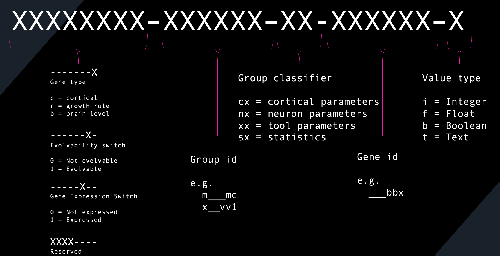
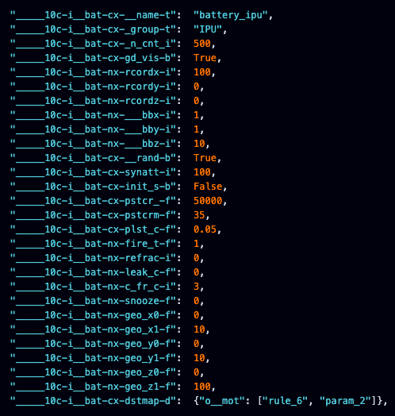

# **Genome**

The genome is a data structure comprised of key-value pairs that provides user-configurable anatomical and physiological parameters to FEAGI for artificial brain development. The neuroembryogenesis module (`src/evo/neuroembryogenesis.py`) processes genome data and generates virtual anatomical features within the artificial brain, such as cortical areas, cortical layers, neurons and synapses. Users can generate an artificial brain capable of processing various input data types (via the Input Processing Unit - `src/ipu/source/`) and generating desirable behavior in a medium (ex: a robot) solely through modification of the seed genome. 

## **Genome structure**     

The existing genome contains cortical areas nested under the `"blueprint"` key in `src/evo/static_genome.py` and are useful examples for creating new cortical areas. Other keys at the `"blueprint"` level are used for further defining neurophysiologic and synaptogenic properties within a cortical area. Each cortical area belongs to a specific group (`"...-_group-..."`), possesses a user-defined cortical neuron count (`...-_n_cnt_...`), among other parameters, and is capable of being mapped to another region in the artificial brain.



The figure above shows the structure of a single "gene" ID that is associated with a user-defined value and is part of a cortical area. The sections and sub-sections of the gene ID indicate the cortical area property it encodes. As an example, consider the following gene ID:

    "_____10c-i__bat-nx-___bbx-i"

Using the gene ID decoder above, we can determine that this is a non-evolvable, cortical-level battery IPU (`...-i__bat-...`) gene that is associated with an integer (`...-i`) value which represents the battery IPU cortical area block boundary x-dimension magnitude (`...-___bbx-...`). The following image shows the genes comprising the battery IPU cortical area and their corresponding values:  

OUTDATED



**OUTDATED:** Cortical areas in the genome have dimensions for accommodating the proliferation of neurons and formation of synapses within the defined area. Note the genes that encode geometric (`...-geo_...`) and block (`...-___bb...`) boundaries listed for the _x_, _y_ and _z_ dimensions. Geometric boundaries refer to the overall dimensions of the cortical area and consist of min/max values for each dimension (ex: x0 --> x1). Blocks (i.e. voxels) are cortical area subregions that facilitate the localization of neurons for activation following translation of brain input data. Each neuron cell body created via neurogenesis is associated with a point _(x, y, z)_ existing within these boundaries. Users must define boundaries according to the nature of the input data to ensure its appropriate translation to neuronal activity. Users can subdivide cortical areas by setting block boundaries, which define the dimensions of a block. To better illustrate the concept, if a user defined a `100x100x100` (_x_, _y_, _z_) cortical area with `10x10x10` block boundaries, the cortical area will be divided into `10` blocks, each containing unique neurons. FEAGI will then create references to these blocks, allowing for faster and more refined stimulation of neurons in the cortical area.

## **Editing the genome file**

- Open the genome file (`src/evo/static_genome.py`) using a text editor or IDE.
- Navigate to the end of the data present under the `"blueprint"` key, which contains all of the existing cortical area definitions, and enter the data defining the new cortical area (it will likely be easier to copy a single existing cortical area definition in the genome, paste it at the end of the file and update the values accordingly).
- Give the cortical area a unique name.
- Enter a group ID (`...-_group-...` - typically `"IPU"` if defining an area for processing input data, `"Memory"` when defining a memory area, etc.).
- Specify a number (integer) of neurons that will populate the cortical area (`..._n_cnt_...`). Note that sparsely populated cortical areas will likely result in diminished neuronal activity.
- If the cortical area being created is connected to other areas, ensure that it is mapped (`...-dstmap-...`) to the destination area using appropriate synaptogenesis rules.
- Specify geometric boundaries (`...-geo_...`) and block boundaries (`...-___bb...`) for the cortical area based on the type/structure of input data.
- The other keys in the cortical area (not mentioned above) can be left as-is with existing values (assuming the user copied an existing cortical area to use as a template).
- Save the genome file.

<!-- ## **Using the genome editing tool** -->

### Synaptogenesis Rules  --TODO--

Syntax
```
"_____10c-______-cx-dstmap-d": {”destination_cortical_id": [”morphology_id",
      morphology_scalar,                    postSynapticCurrent multiplier, 
      plasticity flag
  ]}}
```


## **Special Cortical Areas**

- IPU
  - i__inf
  - i__bat
  - i__pro


- OPU
  - o__ser
  - o__mot
  - o__bat


- Other
  - ishock
  - _death
  - i_init


## **Troubleshooting issues**

After adding the desired data to the genome file, users should confirm that FEAGI is able to create the new cortical area(s). Navigate to the `src/` directory in `feagi/` and run `python3 main.py` to begin FEAGI execution. During FEAGI initialization, a list of cortical areas loaded from the genome are displayed in the terminal output. Ensure that the newly-added cortical areas are present in this list.    

If newly-created cortical areas are not present in the output of FEAGI initialization or users encounter other runtime errors following genome modification, consider the following:    

- **Genome file**
  - Were changes made to the correct genome file? Users should add new cortical areas to `src/evo/static_genome.py`.
- **Genome file syntax**
  - Did the changes made to the genome file introduce syntax errors? Ensure that all new cortical areas are added under the `"blueprint"` key and indented to the appropriate levels. All opening brackets ( `{`, `(`, `[` ) should have a corresponding closing bracket ( `}`, `)`, `]` ), commas ( `,` ) must separate each key-value pair and no values should be empty/blank.

  
