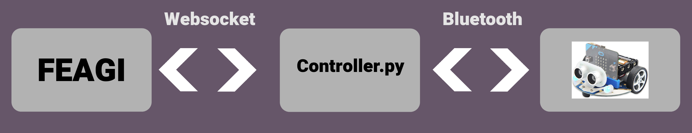

# Work in process (Completely DRAFT)
## Install brain in Microbit
1) Introduction Microbit
Microbit was intrdouced in 2016. This can be used in various projects and it is often used in robots too. Microbit is very easy and effective while it kept 
the minimum memory usage. So with FEAGI, it allows you to control the robot effectively. FEAGI is the Framework for Evolutionary Artificial General Intelligence
and it will control the robot. You can also control the robot through Godot using FEAGI as well. 

2) FEAGI and microbit use-case
WIP
3) Quick example between them
WIP
4) Requirements
There will be more specific in some areas such as software operating but this is the general requirement. We will come to the specific for your own case.
- FEAGI
- Bluetooth
- Python3.7+
- Docker 
5) Quick start

6) More depth using microbit and FEAGI after quick start

## Microbit's full information
1) Programming used
- Microbit used makecode mix with the python so the `controller.py` communicates between Microbit and FEAGI. 
Here is the diagram of workflow:

2) Docker container

3) Configuration inside microbit
4) Bluetooth
5) How to set things up outside of docker

