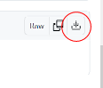

# How to Use FEAGI on Microbit

## Requirements for Microbit
* A micro-USB cable
* Micro:bit device
* Computer

## Instructions

1. Connect your micro-USB cable to the micro:bit and your computer.
   

2. Visit this [link](https://github.com/Neuraville/feagi/blob/staging/third_party/embodiments/elecfreaks/cutebot/web_html_microbit/microbit-final_microbit_with_service.hex) and download the HEX file. It should look like this.
   
   Drag and drop the file from your Downloads folder to the Micro:bit.
   

3. You will see the screen go black on the Microbit while the orange or yellow LED on the back of 
   the micro:bit blinks rapidly. Once you see the LCD display showing `1`, you can safely unplug 
   the USB cable.

4. Open the playground and click the `Microbit` blue button. A pop-up window full of device options will appear. Select the one labeled `uBit`. Each micro:bit has its own unique name. For example, mine is `uBit[zovep]`. Yours will have its own name too.
   
5. **MAC only**: You will see this menu pop up. Due to Apple's security measures, it is required to ask for user permission, so you can simply press 'connect'. See here for an example:
   

6. You should now see the number `2` displayed on the micro:bit's LCD. This indicates a successful connection.
