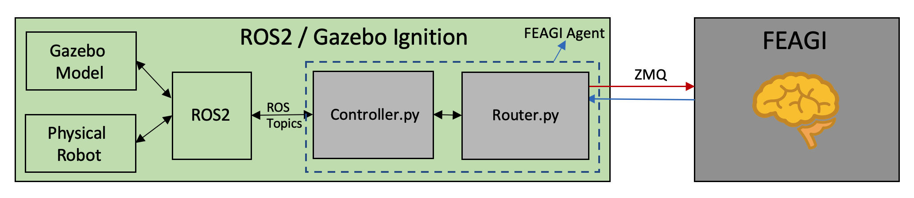

# Building A Robot Simulation Using ROS2 and Gazebo Igition
## README information
This readme's purpose is to teach you to create your own model along with the capability to control the model using Ign/ROS2. Since this readme is a very lengthy document, I created a table for you to be able to hit the ground running. I also made an article on my blog for this documentation as well where I expand on more details there. The blog is called `simulation-blog.md`. This is designed to provide the latest and most reliable information on using the newest and latest software. 


## Quick click table
1. [Create your own workspace](https://github.com/feagi/feagi-core/blob/feature-feature-doc-ign-foxy-draft-part3/third_party/gazebo/smart_car/freenove_4wd_car_description/README.md#create-your-own-workspace)
2. [Starting With A Car In Simulation](https://github.com/feagi/feagi-core/blob/feature-feature-doc-ign-foxy-draft-part3/third_party/gazebo/smart_car/freenove_4wd_car_description/README.md#starting-with-a-car-in-simulation)
3. [Create the bridge between ros2 and ign](https://github.com/feagi/feagi-core/blob/feature-feature-doc-ign-foxy-draft-part3/third_party/gazebo/smart_car/freenove_4wd_car_description/README.md#create-the-bridge-between-ros2-and-ign)
4. [Control model in the ign gazebo from Foxy using Python3](https://github.com/feagi/feagi-core/blob/feature-feature-doc-ign-foxy-draft-part3/third_party/gazebo/smart_car/freenove_4wd_car_description/README.md#control-model-in-the-ign-gazebo-from-foxy-using-python3)
5. [Instructions on detail unique cases](https://github.com/feagi/feagi-core/blob/feature-feature-doc-ign-foxy-draft-part3/third_party/gazebo/smart_car/freenove_4wd_car_description/README.md#control-model-in-the-ign-gazebo-from-foxy-using-python3)
6. [FEAGI on a car model](https://github.com/feagi/feagi-core/blob/feature-feature-doc-ign-foxy-draft-part3/third_party/gazebo/smart_car/freenove_4wd_car_description/README.md#feagi-on-a-car-model)
7. [Extra and Detailed information](https://github.com/feagi/feagi-core/blob/feature-feature-doc-ign-foxy-draft-part3/third_party/gazebo/smart_car/freenove_4wd_car_description/README.md#feagi-on-a-car-model)
8. [Sources](https://github.com/feagi/feagi-core/tree/feature-feature-doc-ign-foxy-draft-part3/third_party/gazebo/smart_car/freenove_4wd_car_description#sources)
## Requirements For This Project:
1. ROS2 Foxy
2. Citadel for Ign Gazebo
3. Python3
4. Linux (Currently supported on Linux. Windows/Macs will eventually be added)

## Steps to build your own robot using ROS2 and Gazebo Ignition
1. Create your own workspace
2. Create your own robot
3. Build the bridge between ros2 and ign
4. Update launch, cmakelist, setup.py, and setup.cfg, package.xml accordingly
5. Create a simple python code to control ros2/ign.

## Create your own workspace
<details>
  <summary>Click here to see the full steps</summary>
1. `source /opt/ros/foxy/setup.bash`
    2. `mkdir -p my_first_ws/src`
    3. `cd my_first_ws/src`
    4. `ros2 pkg create --build-type ament_python my_first_robot`
    5. `cd my_first_robot/`
    6. `cd my_first_robot/` (again)
    7. `touch helloworld_test.py`
    8. `chmod a+x helloworld_test.py`
    9. Paste this inside the helloworld_test.py
    ```
    import rclpy
    from rclpy.node import Node
    
    from std_msgs.msg import String
    
    
    class MinimalPublisher(Node):
    
        def __init__(self):
            super().__init__('minimal_publisher')
            self.publisher_ = self.create_publisher(String, 'topic', 10)
            timer_period = 0.5  # seconds
            self.timer = self.create_timer(timer_period, self.timer_callback)
            self.i = 0
    
        def timer_callback(self):
            msg = String()
            msg.data = 'Hello World: %d' % self.i
            self.publisher_.publish(msg)
            self.get_logger().info('Publishing: "%s"' % msg.data)
            self.i += 1
    
    
    def main(args=None):
        rclpy.init(args=args)
    
        minimal_publisher = MinimalPublisher()
    
        rclpy.spin(minimal_publisher)
    
        # Destroy the node explicitly
        # (optional - otherwise it will be done automatically
        # when the garbage collector destroys the node object)
        minimal_publisher.destroy_node()
        rclpy.shutdown()
    
    
    if __name__ == '__main__':
        main()
    ```
    10. Update your package.xml with this code inside the package.xml under <license>TODO: License declaration</license>
    
    ```
    <exec_depend>rclpy</exec_depend>
    <exec_depend>std_msgs</exec_depend>
    ```
    
    Which looks like this:
    ```
    <?xml version="1.0"?>
    <?xml-model href="http://download.ros.org/schema/package_format3.xsd" schematypens="http://www.w3.org/2001/XMLSchema"?>
    <package format="3">
      <name>my_first_robot</name>
      <version>0.0.0</version>
      <description>TODO: Package description</description>
      <maintainer email="your_email">you</maintainer>
      <license>TODO: License declaration</license>
    
      <exec_depend>rclpy</exec_depend>
      <exec_depend>std_msgs</exec_depend>
    
      <test_depend>ament_copyright</test_depend>
      <test_depend>ament_flake8</test_depend>
      <test_depend>ament_pep257</test_depend>
      <test_depend>python3-pytest</test_depend>
    
      <export>
        <build_type>ament_python</build_type>
      </export>
    </package>
    ```
    
    11. Add this in the setup.py
    ```
        entry_points={
            'console_scripts': [
                'hello_world = my_first_robot.helloworld_test:main',
            ],
    ```
    
    which should look like this;
    ```
    from setuptools import setup
    
    package_name = 'my_first_robot'
    
    setup(
        name=package_name,
        version='0.0.0',
        packages=[package_name],
        data_files=[
            ('share/ament_index/resource_index/packages',
                ['resource/' + package_name]),
            ('share/' + package_name, ['package.xml']),
        ],
        install_requires=['setuptools'],
        zip_safe=True,
        maintainer='you',
        maintainer_email='your email',
        description='TODO: Package description',
        license='TODO: License declaration',
        tests_require=['pytest'],
        entry_points={
            'console_scripts': [
                'hello_world = my_first_robot.helloworld_test:main',
            ],
        },
    )
    
    ```
    12. Check your setup.cfg like this:
    ```
    [develop]
    script-dir=$base/lib/my_first_robot
    [install]
    install-scripts=$base/lib/my_first_robot
    ```
    If this match your setup.cfg, leave it. If no, copy above and paste it in the setup.cfg
    
    13. `colcon build --symlink-install`
    14. `source install/setup.bash`
    15. `ros2 run my_first_robot hello_world`
    
    Congratulations! You created a Python code using ROS2 only. Next, we will be learning how to control an ign model using ROS2.

## Starting With A Car In Simulation
 There are two important aspects of an SDF file. One is the world and the other is the model. The world is more likely the enviroment you created for the robot. A model is the object (in our case, a robotic car)
To learn more about the world and a model, here are some Ignition tutorials available:
1. [World](https://ignitionrobotics.org/docs/citadel/sdf_worlds)
2. [Model](https://ignitionrobotics.org/docs/citadel/building_robot)

Those tutorials help you to understand how to create a model. In these steps, we will be using the model’s joint_controller only. 

To start with create your own robot inside your workspace:
1. `cd ~/my_first_ws/src/my_first_robot`
2. `mkdir -p models/SDF`
3. `cd ~/my_first_ws/src/my_first_robot/models/SDF/`
4. `touch my_model.sdf`
5. Paste this under left wheel joint:
```
                <plugin
                      filename="ignition-gazebo-joint-position-controller-system"
                      name="ignition::gazebo::systems::JointPositionController">
                      <joint_name>left_wheel_joint</joint_name>
                      <topic>left_wheel_joint</topic>
                </plugin>
```
6. Paste this under right wheel joint:
```
                <plugin
                      filename="ignition-gazebo-joint-position-controller-system"
                      name="ignition::gazebo::systems::JointPositionController">
                      <joint_name>right_wheel_joint</joint_name>
                      <topic>right_wheel_joint</topic>
                </plugin>
```
7. `ign gazebo -r my_model.sdf`
8. Click this to open the "Joint Position Controller"


9. Click on "vehicle_blue"


10. You can see infinity numbers like this:


11. It means you made it. Next step will be starting to control a model using ROS2 and Python3.

## Create the bridge between ros2 and ign
1. `cd ~/my_first_ws/src/my_first_robot`
2. `mkdir launch`
3. `touch first_robot.launch.py`
4. `touch ign_gazebo.launch.py`
5. Paste this into ign_gazebo.launch.py:
```
# Copyright 2020 Open Source Robotics Foundation, Inc.
#
# Licensed under the Apache License, Version 2.0 (the "License");
# you may not use this file except in compliance with the License.
# You may obtain a copy of the License at
#
#     http://www.apache.org/licenses/LICENSE-2.0
#
# Unless required by applicable law or agreed to in writing, software
# distributed under the License is distributed on an "AS IS" BASIS,
# WITHOUT WARRANTIES OR CONDITIONS OF ANY KIND, either express or implied.
# See the License for the specific language governing permissions and
# limitations under the License.

"""Launch Ignition Gazebo with command line arguments."""

from os import environ

from launch import LaunchDescription
from launch.actions import DeclareLaunchArgument
from launch.actions import ExecuteProcess
from launch.substitutions import LaunchConfiguration


def generate_launch_description():
    env = {'IGN_GAZEBO_SYSTEM_PLUGIN_PATH':
           ':'.join([environ.get('IGN_GAZEBO_SYSTEM_PLUGIN_PATH', default=''),
                     environ.get('LD_LIBRARY_PATH', default='')])}

    return LaunchDescription([
        DeclareLaunchArgument('ign_args', default_value='',
                              description='Arguments to be passed to Ignition Gazebo'),
        ExecuteProcess(
            cmd=['ign gazebo',
                 LaunchConfiguration('ign_args'),
                 ],
            output='screen',
            additional_env=env,
            shell=True
        )
    ])

```
6. Paste this into first_robot.launch.py
```
import os

from ament_index_python.packages import get_package_share_directory

from launch import LaunchDescription
from launch.actions import IncludeLaunchDescription
from launch.launch_description_sources import PythonLaunchDescriptionSource

from launch_ros.actions import Node


def generate_launch_description():
    pkg_ros_ign_gazebo = get_package_share_directory('my_first_robot')

    ign_gazebo = IncludeLaunchDescription(
        PythonLaunchDescriptionSource(
            os.path.join(pkg_ros_ign_gazebo, 'launch', 'ign_gazebo.launch.py')),
        launch_arguments={
            'ign_args': '-r models/SDF/my_model.sdf'
        }.items(),
    )

    # Bridge
    bridge = Node(
        package='ros_ign_bridge',
        executable='parameter_bridge',
        arguments=['/left_wheel_joint@std_msgs/msg/Float64@ignition.msgs.Double',
                   '/right_wheel_joint@std_msgs/msg/Float64@ignition.msgs.Double',
                   ],
        output='screen'
    )

    return LaunchDescription([
        ign_gazebo,
        bridge,
    ])


```
7. `cd ~/my_first_ws/src/my_first_robot`
8. `touch CMakeLists.txt`
9. paste this in the CMakeLists.txt:
```
cmake_minimum_required(VERSION 3.5)

project(my_first_robot)

find_package(ament_cmake REQUIRED)

install(
  DIRECTORY
    launch/
  DESTINATION share/${PROJECT_NAME}/launch
)

install(
  DIRECTORY
    models/
  DESTINATION share/${PROJECT_NAME}/models
)

ament_package()
```

10. Update your package.xml with this under <license>:
```
 <buildtool_depend>ament_cmake</buildtool_depend>
 <buildtool_depend>ament_cmake_python</buildtool_depend>

  <!-- Edifice -->
  <exec_depend condition="$IGNITION_VERSION == edifice">ignition-gazebo5</exec_depend>
  <!-- Dome -->
  <exec_depend condition="$IGNITION_VERSION == dome">ignition-gazebo4</exec_depend>
  <!-- Citadel (default) -->
  <exec_depend condition="$IGNITION_VERSION == citadel">ignition-gazebo3</exec_depend>
  <exec_depend condition="$IGNITION_VERSION == ''">ignition-gazebo3</exec_depend>

```
11. Add this line under <exec_depend>:
```
  <exec_depend>ros_ign_bridge</exec_depend>
  <exec_depend>ros_ign_gazebo</exec_depend>
```

12. Add this above <export>:
```
  <depend condition="$IGNITION_VERSION == citadel">ignition-msgs5</depend>
  <depend condition="$IGNITION_VERSION == citadel">ignition-transport8</depend>
```
13. Replace the `<build_type>ament_python</build_type>` to `<build_type>ament_cmake</build_type>`
14. `sudo rm -R install/ log/ build/`
15. `colcon build --symlink-install`
16. `source install/setup.bash`
17. `ros2 launch my_first_robot first_robot.launch.py`
18. Open new terminal and source install/setup.bash
19. `ros2 topic list`
You should see the output like this:
```
/left_wheel_joint
/parameter_events
/right_wheel_joint
/rosout
```

Once you see this, it means you are ready to control ROS2/model!

## Control Model In The Ign Gazebo From Foxy Using Python3
1. `cd ~/my_first_ws/src/my_first_robot`
2. Paste this inside helloworld_test.py:
```
#!/usr/bin/env python3

import sys
import time
import geometry_msgs.msg
import std_msgs.msg
import rclpy

rclpy.init()
node = rclpy.create_node('test')
left = node.create_publisher(std_msgs.msg.Float64, '/left_wheel_joint', 10)
right = node.create_publisher(std_msgs.msg.Float64, '/right_wheel_joint', 10)
global bank_number
bank_number = float(0) ## Holds the total value


def move_wheels(random_number):
    global bank_number
    value = std_msgs.msg.Float64()
    value.data = float(random_number)
    hold_number = bank_number
    for x in range(int(random_number)):
        hold_number += 1
        value.data = float(hold_number)
        right.publish(value)
        left.publish(value)

if __name__ == '__main__':
    while True:
        print("Please put your input between 0 to 100")
        value = input()
        move_wheels(float(value))
```
3. Type this in one terminal, `ros2 launch my_first_robot first_robot.launch.py`
4. Type this in a new terminal, `ros2 run my_first_robot helloworld_test.py` then put 5. 

You can see the robot move forth and back over and over. It's due to no mass and friction inside the sdf file also the caster moves them too.

Congraulations! You have learned how to control the wheel using joint_controller and convert between ign and ros2! 


# Instructions on detail unique cases
## Instructions On Adding The Image:
Igniton Citadel is using `<pbr></pbr>` to allow you upload the image. From our current file:
```
<material>
            <ambient>0.8 0.8 0.8 1</ambient>
            <diffuse>0.8 0.8 0.8 1</diffuse>
            <specular>1 0.8 0.8 1</specular>
            <pbr>
                <metal>
                  <albedo_map>floor.png</albedo_map>
                  <normal_map>floor.png</normal_map>
                </metal>
              </pbr>
          </material>
```

The picture is inside the `models/sdf/` folder since that is where the sdf file is at. It follows the path where the sdf is in. 


## Instructions On Adding More Than Two Wheels:
You can have as many wheels as you want. You can even start with the one wheel too. This section will teach you how to add more wheels.

So our model has four wheels, front_left, front_right, rear_left, and rear_right. Those are /M0, /M1, /M2, and /M3 respectively to ROS2 perspective. 

So, to add the plugin on the wheel using this sample:
```
    <plugin
          filename="ignition-gazebo-joint-position-controller-system"
          name="ignition::gazebo::systems::JointPositionController">
          <joint_name>your_joint_name</joint_name>
                <topic>your_custom_topic</topic>
    </plugin>
```

There is also some extra [Parameters](https://ignitionrobotics.org/api/gazebo/4.1/classignition_1_1gazebo_1_1systems_1_1JointController.html#System-Parameters)

Here is what is being used on our file:
```
      <!--      M3 topic-->
    <plugin
          filename="ignition-gazebo-joint-position-controller-system"
          name="ignition::gazebo::systems::JointPositionController">
          <joint_name>rear_right_wheel_joint</joint_name>
                <topic>M3</topic>
    </plugin>
```
Under the `rear_right_wheel_joint` joint. This allows me to assign the plugin on one joint for IGN so IGN can let ros2 know where to control.

## To Add Sensors:
There are several sensors embedded on the robot: Infrared and ultrasonic sensors. Each will be expanded in the `simulation-blog.md` along with the reason as of why.

**Ultrasonic**: the simulation is designed to mimic ultrasonic as closely as possible. The range is between 2 cm to 400 cm which is 0.02 m to 4.5 m. It is displayed in RVIZ as well. The red line should look like this:

    


**Infrared sensor**: This has three infrared sensors inserted on the purple plate/board. Left, middle, and right which called `/IR0, /IR1, and /IR2` respectively. It's configured as infrared sensors behavior.


## Create topics within SDF for ROS2
 There are many ways to create a topic from the SDF. Inside `<sensor></sensor>` or `<plugin></plugin>`, there is a parameter called `<topic></topic>`. You can create any name you want in it.
 
From our current code, I created the ultrasonic0 under the `<sensor>` inside the <`link></link>`:
```
      <sensor name='gpu_lidar' type='gpu_lidar'>
          <always_on>1</always_on>
          <visualize>true</visualize>
          <topic>ultrasonic0</topic>
          <update_rate>10</update_rate>
          <lidar>
              <scan>
                  <vertical>
                    <samples>5</samples>
                    <resolution>1</resolution>
                    <min_angle>0.00</min_angle>
                    <max_angle>0.25</max_angle>
                  </vertical>
              </scan>
          <range>
            <min>0.120000</min>
            <max>4</max>
            <resolution>0.015000</resolution>
          </range>
          <noise>
            <type>gaussian</type>
            <mean>0.0</mean>
            <stddev>0.01</stddev>
          </noise>
        </lidar>
          <plugin
            filename="libRosIgnPointCloud.so"
            name="ros_ign_point_cloud::PointCloud">
            <namespace>freenove_smart_car</namespace>
            <topic>pc2</topic>
            <frame_id>/sensor</frame_id>
          </plugin>
    </sensor>
```

More detail is in simulation-blog.md


# FEAGI On A Car Model
## Instructions On Starting With This Project:

1. navigate to __freenove_4wd_car_description/__ directory
2. `source /opt/ros/foxy/setup.bash`
3. `colcon build`
4. `source install/setup.bash`
5. `ros2 launch freenove_4wd_car_description freenove_smart_car.launch.py`

If you want to move it using the python, do it on a different terminal
1. Navigate to __freenove_4wd_car_description/__ again
2. `source install/setup.bash`
3. `ros2 run freenove_4wd_car_description controller.py`


## Instructions on starting with this project in the container

1. Navigate to __/feagi-core/docker/__
2. `docker-compose -f docker-compose-feagi-ros-ign.yml build --no-cache`
3. Until #2 is complete, run this `docker-compose -f docker-compose-feagi-ros-ign.yml up`
4. [Open this link](127.0.0.1:6080/) to connect from your container with your browser
5. Open terminal inside the container then type this `./setup_simulation.sh`


# Extra and Detailed Information
## Information on Models:

This model was designed to look as closely as the real life robot named [Freenove 4wd smart car](https://www.amazon.com/Freenove-Raspberry-Tracking-Avoidance-Ultrasonic/dp/B07YD2LT9D).

The purpose for this was to allow the robot to understand the enviroment it is in and illustrate the situation in a rviz/gazebo. This is using several integrations between the Igniton Gazebo Version Citadel, ROS2 Foxy and FEAGI. This robot has 3 infrared sensors, Ultrasonic (HC-SR04), two servos, and four wheels. This model is controllable too.
            


## Information About The FEAGI and ROS2/IGN
ROS2/IGN communicate with FEAGI agent which is `Controller.py` and `Router.py`. The conversion between IGN and ROS2 is in the launch file.
Here is the diagram between them:



## Ignition Gazebo
 The version of Ignition A.K.A IGN is Citadel. Citadel is highly recommended and has been largely supported by the IGN Gazebo team. It is not the same as the classic Gazebo (Version 11 or less). IGN is designed to work with the ROS2 Foxy and newer versions. **This will not include ROS1 nor Python2.7**

This will be using an SDF file which is located in the __models/__ directory. The model has multiple plugins included in each wheel, servo, and ultrasonic. The image will display in the Foxy section of all plugins that is being sent to Foxy.

In Ignition gazebo perspective, each joint is being controlled by the plugin called [joint_controller](https://ignitionrobotics.org/api/gazebo/4.1/classignition_1_1gazebo_1_1systems_1_1JointController.html).

## Foxy
This is the latest ROS2 and everything has been designed in Foxy. **Galactic hasn't been tested by this project.**
Everything in this project is mainly focused on Foxy and has been using Foxy. The model created plugins from IGN Gazebo and Foxy will detect everything from the robot once it is loaded.

## A Link VS A Joint
A `<link>` is the part where you create a new part. Our model has four wheels, front_left, front_right, rear_left, and rear_right. So, with the <joint>, this allows you to put two parts (or link) together. I added all the wheels to attach on the body (chassis).

## Full list Plugins
Plugins are from Ign Gazebo's library. Here is the current resource for [Foxy and Citadel plugins](https://github.com/ignitionrobotics/ros_ign/tree/foxy/ros_ign_gazebo_demos)

## Joint_controller:
The joint controller is a plugin where it allows you to control the arms, joint, or any single joint. It was designed to focus on the single joint to be controlled by ROS2. The current acceptable input is a float value.

## Measurement Inside The Citadel
The default measurement is meter. Everything is done in meters so be sure to use the appropriate measurement to match your real life custom robot. 

## Simulation blog
[More detail here](simulation-blog.md)


# Sources
## Create your own workspace
1. [Creating your first ROS 2 package using Foxy](https://docs.ros.org/en/foxy/Tutorials/Creating-Your-First-ROS2-Package.html)
2. [Writing a simple publisher and subscriber (Python)](https://docs.ros.org/en/foxy/Tutorials/Writing-A-Simple-Py-Publisher-And-Subscriber.html)
3. [Create a ROS2 package for Both Python and Cpp Nodes](https://roboticsbackend.com/ros2-package-for-both-python-and-cpp-nodes/)

## Starting With A Car In Simulation
1. [SDF world](https://ignitionrobotics.org/docs/citadel/sdf_worlds)
2. [SDF model](https://ignitionrobotics.org/docs/citadel/building_robot)
3. [Plugins for Foxy](https://github.com/ignitionrobotics/ros_ign/tree/foxy/ros_ign_gazebo_demos)
4. [Basic launch file on ROS2](https://docs.ros.org/en/foxy/Tutorials/Launch-Files/Creating-Launch-Files.html)
5. [List of detailed plugins](https://ignitionrobotics.org/api/gazebo/4.1/namespaceignition_1_1gazebo_1_1systems.html)

## Create the bridge between ros2 and ign
1. [Basic launch file on ROS2](https://docs.ros.org/en/foxy/Tutorials/Launch-Files/Creating-Launch-Files.html)
2. [ROS2 data type list](https://github.com/ros2/common_interfaces/tree/foxy)
3. [IGN Citadel data type list](https://ignitionrobotics.org/api/msgs/1.0/namespaceignition_1_1msgs.html) 

## Control model in the ign gazebo from Foxy using Python3
1. [Writing a simple publisher and subscriber (Python)](https://docs.ros.org/en/foxy/Tutorials/Writing-A-Simple-Py-Publisher-And-Subscriber.html)
2. [Python3](https://www.w3schools.com/python/)
3. [Ign topics](https://ignitionrobotics.org/docs/citadel/moving_robot)

## FEAGI
1. [More information about FEAGI](https://github.com/feagi/feagi-core)

# Troubleshooting Section
Problem #1: My changes did not update in my ROS2 project.


Solution #1: Did you run colcon build --symlink-install? This would have allowed you to have it updated automatically after you saved the changes.


Problem #2: I don't want to use container. How do I use FEAGI on freenove smart car model in my local machine?

Solution #2: I prefer to use it on my local machine too! Here is what you need to do is to change one line in two files: 
`feagi_configuration.ini and configuration.py` 

Let's start with first file, feagi_configuration.ini:
1) Navigate to feagi-core/src/.
2) Open feagi_configuration.ini.
3) Change the line below:
```
sensory_router_ip = ros_gazebo
```
to
```
sensory_router_ip = 127.0.0.1
```
4) Save the change.

So now as for the last file, configuration.py:
1. Navigate to feagi-core/third_party/gazebo/smart_car/freenove_4wd_car_description/src/
2. Open configuration.py.
3. Look for the part.
```
    "feagi_ip": "feagi",
```
4. Replace the "feagi" to "127.0.0.1". (Include quotes)
5. Save the change.


Problem #3: How do I load this demo into the newer version of Ignition Gazebo? I don't want to delete older version.


Solution #3: Here is how you do so by navigating to feagi-core/third_party/gazebo/smart_car/freenove_4wd_car_description/launch/freenove_smart_car.launch.pyThen edit the file and find the line where it says
```
'ign_args': '-r models/sdf/freenove_smart_car.sdf'
```

Then replaced from '-r models/sdf/freenove_smart_car.sdf' to --force-version (version number) -r models/sdf/freenove_smart_car.sdf'. Be sure to replace the whole "(version number)" to 3.9.0 (Citadel) or 6.2.0 (Fortress). You can find your own newest version by run ign gazebo --versions`

