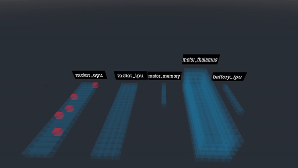

# Monitoring artificial brain’s cortical activity
## Abstract
You will learn about this tool to utilize your troubleshoot tools, use the demo on a different demo ros2/gazebo and learn how to use this tool on your project.
 
## The purpose of artificial brain's cortical activity
This tool is designed to show you all cortical events being activated. You will have a different cortical area where it display all neurons being firing. Let's use our ros2/gazebo demo as this example with this tool. Imagine if your robot is not acting normal like this gif:


As you can see robot acting weird in the demo. See the tool on the right side.

Here is what we implemented components in those cortical areas. As you can see there's three neurons firing in IR_IPU cortical area. It's because IR in gazebo can see the black line. As you can see the gif above where the robot moved as the IR detected no black line anymore, the IR_IPU cortical area disappeared. 

Like this:


Or proximity data (such as ultrasonic sensor) like this:


This tool is designed to show you all cortical area at once so that way, you can troubleshoot easier. See the tools on igntion gazebo as I have to load one by one for each sensor. Imagine if this robot have more than 20 sensors at once. It would be too much of time to load all troubleshooting tools. With this cortical activity, it will be able to load all at once in real time.


This is the right way and see how this tool show you the difference. See the IR_IPU where the three neuron firing non-stop as the robot follows the black line. This is the purpose of troubleshooting tool.


## A detailed information behind FEAGI
More detailed documentation is [here](https://github.com/feagi/feagi-core#readme)

So, the FEAGI will read the static_genome.py which is located in `src/evo/static_genome.py`. As the FEAGI reads the `block_boundaries`, `relative_coordinate` and `visualization`. It will focus on the cortical area aka `block_boundaries` to develop and build the model of the cortical area and move this to the coordinate aka `relative_coordinate`. Once it see the visualization on, it would know you are using it on a componenet. Let's say, you used IR componenets on IR_IPU. 

This genome display all stuff being used in the general robot. You can also add them in the genome as well which is explained in Cortical Area Arrangements section.

## To start with the program to see the data
```
1. FEAGI_initalize.sh
```

If you want to do it without script, you can do by:
```
1. Start FEAGI
2. python3 bridge_godot_python.py
3. ./FEAGI_activity.x86_64
```
If you want to launch it in the container, you can do this:
```

```
It should look like this,




**Red voxels are done by FEAGI**

## Cortical activity's job.
The program is made by Godot. It's designed to illustrate the neurons firing in cortical area and show what is done from the FEAGI. The purpose of this is to learn the system and troubleshooting the system easier. This will generate all cortical area being used and then it will show the firing neurons within the cortical area. Basically, FEAGI created the cortical area in 3d space and allowed godot to translate every voxel which is translated as a neuron firing from the FEAGI to any robot. The cortical area, a blue block in this instance, will show you which the cortical area is used by FEAGI and have them display all neuron firing inside the cortical area. 

So, the FEAGI will display like this per one second. Those are called burst. 


Those burst come from the burst engine. Just think of it as like a cyclical motor that fires regularly. So those neuron will be sent to all cortical areas and those neurons will display which is belonged to a cortical area. Basically, you are seeing the artificial brain's activity. 

So the godot's role is to read the genome and translate FEAGI into godot. Red voxel is a neuron being firing.

## bridge_godot_python.py's role
This is the bridge between FEAGI and Godot. Since Godot doesn't support ZMQ and doesn't run as python. Godot run on the GDnative. So, the solution was to communicate through the UDP. Python3 can do ZMQ and UDP and FEAGI is made by entirely python3. Basically, this script will fills the gap and send data to godot as FEAGI sends a burst of data in real time. 

## Launch into a unique project

You probably have tried our freeenove smartcar demo in gazebo using ROS2 and FEAGI. If you haven't seen it, here is the  [documentation](https://github.com/feagi/feagi-core/blob/develop/third_party/gazebo/smart_car/freenove_4wd_car_description/README.md).


Container part ##TODO: Needs to complete this part

Before you start, be sure to copy bridge_godot_python.py, FEAGI_activity.x86_64, FEAGI_initalize.sh and FEAGI_activity.pck from feagi-core/third-party/godot/ to feagi-core/src/evo/.

After this, launch FEAGI then:
```
1. Navigate to feagi-core/docker/
2. docker-compose -f docker-compose-feagi-ros-ign-VNC.yml build --no-cache
3. docker-compose -f docker-compose-feagi-ros-ign-VNC.yml up
4. Open this in your browser: 127.0.0.1:6080/
5. Open a seperate terminal, navigate to /feagi-core/src/evo/
6. ./FEAGI_initalize.sh
```

See how ros2/gazebo being controlled by FEAGI as you can see FEAGI's neuron firing 


## Cortical Area Arrangements
FEAGI using Genome's relative coordinate to create a block and send the data on it. So, with the relative coordinate, this is where you lay out the cortical area. From the same example I used,


Previous lay out looked like this:


and 


I moved the cortical area only used for this github example. 


Cortical area and neuron (red cubes) are on the coordination plane's the quadrant 1 only.
Picture reference: 


And the cortical area arrangements like this


To change the relative_coordinate:
```
1. Navigate to feagi-core/src/evo/static_genome.py
2. Search for "relative_coordinate".
3. Change the coordinate of x,y,z under the "relative_coordinate"
4. Save and launch FEAGI.
5. Launch FEAGI_initalize.sh
```
	
## Cortical area's size
You can change the cortical area's width, depth and height to match your needs. 

Here is how you change the W,D,H:
```
1. Navigate to feagi-core/src/evo/static_genome.py
2. Search for "block_boundaries" under the desire name of cortical area
3. Change the W,D,H respectively.
```

Here is the future reference


## Enable the cortical area
Previously, I had to enable proximity IPU to show the ultrasonic. Doing by navigate to `src/evo/static_genome.py`

Search the desire cortical area then add this

            "relative_coordinate": [
                x,
                 y,
                 z
            ],
            "visualization": True,


above the `"geometric_boundaries":`

Be sure to put `True` next to visualization so that way, it can tell FEAGI that you need it. The bridge will be able to read and illustrate the cortical area.

As for the relative_coordinate, you can put it somewhere you want it to be. 


