# Monitoring artificial brain’s cortical activity
## Abstract
You will learn about this capability that you can use to help you when you troubleshoot. You can use the godot program on a ROS2/Gazebo demo, and learn how to use this capability on a current or future project.
 
## The Purpose Of The Artificial Brain's Cortical Activity
This capability was designed to show you all cortical events being activated. You will have access to a different cortical area where it will display all neurons being fired. Let's use our ROS2/Gazebo demo as an example to highlight this capability. Imagine if your robot is not acting normal like this gif:


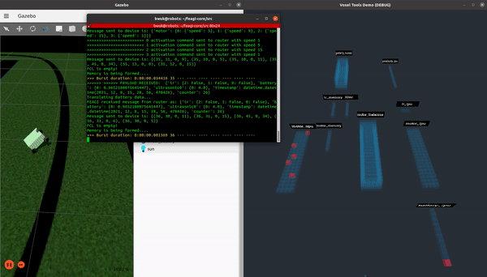


 As you can see, the robot is acting weird in the demo. (See the tool on the right side).


Here is what we have implemented as components in those cortical areas. As you can see, there are three neurons firing in the IR_IPU cortical area. This is due to  the IR in Gazebo as can be seen by the black line. The gif above showing where the robot moved away as the IR_IPU cortical area disappeared. This is because the IR was detected no black line anymore.

Like this:

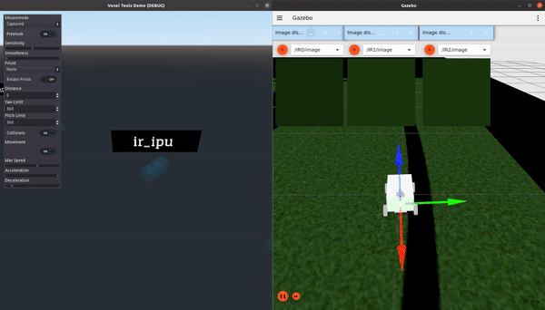

Or proximity data (such as ultrasonic sensor) like this:


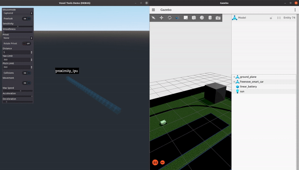


This capability was designed to show you all the cortical areas at once so that way you can troubleshoot easier. You can see the tools on Ignition Gazebo as I load each sensor one by one. Imagine if this robot would have more than 20 sensors at once. It would be very time consuming to have to load all the troubleshooting tools. With this capability, you can be able to load all the sensors, in real-time, at once. 


This is the proper way and as you can see, this tool shows you the difference in managing time. See the IR_IPU where the three neurons are firing non-stop as the robot follows the black line? This is the purpose of the troubleshooting tool.


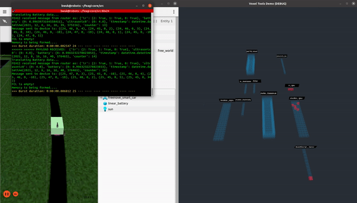


## Detailed Information Behind FEAGI
More detailed documentation is [here](https://github.com/feagi/feagi-core#readme)

The FEAGI will read the static_genome.py which is located in `src/evo/static_genome.py`. As the FEAGI reads the `block_boundaries`, `relative_coordinate` and `visualization`, it will focus on the cortical area a.k.a `block_boundaries` to develop and build the model of the cortical area and move this to the coordinate a.k.a `relative_coordinate`. Once it can see the visualization on, it would know you are using it on a component. Let's say, you used IR components on IR_IPU. 

This genome will display all the cortical areas, neurons, and information being used in a general robot. You may also add the genome as well which is explained in the Cortical Area Arrangements section.

## Starting With The Program To View The Neurons Data

If you want to launch the godot in the container, you can do so by doing this:
```
1. Navigate to feagi-core/docker/
2. paste this in terminal: docker-compose -f docker-compose-godot.yml build --no-cache
3. Once this complete the build, paste this: docker-compose -f docker-compose-godot.yml build up
4. Open http://127.0.0.1:6080/ in your browser
```
It should look like this,


Control list for the camera in container:
### Action   =   keys
Rotate left = 'A'
Rotate right = 'D'
Rotate upward = 'W'
Rotate backward = 'S'
Move to left = 'arrow left'
Move to right = 'arrow right'
Move to forward = 'arrow up'
Move to backward = 'arrow back'


If you want to do it on local machine, you can do so by doing this:
```
1. Navigate to feagi-core/third_party/godot/local_machine/
2. FEAGI_initalize.sh
```

If you want to do it without a script, you can do so by following these steps:
```
1. Start FEAGI
2. python3 bridge_godot_python.py
3. ./FEAGI_activity.x86_64
```

On local control for the camera using mouse to freelook and arrow keys as move. 


**Red voxels are done by FEAGI**

## The Cortical Activity's job.
The program is made by Godot. It's designed to illustrate the neurons firing in the cortical area and show what is done from the FEAGI. The purpose of this is to learn the system and easily troubleshoot the system. This will generate all the cortical areas being used and then it will show the firing neurons within the cortical area. Basically, FEAGI created the cortical area in 3d space and allowed Godot to translate every voxel which is translated as a neuron firing from the FEAGI to any robot. The cortical area, a blue block in this instance, will show you which cortical area is being used by FEAGI and have them display all the neurons firing inside the cortical area. 

FEAGI will display like this per one second which is known as a burst. 


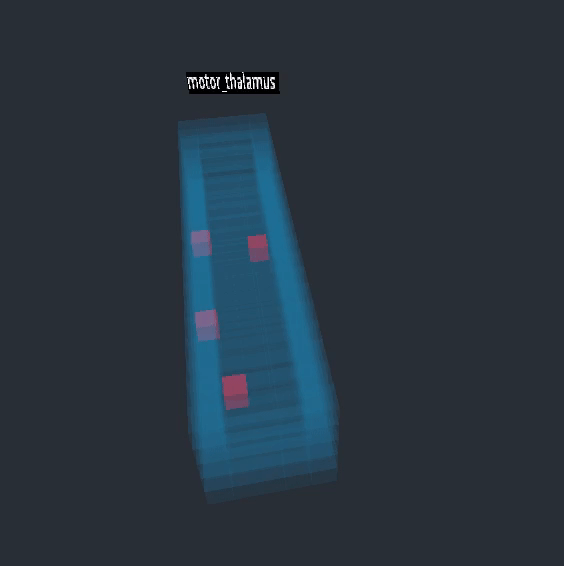


 These bursts come from the burst engine. Just think of it as like a cyclical motor that fires regularly. Those neurons will be sent to all the cortical areas and those neurons will display which is belonged to a cortical area which means you are seeing the artificial brain's activity. 


The Godot's role is to read the genome and translate FEAGI into Godot. Red voxel is a neuron being fired.

## bridge_godot_python.py's Role
This is the bridge between FEAGI and Godot. Since Godot doesn't support ZMQ and doesn't run as Python. Godot runs on the GDnative. The solution was to communicate through the UDP. Python3 can do ZMQ and UDP and FEAGI is made entirely by Python3. Basically, this script fills the gaps and sends data to Godot as FEAGI sends a burst of data in real-time. 

## Launch Into A Unique Project

You probably have tried our freeenove smartcar demo in Gazebo using ROS2 and FEAGI. If you haven't seen it, here is the  [documentation](https://github.com/feagi/feagi-core/blob/develop/third_party/gazebo/smart_car/freenove_4wd_car_description/README.md).


**Container:**
```
1. Navigate to feagi-core/docker/
2. docker-compose -f docker-compose-feagi-ros-ign-VNC.yml build --no-cache
3. docker-compose -f docker-compose-feagi-ros-ign-VNC.yml up
4. Open this in your browser: 127.0.0.1:6080/
4. Open a new terminal.
5. Navigate to feagi-core/third_party/godot/
6. Type in the therminal: "python3 bridge_godot_python.py"
7. Open a new terminal again, then navigate to feagi-core/third_party/godot/
8. ./FEAGI_activity.x86_64
```

See how ROS2/Gazebo is being controlled by FEAGI as you can see FEAGI's neuron firing

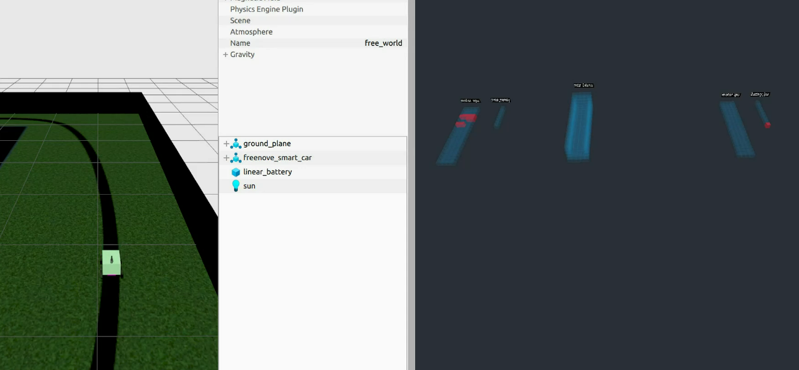

## Cortical Area Arrangements
FEAGI uses the Genome's relative coordinates to create a block's location and send the data on it. With the relative coordinate, you are able to lay out the cortical area. Here is from the same example I previously used,

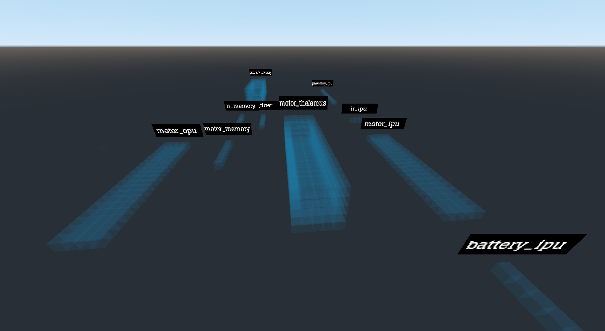


Prior lay out looked like this:

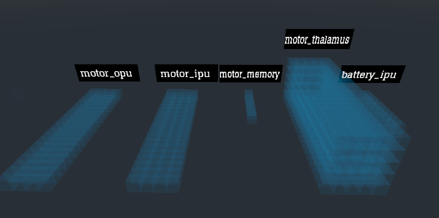

and 


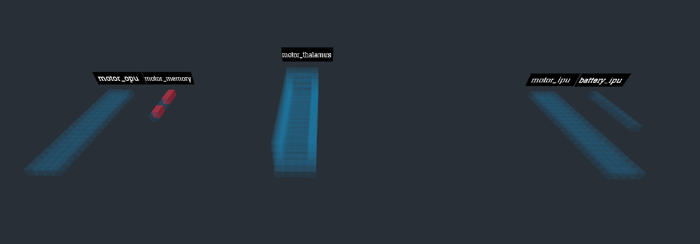


 Cortical area and neuron (red cubes) are on the coordination plane’s quadrant 1 only.

Picture reference: 

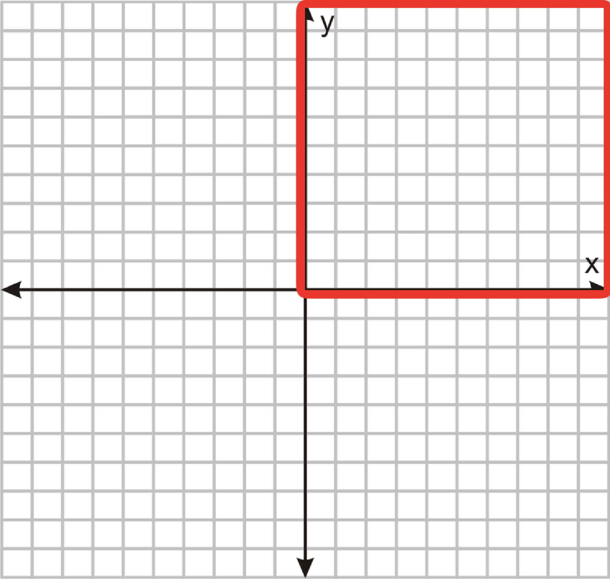

And the cortical area arrangements like this

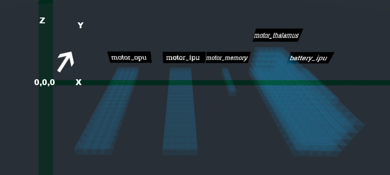

To change the relative_coordinate:
```
1. Navigate to feagi-core/src/evo/static_genome.py
2. Search for "relative_coordinate".
3. Change the coordinate of x,y,z under the "relative_coordinate"
4. Save and launch FEAGI.
5. Launch FEAGI_initalize.sh
```
	
## Cortical area's size
You can change the cortical area's width, depth and height to match your needs. 

Here is how you change the W,D,H:
```
1. Navigate to feagi-core/src/evo/static_genome.py
2. Search for "block_boundaries" under the desire name of cortical area
3. Change the W,D,H respectively.
```

Here is the future reference

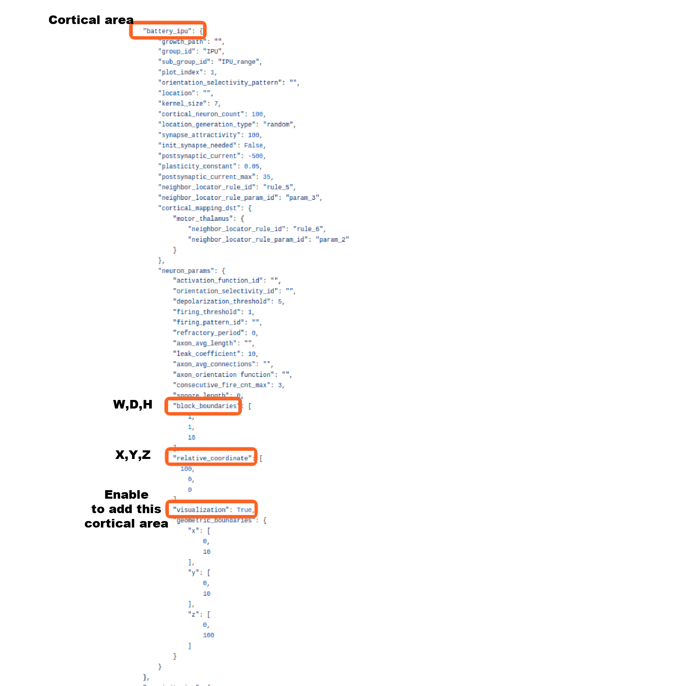


## Enable The Cortical Area
 Previously I had to enable proximity IPU to show the ultrasonic. This is done by navigating to `src/evo/static_genome.py`


Search the desire cortical area then add this

            "relative_coordinate": [
                x,
                 y,
                 z
            ],
            "visualization": True,


above the `"geometric_boundaries":`

Be sure to put `True` next to visualization so that way, it can tell FEAGI that you need it. The bridge will be able to read and illustrate the cortical area.

As for the relative_coordinate, you can put it somewhere you want it to be. 


