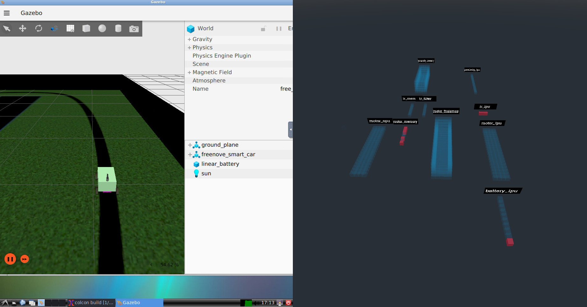
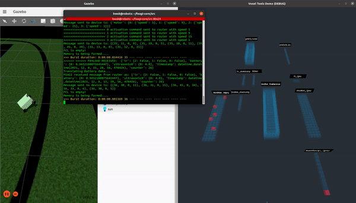
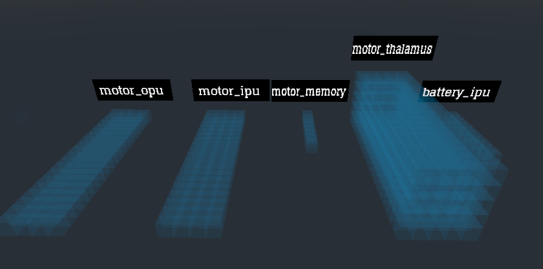

# Monitoring an artificial brain’s cortical activity

## Introduction
This tool enables users to visualize neuronal activity produced in the cortical areas of the artificial brain generated by FEAGI using the Godot game engine. Visualizing FEAGI artificial brain activity can be useful for characterizing, troubleshooting and better understanding brain performance/behavior (physiology?). Artificial brain cortical areas are represented in Godot in accordance with the dimensions specified in `feagi-core/src/evo/static_genome.py` (for each specified area), comprised of voxels (i.e. blocks), which can be populated with neurons

## The Cortical Activity's job.
<details>
  <summary>Click here to expand</summary>

The program is made by Godot. It's designed to illustrate the neurons firing in the cortical area and show what is done from the FEAGI. The purpose of this is to learn the system and easily troubleshoot the system. This will generate all the cortical areas being used and then it will show the firing neurons within the cortical area. Basically, FEAGI created the cortical area in 3d space and allowed Godot to translate every voxel which is translated as a neuron firing from the FEAGI to any robot. The cortical area, a blue block in this instance, will show you which cortical area is being used by FEAGI and have them display all the neurons firing inside the cortical area. 

FEAGI will display like this per one second which is known as a burst. 


These bursts come from the burst engine. Just think of it as like a cyclical motor that fires regularly. Those neurons will be sent to all the cortical areas and those neurons will display which is belonged to a cortical area which means you are seeing the artificial brain's activity. 

The Godot's role is to read the genome and translate FEAGI into Godot. Red voxel is a neuron being fired.
</details>

<!--  -->
 
## Artificial brain cortical activity
<details>
  <summary>Click here to expand</summary>

This capability was designed to show you all cortical events being activated. You will have access to a different cortical area where it will display all neurons being fired. Let's use our ROS2/Gazebo demo as an example to highlight this capability. Imagine if your robot is not acting normal like this gif:



Here is what we have implemented as components in those cortical areas. As you can see, there are three neurons firing in the IR_IPU cortical area. This is due to  the IR in Gazebo as can be seen by the black line. The gif above showing where the robot moved away as the IR_IPU cortical area disappeared. This is because the IR was detected no black line anymore.

Like this:


Or proximity data (such as ultrasonic sensor) like this:


This capability was designed to show you all the cortical areas at once so that way you can troubleshoot easier.


</details>

## Detailed Information Behind FEAGI
<details>
  <summary>Click here for more information</summary>

The FEAGI will read the static_genome.py which is located in `src/evo/static_genome.py`. As the FEAGI reads the `block_boundaries`, `relative_coordinate` and `visualization`, it will focus on the cortical area a.k.a `block_boundaries` to develop and build the model of the cortical area and move this to the coordinate a.k.a `relative_coordinate`. Once it can see the visualization on, it would know you are using it on a component. Let's say, you used IR components on IR_IPU. 

This genome will display all the cortical areas, neurons, and information being used in a general robot. You may also add the genome as well which is explained in the Cortical Area Arrangements section.

More information about FEAGI is available [here](https://github.com/feagi/feagi-core#readme).
</details>

## Launching the visualization tool
<details>
  <summary>Click here to see detailed steps</summary>

To launch a containerized version of the Godot visualization tool, perform the following steps:
```
1. Navigate to feagi-core/docker/
2. docker-compose -f feagi.yml build --no-cache
3. docker-compose -f feagi.yml up
4. Navigate to http://127.0.0.1:6080/ in a browser
```
Browser output should resemble the following image:


To run the tool locally:
```
1. Navigate to feagi-core/third_party/godot/local_machine/
2. ./FEAGI_initalize.sh
```

**Visualization tool camera controls**

| Action        | Key         |
| :-----------: | :---------: |
| Rotate left   |      A      |
| Rotate right  |      D      | 
| Rotate up     |      W      |
| Rotate down   |      S      |
| Move R to L   | left arrow  |
| Move L to R   | right arrow |
| Move forward  | up arrow    |
| Move backward | down arrow  |
</details>

## Enable FEAGI cortical areas for visualization in Godot environment
<details>
  <summary>Click here for more details</summary>
Cortical areas in the artificial brain generated by FEAGI require additional configuration to appear in Godot visualizations. To enable visualization for a cortical area, add the following key-value pairs in `src/evo/static_genome.py` under the desired area (above the `"geometric_boundaries"` key - see image below):

            "relative_coordinate": [
                 x,
                 y,
                 z
            ],
            "visualization": True,

Ensure `"visualization"` is set to `True`. Relative coordinates determine the positioning of the cortical area in the Godot simulation environment. Select coordinates appropriate for your monitoring purposes and ensure that discrete areas are not overlapping.


FEAGI uses the Genome's relative coordinates to create a block's location and send the data on it. With the relative coordinate, you are able to lay out the cortical area. Here is from the same example I previously used,


Prior lay out looked like this:



and 


Cortical area and neuron (red cubes) are on the coordination plane’s quadrant 1 only.

Picture reference: 


And the cortical area arrangements like this


To change the relative coordinates:
```
1. Navigate to feagi-core/src/evo/static_genome.py
2. Search for "relative_coordinate".
3. Change the values of x,y,z under the "relative_coordinate" key
4. Save and launch FEAGI.
5. Launch FEAGI_initalize.sh
```
</details> 

## Change FEAGI cortical area's size
<details>
  <summary>Click here for more details</summary>

To change a cortical area's width, depth and height: 

```
1. Navigate to feagi-core/src/evo/static_genome.py
2. Search for "block_boundaries" under the target cortical area
3. Change the W,D,H values as needed (see image below)
```


</details>
