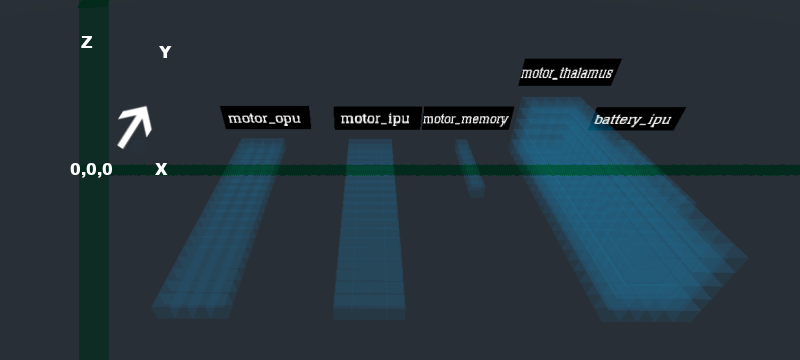
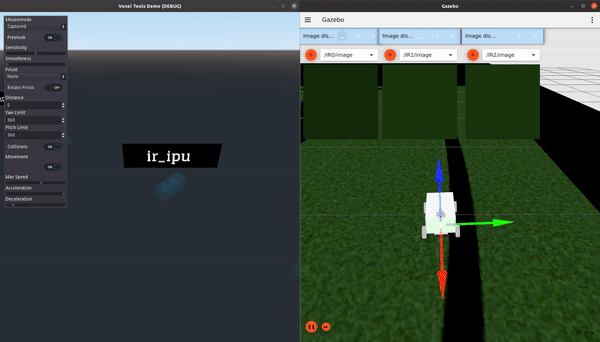
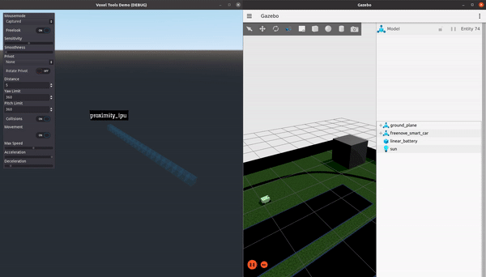
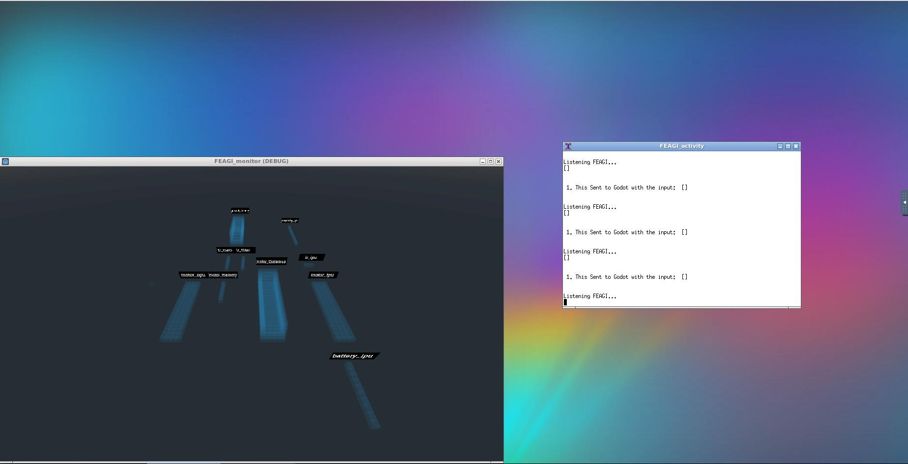
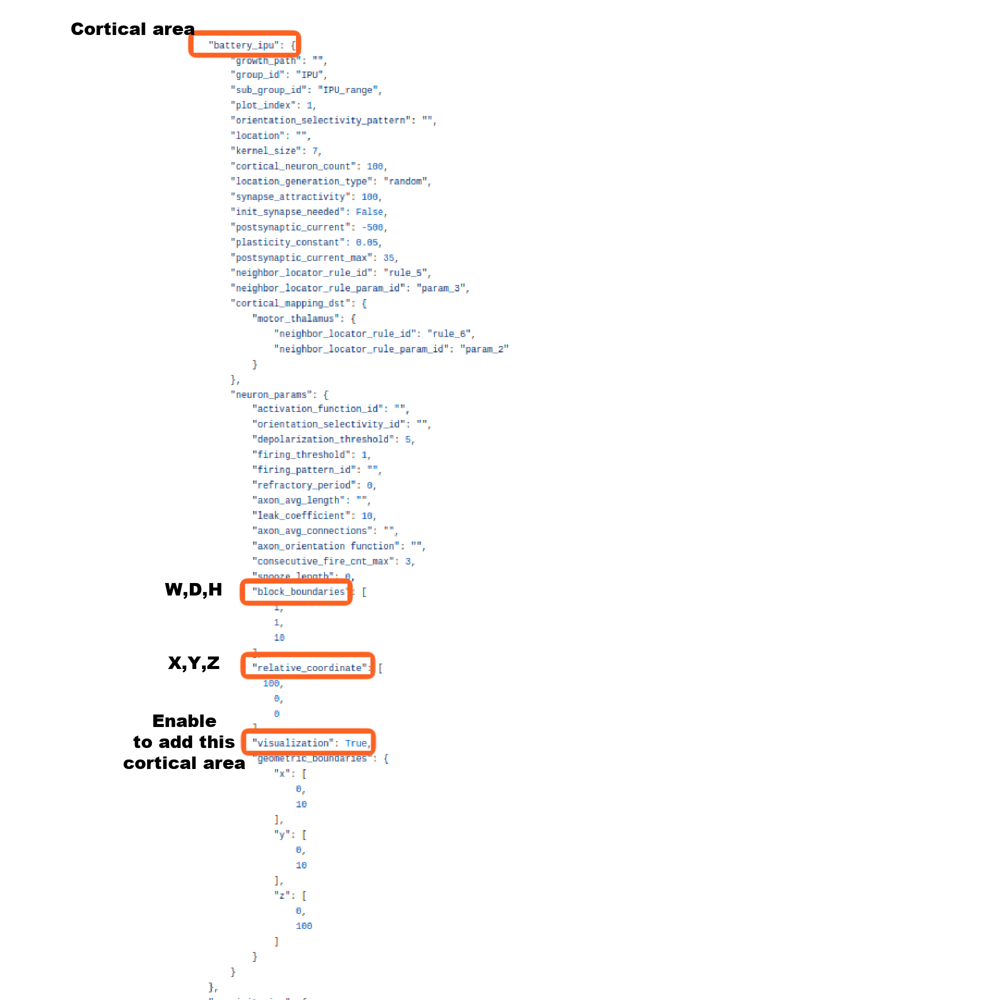

**This information may be outdated. Please refer to the [Wiki](https://github.com/feagi/feagi/wiki/Godot) for the most up to date information.**


# **Monitoring artificial brain cortical activity**

- [Monitoring an artificial brain’s cortical activity](#monitoring-an-artificial-brain-s-cortical-activity)
  * [Introduction](#introduction)
  * [Artificial brain cortical activity](#artificial-brain-cortical-activity)
  * [Launching the visualization tool](#launching-the-visualization-tool)
  * [Enable cortical areas for visualization in Godot environment](#enable-cortical-areas-for-visualization-in-godot-environment)
  * [Change FEAGI cortical area size](#change-feagi-cortical-area-size)

&nbsp;
# **Introduction**
This tool enables users to visualize neuronal activity produced in the cortical areas of the artificial brain generated by FEAGI using the Godot game engine. Visualizing artificial brain activity can be useful for characterizing, troubleshooting and, ultimately, better understanding brain functioning.

&nbsp;
# **Artificial brain cortical activity**
Artificial brain cortical areas are represented in Godot in accordance with the dimensions specified in `feagi/src/evo/static_genome.json` for each defined area and are comprised of voxels (i.e. blocks), which can be populated with neurons capable of forming synapses. In the Godot environment, red voxels indicate intrinsic neuronal activity. As cortical activity is generated and propagates in the artificial brain, data describing the general dimensions of the area and locations of voxels with active (i.e. firing) neurons are transmitted to Godot for visualization. Cortical areas must have visualization enabled (see [Enable cortical areas for visualization in Godot environment](#enable-cortical-areas-for-visualization-in-godot-environment)) to appear in the Godot environment.



In the following example, observe the instances of neuronal activity occurring within the motor thalamus cortical area. The rate at which active (red) voxels appear (i.e. burst frequency) is defined and controlled by FEAGI.    


In these examples, voxels in the cortical areas (`ir_ipu` and `proximity_ipu`, respectively) are activating in response to external stimuli detected by the robot in the virtual environment. As the virtual robot's three IR sensors (located on the bottom/front of the robot facing downward) are exposed to the black line, neurons in the IR IPU cortical area voxels corresponding to the sensors are activated (Left). Similarly, voxels in the proximity IPU cortical area are activated in a manner dependent on the proximity of an object relative to the virtual robot (Right).      
 

&nbsp;
# **Launching the visualization tool**
<details>
  <summary>Click here to see detailed steps</summary>
To launch a containerized version of the Godot visualization tool, perform the following steps:

```
1. Navigate to feagi/docker/
2. docker-compose -f feagi.yml build --no-cache
3. docker-compose -f feagi.yml up
4. Navigate to http://127.0.0.1:6080/ in a browser
```
Browser output should resemble the following image:


To run the tool locally:
```
1. Navigate to feagi/third_party/godot/local_machine/
2. ./FEAGI_initalize.sh
```

**Visualization tool camera controls**

| Action        | Key         |
| :-----------: | :---------: |
| Rotate left   |      A      |
| Rotate right  |      D      | 
| Rotate up     |      W      |
| Rotate down   |      S      |
| Move Left     | left arrow  |
| Move Right    | right arrow |
| Move forward  | up arrow    |
| Move backward | down arrow  |
</details>

&nbsp;
# **Enable cortical areas for visualization in Godot environment**
<details>
  <summary>Click here for more details</summary>
Cortical areas in the artificial brain generated by FEAGI require additional configuration to appear in Godot visualizations. To enable visualization for a cortical area, add the following key-value pairs in `src/evo/static_genome.json` under the desired area (above the `"geometric_boundaries"` key - see image below):

            "relative_coordinate": [
                 x,
                 y,
                 z
            ],
            "visualization": True,

Ensure `"visualization"` is set to `True`. Relative coordinates determine the positioning of the cortical area in the Godot simulation environment. Select coordinates appropriate for your monitoring purposes and ensure that discrete areas are not overlapping.


To change the relative coordinates:
```
1. Navigate to feagi/src/evo/static_genome.json
2. Search for "relative_coordinate".
3. Change the values of x,y,z under the "relative_coordinate" key
4. Save and launch FEAGI.
5. Launch FEAGI_initalize.sh
```
</details> 

&nbsp;
# **Change FEAGI cortical area size**
<details>
  <summary>Click here for more details</summary>

To change a cortical area's width, depth and height: 

```
1. Navigate to feagi/src/evo/static_genome.json
2. Search for "block_boundaries" under the target cortical area
3. Change the W,D,H values as needed (see image below)
```


</details>
