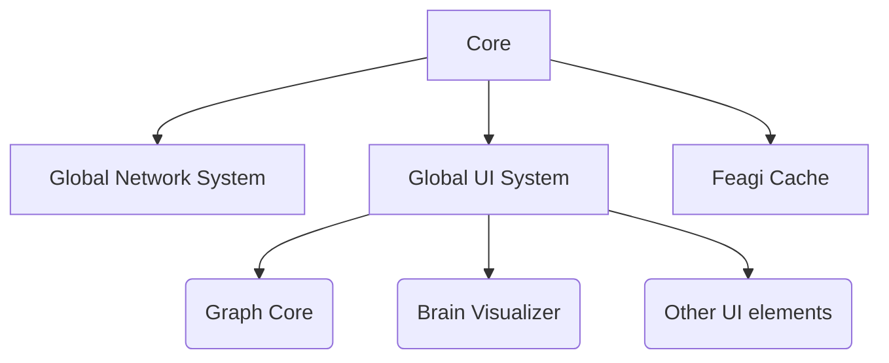
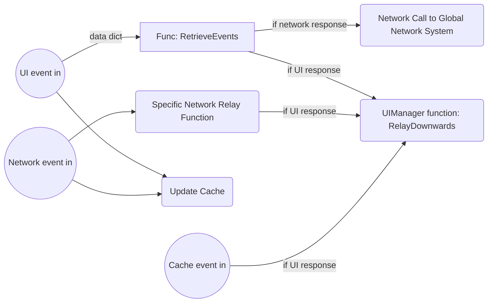
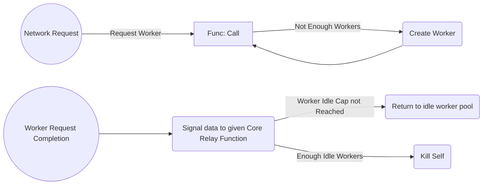
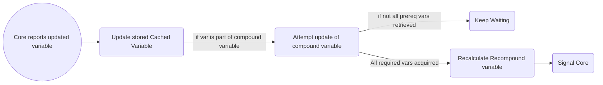
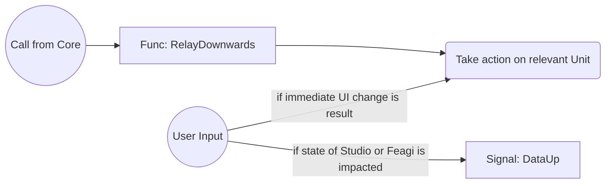

# NeuroRobotics Studio
This documentation gives the general layout of the system

### Core:
The central manager of the Studio. Receives global input events from below components, directs network calls and data caching events, and pushes out changes to the UI and network in response.

### Global Network System:
A managed set of workers that handles API calls. Since network calls are non-instant, workers are dynamically created as needed, and will signal out to Core once call is completed

### Cache:
Holds variables retrieved from Network and other places, as well as calculating and updating compound variables that require several network calls to be generated

### UI Manager
Parent to all UI elements, relay station for UI Events. Handles creation and management of Units 

