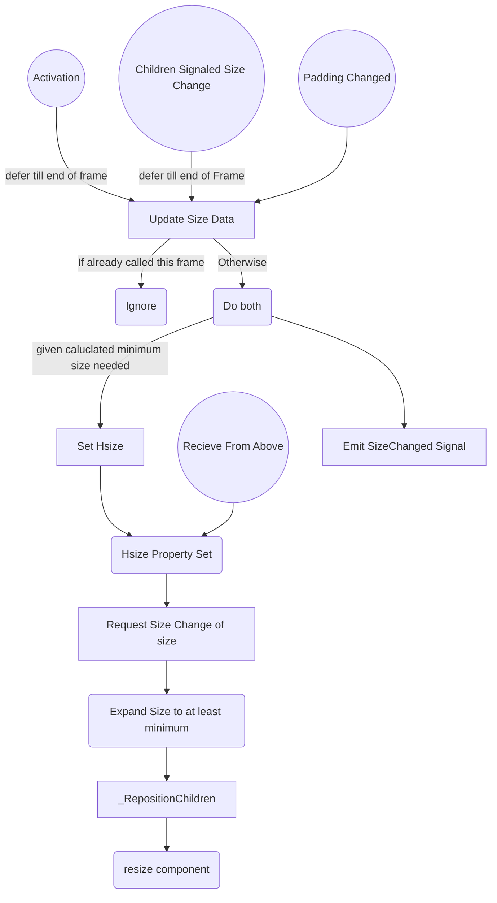

# Component

In this context, a component is a prefab/scene set of UI nodes orchestrated by a single script for a purpose. Usually, they consist of some form of user input and a header/label, but can differ

To initialize a component (must be done before use), pass through an activation dictionary into the Activation function

**Universal properties/methods/activationDict of all Components**
 - Properties:
	 - componentType: (str)
		 - set at activation only, **required**
		 - returns: The type of component
	 - ID: (str)
		 - set at activation only, **required**
		 - returns the string ID name of the component, used with the JSON init and with passing data through
	 - isHorizontal: (bool)
		 - set at activation only
		 - returns whether the internal components are laid horizontally (true) or vertically (false). Default is True
	 - dataAvailable: (bool)
		 - returns whether this component has accessible data
	 - dataSignalAvailable: (bool)
		 - returns whether this component has an accessible data signal
	 - data: (variant)
		 - returns the data within the component
	 -	minimumSize: (Vector2)
		 -	returns: The cached minimum dimensions that the internal nodes allow. *To force update this, call "_UpdateMinimumDimensions"!*
	 - padding: (Vector2) 
		 - padding on sides of the component
		 - set at activation, and can be updated as a property
			 - setting triggers a minimum size recalculation, and if necessary, Size change
		 - returns the padding on the sides of the component (half on either side). Default is <6.0, 3.0>
	 - Hsize: (Vector2)
		 - can be set at activation or as a property
			 - Component will refuse to shrink down smaller than minimum allowed size
			 - Will signal up a SizeChanged signal
		 - returns the size of the component back panel
	 - alignmentHeight: (HeightAlignmentSide Enum)
		 - If internals should be aligned to the bottom, center or top
		 - can be set as activation or as a property
		 - returns the current HeightAlignmentSide Enum setting
	 - alignmentWidth: (WidthAlignmentSide Enum)
		 - If internals should be aligned to the right, center or left
		 - can be set as activation or as a property
		 - returns the current WidthAlignmentSide Enum setting
	
 - Methods:
	 - Activate(settings: dictionary) -> bool: 
		 - Initializes all prerequisites. Will ignore all calls after the first.
	 - ApplyPropertiesFromDict(settings: dictionary) --> void
		 - Updates the children by ID from the dictionary, useful for setting values
	 - RequestSizeChange(newSize: Vector2) -> bool:
		 - Can be called from above to request a change of size to given. Will expand requested size if too small. Does not signal up changes to size. 
		 - Returns false if input size had to be changed
	 - UpdateSizeData(forceUpdate: bool = false): 
		 - Called from below to request the component to grow to the smallest allowed size.
		 - Emits 'SizeChanged' when done

 - activationDict:
	 - componentType: The specific type of component this will be. **Required**
	 - ID: The ID to reference the component by. **Required**
	 - isHorizontal: (bool) If the internal components are laid horizontally. *Optional*
	 - padding: (Vector2) The X and Y padding that is split along each side respectfully. *Optional*, 10x6 by default
	 - size: The custom size you want this component to be. It will be ignored if the given size is smaller than the allowed size. *optional*

 - Signals
	 - MinSizeRecalculated(newMinSize: Vector2, changedObjectReference: [specific component reference])
		 - Signaled up whenever the minimum required size of the component has been updated
	 - DataUp(customData: Dictionary, changedObjectReference)
		 - Signaled up with user input events on the component (if relevant). Details of the customData dict depends on the specific component

#### Size Change System
