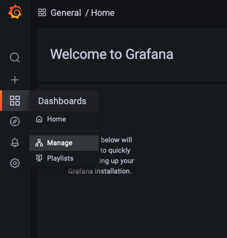
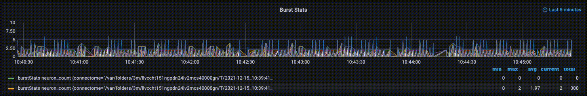
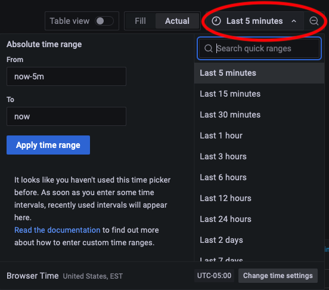

# **Visualizing FEAGI data with Grafana**
Users have the option to perform real-time monitoring of artificial brain activities (ex: membrane potentials, active cortical areas, composite network activity, current burst index etc.) during FEAGI runtime, which can be useful for troubleshooting and gaining insights into artificial brain functioning. This is achieved using [Grafana](https://grafana.com) combined with [InfluxDB](https://www.influxdata.com) serving as a Grafana datasource for the various forms of time series data generated by FEAGI. These tools can be quickly deployed alongside FEAGI using a containerized approach with minimal user setup required.  

## **Grafana**
Grafana is an open source web application that provides customizable data visualization where users can create dashboards for visualizing data obtained from a datasource (ex: a database). Configuration files for both dashboards and datasources can be found in `/feagi-core/third_party/grafana/provisioning` in the `dashboards/` and `datasources/` directories, respectively. General configuration of Grafana itself is achieved through the `grafana.ini` configuration file found in `/feagi-core/third_party/grafana/`. For more extensive Grafana configuration information, view the Grafana configuration [documentation](https://grafana.com/docs/grafana/latest/administration/configuration/). 

As mentioned previously, Grafana uses InfluxDB as a datasource, which stores time series data collected from FEAGI during execution. The aforementioned datasource configuration file for the InfluxDB datasource contains data for authenticating the InfluxDB instance, connecting to the database URL and specifying the target bucket for data storage. For this containerized deployment, it is recommended that users refrain from altering any of the accessible configuration files to avoid corrupting connections amongst services.

<!-- provide instructions for how to create a custom dashboard from scratch and save as JSON?  -->

**NOTE:** This deployment uses InfluxDB version 2 (`v2.0.7`), which relies on the functional data scripting language [Flux](https://docs.influxdata.com/flux/v0.x/get-started/) for querying and other data processing operations instead of the SQL-like [InfluxQL](https://docs.influxdata.com/influxdb/v1.8/query_language/) associated with earlier versions of InfluxDB (`< v2.0`). A sample Flux query is provided below to show the basic structure and highlight differences from InfluxQL syntax.
 
```
from(bucket: "example-bucket")
  |> range(start: -1d)
  |> filter(fn: (r) => r._measurement == "example-measurement")
  |> mean()
  |> yield(name: "_results")
```
**Sample Flux query**

## **Deploying networked FEAGI, InfluxDB and Grafana containers using `docker-compose`**
To deploy a containerized setup consisting of FEAGI, InfluxDB and Grafana, navigate to `/feagi-core/docker/` and enter the following commands as shown below (assuming both [Docker](https://docs.docker.com/get-docker/) and [docker-compose](https://docs.docker.com/compose/install/) are installed on the host machine):

**Build the images**
- `docker-compose -f docker-compose-feagi-influx-grafana.yml build --no-cache`

**Start the containers**
- `docker-compose -f docker-compose-feagi-influx-grafana.yml up`

**Access Grafana**
- Navigate to `http://localhost:3000` in a web browser to access the Grafana main menu, where users may select an existing data visualization dashboard (ex: `test_dashbboard` - a simple, one-panel dashboard for visualizing FEAGI neuron burst data to verify connectivity) or create a new, customized dashboard by clicking on the dashboard icon, then `Manage`, followed by `New Dashboard`.

  &nbsp;  
    
  **Access Grafana dashboard management (if needed) via the menu dock**

- To learn more about Grafana dashboards (creation, customization, management, etc.), visit the following resources:
    - [Grafana Dashboard overview](https://grafana.com/docs/grafana/latest/dashboards/?pg=docs)

    - [Best practices for creating dashboards](https://grafana.com/docs/grafana/latest/best-practices/best-practices-for-creating-dashboards/)

    - [Change default dashboard](https://grafana.com/docs/grafana/latest/administration/preferences/change-home-dashboard/)
        
    - [Add panels to a dashboard](https://grafana.com/docs/grafana/latest/panels/add-a-panel/)

**Confirm FEAGI data is flowing to Grafana**
- After running `docker-compose -f docker-compose-feagi-influx-grafana.yml up`, data should begin flowing from FEAGI (to InfluxDB) to Grafana and, if configured accordingly, appear in the dashboard in the respective panel(s), similar to the figure shown below.

  &nbsp;  
    
  **Example of FEAGI data being displayed in the panel of a Grafana dashboard**
 
- If no data appears in the dashboard despite appropriate configuration, it may be necessary to change the dashboard's Time Range (upper right corner of dashboard), which controls how far into the past the panel's time scale extends, to one of the values present in the dropdown menu (ex: Last _n_ minutes).

  &nbsp;  
    
  **Location of Time Range dropdown menu on a Grafana dashboard**  

- After confirming that data is flowing to the Grafana dashboard, make any desired adjustments to the dashboard's appearance and/or properties using the Grafana dashboard user interface.
