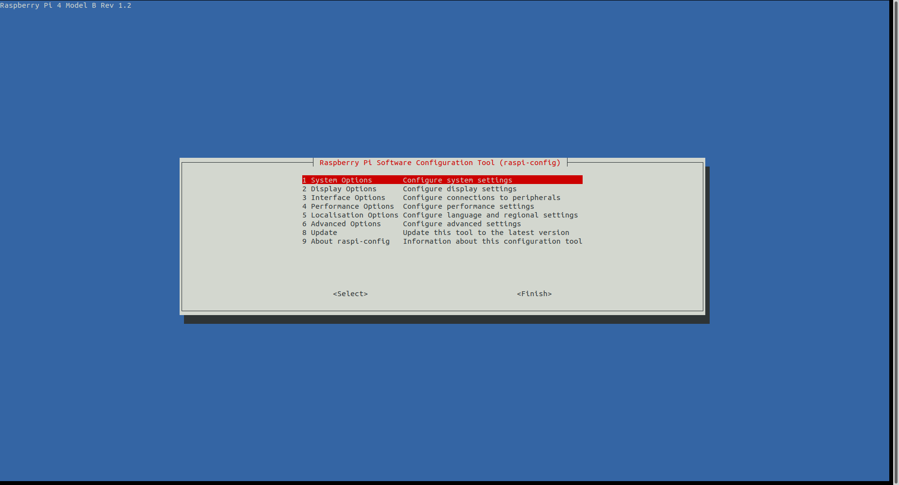

# Requirements:
- Raspberry Pi OS (32-bit), minimum 8 GB, with legacy camera support enabled.

# Shortest and fastest steps:
Assuming you already have legacy camera enabled, Raspbian OS 32-bit desktop installed, and have 
pip3/Python3 installed, follow these steps:

1. Run the following command to set up for the first time:
```
   python3 -m feagi_agent_freenove --ip <url/ip> --setup true
```
If you have already run the setup, use this command instead:
```
   python3 -m feagi_agent_freenove --ip <url/ip>
```
Replace `<url/ip>` with your FEAGI's IP address.

The command should be executed within the terminal.


# Full detailed steps:

1) Keep in mind that this is the robot body ``without`` the Raspberry Pi board. You can find it 
   here: [Freenove_Body](https://www.amazon.com/Freenove-Raspberry-Tracking-Avoidance-Ultrasonic/dp/B07YD2LT9D/ref=sr_1_3?keywords=freenove+4wd+car+kit&qid=1686246937&sprefix=freenove%2Caps%2C154&sr=8-3&ufe=app_do%3Aamzn1.fos.006c50ae-5d4c-4777-9bc0-4513d670b6bc)

2) Order the Raspberry Pi board. RPI 3 or RPI 4 are good options. You can find it here: 
   [Raspberry PI Board](https://www.amazon.com/Raspberry-Model-2019-Quad-Bluetooth/dp/B07TC2BK1X/ref=pd_bxgy_vft_none_img_sccl_1/145-1668819-0949402?pd_rd_w=MM6jo&content-id=amzn1.sym.26a5c67f-1a30-486b-bb90-b523ad38d5a0&pf_rd_p=26a5c67f-1a30-486b-bb90-b523ad38d5a0&pf_rd_r=WP4TBQQDTXVRH05BVVK4&pd_rd_wg=tpNVc&pd_rd_r=aca7db21-d4e0-4548-9e0c-a93588faa313&pd_rd_i=B07TC2BK1X&psc=1)

3) Build the robot using the comprehensive documentation. If you don't have the physical 
   documentation, you can use this online PDF available here: [Freenove Documentation PDF](https://github.com/Freenove/Freenove_4WD_Smart_Car_Kit_for_Raspberry_Pi/blob/master/Tutorial.pdf)
You can download it by clicking the 'download' icon on the right side above the PDF preview.

4) Once you have set up the physical robot, run Raspberry Pi's imager to install the Raspbian OS 
   on your SD card. You can download the imager from here: [Raspberry Pi Imager](https://www.raspberrypi.com/software/) Just click 'download' for your OS.

5) In the imager, select 'Raspberry Pi OS 32-bit with desktop (recommended)' so you can burn it to the SD card.

6) Choose your SD card location from the 'choose storage' button.

7) Click the 'Write' button and wait for the process to complete (ETA: approximately 10 minutes).

8) Once you have completed the process, safely remove the SD card. The program will 
   automatically eject it for you after completion. Then, you can insert the SD card into your 
   robot.

9) Complete all the questions asked during the setup (it doesn't matter since it's just for your 
   settings and preferences). ``Remember your own username`` as you will need it for SSH in the future 
   if you want to connect from your computer to the robot

10) After completing all the setup, click 'update'.

11) The RPI will ask you to restart, and that's when you'll start to see the fun stuff.

12) Open the terminal inside the Raspberry Pi and run the command: `sudo raspi-config`
You will see a picture like below:



    * Interface Options -> Legacy Camera Enable support -> enable
    * Interface Options -> SSH -> enable
    * Interface Options -> I2C -> enable
It will ask you to reboot due to enabling legacy camera support. Press OK to use the camera.

13) Open the terminal and type the following:
```
    pip3 install feagi_agent_freenove
```

14) Run the following command to set up for the first time:
```
   python3 -m feagi_agent_freenove --ip <url/ip> --setup true
```
If you have already run the setup, use this command instead:
```
   python3 -m feagi_agent_freenove --ip <url/ip>
```
Replace `<url/ip>` with your FEAGI's IP address.

# Install feagi_agent_freenove
`pip3 install feagi_agent_freenove`

# What is feagi_agent_freenove?
Feagi_agent_freenove is a package that allows you to connect with the Freenove Smartcar, which you can purchase on Amazon: [here on amazon](https://www.amazon.com/Freenove-Raspberry-Tracking-Avoidance-Ultrasonic/dp/B07YD2LT9D). 

It checks all the settings as the first step to ensure that you have all the necessary packages installed. 
After that, it runs requirements.txt and then starts the Freenove smartcar. 

At first, it may be a little slow because it is checking for all the necessary packages. However, after the first scan, it will be much quicker. This package enables you to connect with Feagi automatically, allowing it to see things, move, or share sensors in real-time.

# Requirements.txt
These are the requirements which will be updated over time. The script will use this requirement to scan.

Here: [requirements.txt](https://github.com/feagi/feagi/blob/staging/peripherals/feagi_agent_freenove/feagi_agent_freenove/requirements.txt)

