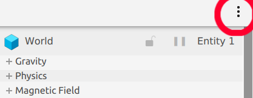
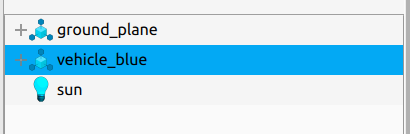
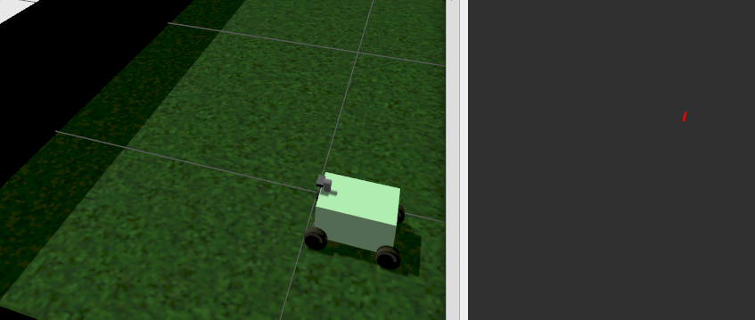
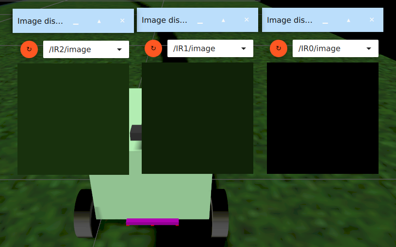
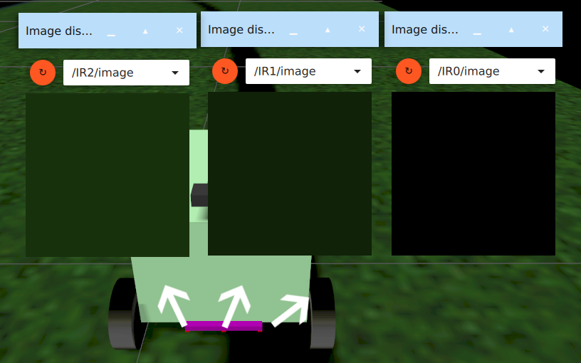
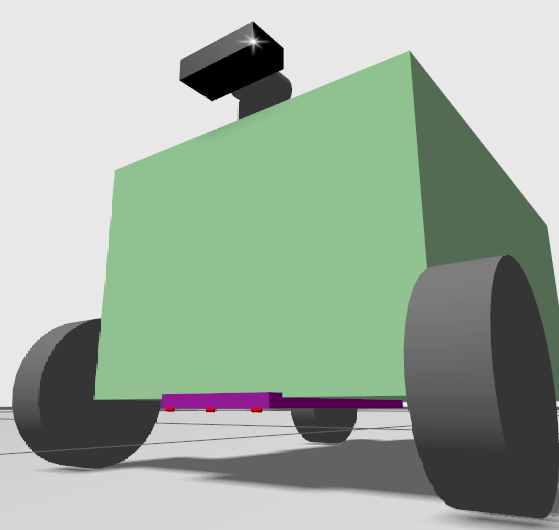
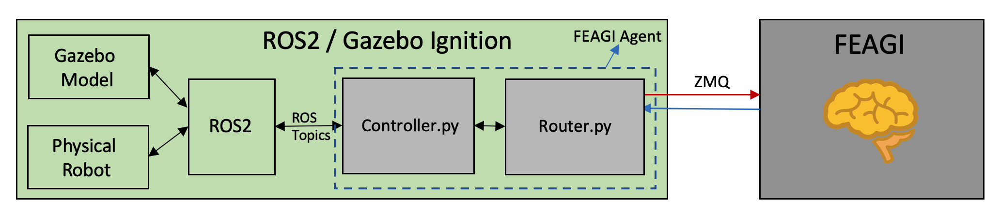

**This page may be outdated. For the most up to date information, please refer to our [Wiki](https://github.com/feagi/feagi/wiki/Creating-a-Simulation-with-ROS2-and-Gazebo)

# **Creating a Robot Simulation Using ROS2 and Gazebo**

- [Creating a Robot Simulation Using ROS2 and Gazebo](#creating-a-robot-simulation-using-ros2-and-gazebo)
  * [Introduction](#introduction)
  * [Requirements For This Project:](#requirements-for-this-project-)
  * [Create a workspace](#create-a-workspace)
  * [Getting started with the simulation](#getting-started-with-the-simulation)
  * [Create a bridge between ROS2 and Gazebo](#create-a-bridge-between-ros2-and-gazebo)
  * [Control the model using Python](#control-the-model-using-python)
- [Customization](#customization)
  * [Adding images to the simulation:](#adding-images-to-the-simulation-)
  * [Adding wheels:](#adding-wheels-)
  * [Adding sensors:](#adding-sensors-)
  * [Create topics in SDF for ROS2](#create-topics-in-sdf-for-ros2)
- [Smart Car Model](#smart-car-model)
  * [Running natively](#running-natively)
  * [Running in container](#running-in-container)
- [More information](#more-information)
  * [Models](#models)
  * [FEAGI, ROS2 and Gazebo networking](#feagi--ros2-and-gazebo-networking)
  * [Simulation blog](#simulation-blog)
- [Sources](#sources)
  * [Create a workspace](#create-a-workspace-1)
  * [Getting started with the simulation](#getting-started-with-the-simulation-1)
  * [Create a bridge between ROS2 and Gazebo](#create-a-bridge-between-ros2-and-gazebo-1)
  * [Control the model using Python](#control-the-model-using-python-1)
  * [FEAGI](#feagi)
- [Troubleshooting](#troubleshooting)

&nbsp;
# **Introduction**
This tutorial provides guidance for creating and deploying a virtual robot controlled by FEAGI in a Gazebo simulation environment. 

## Requirements:
1. ROS2 Foxy
2. Ignition Gazebo Citadel
3. Python (3.8)
4. Linux

## Create a workspace
<details>
<summary> Click here to see detailed steps </summary>

 1. `source /opt/ros/foxy/setup.bash`
 2. `mkdir -p my_first_ws/src`
 3. `cd my_first_ws/src`
 4. `ros2 pkg create --build-type ament_python my_first_robot`
 5. `cd my_first_robot/`
 6. `cd my_first_robot/` (again)
 7. `touch helloworld_test.py`
 8. `chmod a+x helloworld_test.py`
 9. Paste the following in `helloworld_test.py`:
    
    ```
    import rclpy
    from rclpy.node import Node
    from std_msgs.msg import String
    
    
    class MinimalPublisher(Node):
    
        def __init__(self):
            super().__init__('minimal_publisher')
            self.publisher_ = self.create_publisher(String, 'topic', 10)
            timer_period = 0.5  # seconds
            self.timer = self.create_timer(timer_period, self.timer_callback)
            self.i = 0
    
        def timer_callback(self):
            msg = String()
            msg.data = 'Hello World: %d' % self.i
            self.publisher_.publish(msg)
            self.get_logger().info('Publishing: "%s"' % msg.data)
            self.i += 1
    
    
    def main(args=None):
        rclpy.init(args=args)
    
        minimal_publisher = MinimalPublisher()
    
        rclpy.spin(minimal_publisher)
    
        # Destroy the node explicitly
        # (optional - otherwise it will be done automatically
        # when the garbage collector destroys the node object)
        minimal_publisher.destroy_node()
        rclpy.shutdown()
    
    
    if __name__ == '__main__':
        main()
    ```

 10. Update `package.xml` by pasting the following under `<license>TODO: License declaration</license>`:

      ```
      <exec_depend>rclpy</exec_depend>
      <exec_depend>std_msgs</exec_depend>
      ```
      
      `package.xml` should look like this:
      ```
      <?xml version="1.0"?>
      <?xml-model href="http://download.ros.org/schema/package_format3.xsd" schematypens="http://www.w3.org/2001/XMLSchema"?>
      <package format="3">
        <name>my_first_robot</name>
        <version>0.0.0</version>
        <description>TODO: Package description</description>
        <maintainer email="your_email">you</maintainer>
        <license>TODO: License declaration</license>
      
        <exec_depend>rclpy</exec_depend>
        <exec_depend>std_msgs</exec_depend>
      
        <test_depend>ament_copyright</test_depend>
        <test_depend>ament_flake8</test_depend>
        <test_depend>ament_pep257</test_depend>
        <test_depend>python3-pytest</test_depend>
      
        <export>
          <build_type>ament_python</build_type>
        </export>
      </package>
      ```
    
 11. Add the following to `setup.py`:
      ```
          entry_points={
              'console_scripts': [
                  'hello_world = my_first_robot.helloworld_test:main',
              ],
      ```
      
      `setup.py` should look like this:

      ```
      from setuptools import setup
      
      package_name = 'my_first_robot'
      
      setup(
          name=package_name,
          version='0.0.0',
          packages=[package_name],
          data_files=[
              ('share/ament_index/resource_index/packages',
                  ['resource/' + package_name]),
              ('share/' + package_name, ['package.xml']),
          ],
          install_requires=['setuptools'],
          zip_safe=True,
          maintainer='you',
          maintainer_email='your email',
          description='TODO: Package description',
          license='TODO: License declaration',
          tests_require=['pytest'],
          entry_points={
              'console_scripts': [
                  'hello_world = my_first_robot.helloworld_test:main',
              ],
          },
      )
      
      ```

 12. Add the following to `setup.cfg` if it is not present:

      ```
      [develop]
      script-dir=$base/lib/my_first_robot
      [install]
      install-scripts=$base/lib/my_first_robot
      ```
    
 13. `colcon build --symlink-install`
 14. `source install/setup.bash`
 15. `ros2 run my_first_robot hello_world`
</details>

&nbsp;
## Getting started with the simulation
<details>
<summary> Click here to see detailed steps </summary>

There are two important aspects of an SDF file: the world and the model. The world is the enviroment you created for the model, which is a robotic car in this example.

To learn more about creating Gazebo worlds and models, visit the following resources:

1. [World](https://ignitionrobotics.org/docs/citadel/sdf_worlds)
2. [Model](https://ignitionrobotics.org/docs/citadel/building_robot)

To start with create your own robot inside your workspace:
1. `cd ~/my_first_ws/src/my_first_robot`
2. `mkdir -p models/SDF`
3. `cd ~/my_first_ws/src/my_first_robot/models/SDF/`
4. `touch my_model.sdf`
5. Paste this under left wheel joint:
    ```
                    <plugin
                          filename="ignition-gazebo-joint-position-controller-system"
                          name="ignition::gazebo::systems::JointPositionController">
                          <joint_name>left_wheel_joint</joint_name>
                          <topic>left_wheel_joint</topic>
                    </plugin>
    ```
6. Paste this under right wheel joint:
    ```
                    <plugin
                          filename="ignition-gazebo-joint-position-controller-system"
                          name="ignition::gazebo::systems::JointPositionController">
                          <joint_name>right_wheel_joint</joint_name>
                          <topic>right_wheel_joint</topic>
                    </plugin>
    ```
7. `ign gazebo -r my_model.sdf`
8. Open the "Joint Position Controller" by clicking the icon shown in the following image:

    

9. Click on "vehicle_blue"

    

10. Ensure clicking on "vehicle_blue" produces a window similar to the following:

    
</details>

&nbsp;
## Create a bridge between ROS2 and Gazebo
<details>
<summary> Click here to see detailed steps </summary>

 1. `cd ~/my_first_ws/src/my_first_robot`
 2. `mkdir launch`
 3. `touch first_robot.launch.py`
 4. `touch ign_gazebo.launch.py`
 5. Paste the following code into `ign_gazebo.launch.py`:
    ```
    # Copyright 2020 Open Source Robotics Foundation, Inc.
    #
    # Licensed under the Apache License, Version 2.0 (the "License");
    # you may not use this file except in compliance with the License.
    # You may obtain a copy of the License at
    #
    #     http://www.apache.org/licenses/LICENSE-2.0
    #
    # Unless required by applicable law or agreed to in writing, software
    # distributed under the License is distributed on an "AS IS" BASIS,
    # WITHOUT WARRANTIES OR CONDITIONS OF ANY KIND, either express or implied.
    # See the License for the specific language governing permissions and
    # limitations under the License.

    """Launch Ignition Gazebo with command line arguments."""

    from os import environ

    from launch import LaunchDescription
    from launch.actions import DeclareLaunchArgument
    from launch.actions import ExecuteProcess
    from launch.substitutions import LaunchConfiguration


    def generate_launch_description():
        env = {'IGN_GAZEBO_SYSTEM_PLUGIN_PATH':
              ':'.join([environ.get('IGN_GAZEBO_SYSTEM_PLUGIN_PATH', default=''),
                        environ.get('LD_LIBRARY_PATH', default='')])}

        return LaunchDescription([
            DeclareLaunchArgument('ign_args', default_value='',
                                  description='Arguments to be passed to Ignition Gazebo'),
            ExecuteProcess(
                cmd=['ign gazebo',
                    LaunchConfiguration('ign_args'),
                    ],
                output='screen',
                additional_env=env,
                shell=True
            )
        ])

    ```
6. Paste the following into `first_robot.launch.py`:
    ```
    import os

    from ament_index_python.packages import get_package_share_directory

    from launch import LaunchDescription
    from launch.actions import IncludeLaunchDescription
    from launch.launch_description_sources import PythonLaunchDescriptionSource

    from launch_ros.actions import Node


    def generate_launch_description():
        pkg_ros_ign_gazebo = get_package_share_directory('my_first_robot')

        ign_gazebo = IncludeLaunchDescription(
            PythonLaunchDescriptionSource(
                os.path.join(pkg_ros_ign_gazebo, 'launch', 'ign_gazebo.launch.py')),
            launch_arguments={
                'ign_args': '-r models/SDF/my_model.sdf'
            }.items(),
        )

        # Bridge
        bridge = Node(
            package='ros_ign_bridge',
            executable='parameter_bridge',
            arguments=['/left_wheel_joint@std_msgs/msg/Float64@ignition.msgs.Double',
                      '/right_wheel_joint@std_msgs/msg/Float64@ignition.msgs.Double',
                      ],
            output='screen'
        )

        return LaunchDescription([
            ign_gazebo,
            bridge,
        ])


    ```
7. `cd ~/my_first_ws/src/my_first_robot`
8. `touch CMakeLists.txt`
9. Paste the following into `CMakeLists.txt`:
    ```
    cmake_minimum_required(VERSION 3.5)

    project(my_first_robot)

    find_package(ament_cmake REQUIRED)

    install(
      DIRECTORY
        launch/
      DESTINATION share/${PROJECT_NAME}/launch
    )

    install(
      DIRECTORY
        models/
      DESTINATION share/${PROJECT_NAME}/models
    )

    ament_package()
    ```

10. Update `package.xml` with the following under `<license>`:
    ```
    <buildtool_depend>ament_cmake</buildtool_depend>
    <buildtool_depend>ament_cmake_python</buildtool_depend>

      <!-- Edifice -->
      <exec_depend condition="$IGNITION_VERSION == edifice">ignition-gazebo5</exec_depend>
      <!-- Dome -->
      <exec_depend condition="$IGNITION_VERSION == dome">ignition-gazebo4</exec_depend>
      <!-- Citadel (default) -->
      <exec_depend condition="$IGNITION_VERSION == citadel">ignition-gazebo3</exec_depend>
      <exec_depend condition="$IGNITION_VERSION == ''">ignition-gazebo3</exec_depend>

    ```
11. Add these lines under `<exec_depend>` (in `package.xml`):
    ```
      <exec_depend>ros_ign_bridge</exec_depend>
      <exec_depend>ros_ign_gazebo</exec_depend>
    ```

12. Add these lines above `<export>` (in `package.xml`):
    ```
      <depend condition="$IGNITION_VERSION == citadel">ignition-msgs5</depend>
      <depend condition="$IGNITION_VERSION == citadel">ignition-transport8</depend>
    ```
13. Swap `<build_type>ament_python</build_type>` with `<build_type>ament_cmake</build_type>` (in `package.xml`).
14. `sudo rm -R install/ log/ build/`
15. `colcon build --symlink-install`
16. `source install/setup.bash`
17. `ros2 launch my_first_robot first_robot.launch.py`
18. Open a new terminal and run `source install/setup.bash`
19. `ros2 topic list`    

The output of the previous command should be similar to:    

```
/left_wheel_joint
/parameter_events
/right_wheel_joint
/rosout
```
</details>

&nbsp;
## Control the model using Python
<details>
<summary> Click here to see detailed steps </summary>

1. `cd ~/my_first_ws/src/my_first_robot`
2. Paste the following inside `helloworld_test.py`:
    ```
    #!/usr/bin/env python3

    import sys
    import time
    import geometry_msgs.msg
    import std_msgs.msg
    import rclpy

    rclpy.init()
    node = rclpy.create_node('test')
    left = node.create_publisher(std_msgs.msg.Float64, '/left_wheel_joint', 10)
    right = node.create_publisher(std_msgs.msg.Float64, '/right_wheel_joint', 10)
    global bank_number
    bank_number = float(0) ## Holds the total value


    def move_wheels(random_number):
        global bank_number
        value = std_msgs.msg.Float64()
        value.data = float(random_number)
        hold_number = bank_number
        for x in range(int(random_number)):
            hold_number += 1
            value.data = float(hold_number)
            right.publish(value)
            left.publish(value)

    if __name__ == '__main__':
        while True:
            print("Please put your input between 0 to 100")
            value = input()
            move_wheels(float(value))
    ```
3. In one terminal, enter: `ros2 launch my_first_robot first_robot.launch.py`
4. In a different terminal, enter: `ros2 run my_first_robot helloworld_test.py`, then enter `5`. 

The robot should move forward and backward indefinitely due to the lack of mass and friction parameters defined in the SDF file.
</details>

&nbsp;
# **Customization**
## Adding images to the simulation:
<details>
  <summary>Click here to see detailed steps</summary>

Gazebo uses `<material><pbr><metal></metal></pbr></material>` tags to facilitate adding images.
```
      <material>
        <ambient>0.8 0.8 0.8 1</ambient>
        <diffuse>0.8 0.8 0.8 1</diffuse>
        <specular>1 0.8 0.8 1</specular>
        <pbr>
            <metal>
              <albedo_map>floor.png</albedo_map>
              <normal_map>floor.png</normal_map>
            </metal>
        </pbr>
      </material>
```
To add an image, use the `<material><pbr></pbr></material>` tags and place the image file in the same folder as the SDF file. For example,
the image (`floor.png`) is located in `/freenove_4wd_car_description/models/sdf/`. 
</details>

&nbsp;
## Adding wheels:
<details>
  <summary>Click here to see detailed steps</summary>
The existing model uses four wheels: front_left, front_right, rear_left, and rear_right, which correspond to /M0, /M1, /M2, and /M3 ROS2 topics. The joint controller plugin
connects Gazebo to ROS2, providing data to the latter on how to control a specified component. This plugin requires a `joint_name` tag which corresponds to the 
`joint` tag in the SDF file.

```
    <!--M3 topic-->
    <plugin
          filename="ignition-gazebo-joint-position-controller-system"
          name="ignition::gazebo::systems::JointPositionController">
          <joint_name>rear_right_wheel_joint</joint_name>
                <topic>M3</topic>
    </plugin>
```

More information on the joint controller and its parameters can be found [here](https://ignitionrobotics.org/api/gazebo/4.1/classignition_1_1gazebo_1_1systems_1_1JointController.html#System-Parameters)
</details>

&nbsp;
## Adding sensors:
<details>
  <summary>Click here to see detailed steps</summary>

  **Ultrasonic**: range is 2 cm - 400 cm (0.02 m - 4 m)    
  
    
  

  **Infrared**: left, middle, and right (`/IR0, /IR1, and /IR2` topics in ROS2)

  


 

</details>

&nbsp;
## Create topics in SDF for ROS2
<details>
  <summary>Click here to see detailed steps</summary>

 To create a topic for ROS2 in SDF, add the `<topic></topic>` parameter (specify a name for the topic) inside `<sensor></sensor>` or `<plugin></plugin>`.
 
**Example**: `ultrasonic0` inside `<sensor>`:
```
      <sensor name='gpu_lidar' type='gpu_lidar'>
          <always_on>1</always_on>
          <visualize>true</visualize>
          <topic>ultrasonic0</topic>
          <update_rate>10</update_rate>
          <lidar>
              <scan>
                  <vertical>
                    <samples>5</samples>
                    <resolution>1</resolution>
                    <min_angle>0.00</min_angle>
                    <max_angle>0.25</max_angle>
                  </vertical>
              </scan>
          <range>
            <min>0.120000</min>
            <max>4</max>
            <resolution>0.015000</resolution>
          </range>
          <noise>
            <type>gaussian</type>
            <mean>0.0</mean>
            <stddev>0.01</stddev>
          </noise>
        </lidar>
          <plugin
            filename="libRosIgnPointCloud.so"
            name="ros_ign_point_cloud::PointCloud">
            <namespace>freenove_smart_car</namespace>
            <topic>pc2</topic>
            <frame_id>/sensor</frame_id>
          </plugin>
    </sensor>
```
</details>

&nbsp;
# **Smart Car Model**
## Running natively
<details>
  <summary>Click here to see detailed steps</summary>

1. Navigate to `freenove_4wd_car_description/`
2. `source /opt/ros/foxy/setup.bash`
3. `colcon build`
4. `source install/setup.bash`
5. `ros2 launch freenove_4wd_car_description freenove_smart_car.launch.py`

To control using Python, run the following commands in a new terminal:
1. Navigate to `freenove_4wd_car_description/`
2. `source install/setup.bash`
3. `ros2 run freenove_4wd_car_description controller.py`    

</details>

&nbsp;
## Running in container
<details>
  <summary>Click here to see detailed steps</summary>

1. Navigate to `/feagi/docker/`
2. `docker-compose -f feagi.yml build --no-cache`
3. `docker-compose -f feagi.yml up`
4. [Open this link](http://127.0.0.1:6080/) to connect to the container using VNC
5. Open terminal inside the container and run: `./setup_simulation.sh`    

</details>

&nbsp;
# **More information**
## Models
<details>
  <summary>Click here for more information</summary>

This model was designed to functionally resemble the [Freenove 4wd smart car](https://www.amazon.com/Freenove-Raspberry-Tracking-Avoidance-Ultrasonic/dp/B07YD2LT9D). This robot has 3 infrared sensors, an ultrasonic sensor (HC-SR04), two servos and four wheels.
            


</details>

&nbsp;
## FEAGI, ROS2 and Gazebo networking
<details>
  <summary>Click here for more information</summary>

ROS2 and Gazebo communicate with FEAGI using asynchronous messaging defined in `controller.py` and `router.py`. Data transmission between Gazebo and ROS2 is defined in the launch file.
The following diagram illustrates how the services are connected:

</details>

&nbsp;
# **References**
<details>
<summary>Click here to see the guide references</summary>

## Create a workspace
1. [Creating your first ROS 2 package using Foxy](https://docs.ros.org/en/foxy/Tutorials/Creating-Your-First-ROS2-Package.html)
2. [Writing a simple publisher and subscriber (Python)](https://docs.ros.org/en/foxy/Tutorials/Writing-A-Simple-Py-Publisher-And-Subscriber.html)
3. [Create a ROS2 package for Both Python and Cpp Nodes](https://roboticsbackend.com/ros2-package-for-both-python-and-cpp-nodes/)

## Getting started with the simulation
1. [SDF world](https://ignitionrobotics.org/docs/citadel/sdf_worlds)
2. [SDF model](https://ignitionrobotics.org/docs/citadel/building_robot)
3. [Plugins for Foxy](https://github.com/ignitionrobotics/ros_ign/tree/foxy/ros_ign_gazebo_demos)
4. [Basic launch file on ROS2](https://docs.ros.org/en/foxy/Tutorials/Launch-Files/Creating-Launch-Files.html)
5. [List of detailed plugins](https://ignitionrobotics.org/api/gazebo/4.1/namespaceignition_1_1gazebo_1_1systems.html)

## Create a bridge between ROS2 and Gazebo
1. [Basic launch file on ROS2](https://docs.ros.org/en/foxy/Tutorials/Launch-Files/Creating-Launch-Files.html)
2. [ROS2 data type list](https://github.com/ros2/common_interfaces/tree/foxy)
3. [IGN Citadel data type list](https://ignitionrobotics.org/api/msgs/1.0/namespaceignition_1_1msgs.html) 

## Control the model using Python
1. [Writing a simple publisher and subscriber (Python)](https://docs.ros.org/en/foxy/Tutorials/Writing-A-Simple-Py-Publisher-And-Subscriber.html)
2. [Python3](https://www.w3schools.com/python/)
3. [Ign topics](https://ignitionrobotics.org/docs/citadel/moving_robot)

## FEAGI
1. [More information about FEAGI](https://github.com/feagi/feagi)

</details>

&nbsp;
# **Troubleshooting**
<details>
<summary>Click here to expand the troubleshooting section</summary>

**Problem #1**: My changes did not update in my ROS2 project.

**Solution #1**: Did you run `colcon build --symlink-install`? This updates the project after you save the changes.

**Problem #2**: I don't want to use a container. How do I run FEAGI with the Freenove smart car model on my local machine?

**Solution #2**: 
1. Navigate to `feagi/src/`.
2. Open `feagi_configuration.ini`.
3. Change the line below:
    ```
    sensory_router_ip = ros-gazebo
    ```
    to    
    ```
    sensory_router_ip = 127.0.0.1
    ```
4. Save the change.

5. Navigate to `feagi/third_party/gazebo/smart_car/freenove_4wd_car_description/src/`
6. Open `configuration.py`.
7. Replace
    ```
        "feagi_ip": "feagi",
    ```
    with
    ```
        "feagi_ip": "127.0.0.1",
    ```
8. Save the change.
</details>
